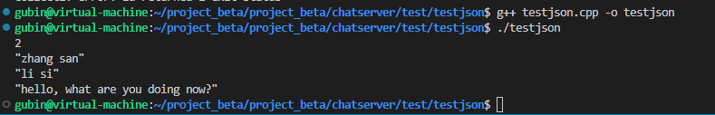

**笔记5-7内容**

# Json介绍：

一种轻量级的数据交换格式（也叫数据序列化方式），采用完全独立于编程语言的文本格式来存储和表示数据。的层次结构简洁和清晰，易于阅读和编写、机器解析和生成，且能有效地提升网络传输效率。

在网络中，常用的数据传输序列化格式有 `XML、Json、ProtoBuf`。在公司级别的项目中，大量的在使用 `ProtoBuf` 作为数据序列化的方式，以其数据压缩编码传输，占用带宽小，同样的数据信息，是 `Json` 的1/10，XML 的1/20，但使用起来比 `Json` 稍复杂一些。

本项目，选用的 `Json` 格式来打包传输数据。

## 一个优秀的Json三方库：

JSON for Modern C++ 是一个由德国大牛 nlohmann 编写的在 C++ 下使用的 JSON 库。

具有以下特点：

1. 直观的语法；

2. 整个代码由一个头文件组成 `json.hpp`，没有子项目，没有依赖关系，没有复杂的构建系统，使用起来非常方便；

   ```cpp
   #include "json.hpp"
   using json = nlohmann::json;
   ```

3. 使用 C++ 11 标准编写；

4. 使用 json 像使用 STL 容器一样；

5. STL 和 json 容器之间可以相互转换；

6. 严谨的测试：所有类都经过严格的单元测试，覆盖了 100％ 的代码，包括所有特殊的行为。此外，还检查了 `Valgrind` 是否有内存泄漏。

## Json数据序列化：

### 普通数据序列化：

```cpp
#include "json.hpp"
#include <iostream>

int main()
{
    using json = nlohmann::json;

    json js;
    // 序列化数组
    js["array"] = {{1,2,3},{4,5,6}};
    std::cout << js << std::endl;
    // 序列化键值对
    js["key"] = "value";
    std::cout << js << std::endl;
    // 序列化对象
    js["key1"] = {"value1_1", "value1_2"};
    js["key2"] = {"value2_1", "value2_2"};
    js["msg"]["key3_1"] = "value3_1";
    js["msg"]["key3_2"] = "value3_2";
    std::cout << js << std::endl;
    
    return 0;
}

/*
{"array":[[1,2,3],[4,5,6]]}

{"array":[[1,2,3],[4,5,6]],"key":"value"}

{"array":[[1,2,3],[4,5,6]],"key":"value","key1":["value1_1","value1_2"],"key2":["value2_1","value2_2"],"msg":{"key3_1":"value3_1","key3_2":"value3_2"}}
*/
```

### 容器序列化：

```cpp
#include "json.hpp"
#include <iostream>
#include <vector>
#include <map>

int main()
{
    using json = nlohmann::json; 
 
    // 容器序列化
    std::vector<int> arr_vctor({1,2,3,4,5});
    js["arr_vctor"] = arr_vctor;
    std::cout << js << std::endl;
    std::vector<std::vector<int>> arr2_vctor({{1,2,3},{4,5,6}});
    js["arr2_vctor"] = arr2_vctor;
    std::cout << js << std::endl;
    std::map<int, std::string> mp;
    mp[1] = "mp1"; mp[2] = "mp2";
    js["map"] = mp;
    std::cout << js << std::endl;

    return 0;
}

/*
{"arr_vctor":[1,2,3,4,5],"array":[[1,2,3],[4,5,6]],"key":"value","key1":["value1_1","value1_2"],"key2":["value2_1","value2_2"],"msg":{"key3_1":"value3_1","key3_2":"value3_2"}}

{"arr2_vctor":[[1,2,3],[4,5,6]],"arr_vctor":[1,2,3,4,5],"array":[[1,2,3],[4,5,6]],"key":"value","key1":["value1_1","value1_2"],"key2":["value2_1","value2_2"],"msg":{"key3_1":"value3_1","key3_2":"value3_2"}}

{"arr2_vctor":[[1,2,3],[4,5,6]],"arr_vctor":[1,2,3,4,5],"array":[[1,2,3],[4,5,6]],"key":"value","key1":["value1_1","value1_2"],"key2":["value2_1","value2_2"],"map":[[1,"mp1"],[2,"mp2"]],"msg":{"key3_1":"value3_1","key3_2":"value3_2"}}
*/
```

## Json数据[反序列化](https://so.csdn.net/so/search?q=%E5%8F%8D%E5%BA%8F%E5%88%97%E5%8C%96&spm=1001.2101.3001.7020)：

```cpp
#include "json.hpp"
#include <iostream>
#include <string>
#include <vector>
#include <map>
using json = nlohmann::json;

std::string func1()
{ 
    json js;
    // 序列化数组
    js["array"] = {{1,2,3},{4,5,6}};
    std::cout << js << std::endl;
    // 序列化键值对
    js["key"] = "value";
    std::cout << js << std::endl;
    // 序列化对象
    js["key1"] = {"value1_1", "value1_2"};
    js["key2"] = {"value2_1", "value2_2"};
    js["msg"]["key3_1"] = "value3_1";
    js["msg"]["key3_2"] = "value3_2";
    std::cout << js << std::endl;
 
    std::string ret = js.dump();  // 将json对象序列化为字符串
    return ret;
}

std::string func2()
{ 
    json js; 
    // 容器序列化
    std::vector<int> arr_vctor({1,2,3,4,5});
    js["arr_vctor"] = arr_vctor;
    std::cout << js << std::endl;
    std::vector<std::vector<int>> arr2_vctor({{1,2,3},{4,5,6}});
    js["arr2_vctor"] = arr2_vctor;
    std::cout << js << std::endl;
    std::map<int, std::string> mp;
    mp[1] = "mp1"; mp[2] = "mp2";
    js["map"] = mp;
    std::cout << js << std::endl;

    std::string ret = js.dump();  // 将json对象序列化为字符串
    return ret;
}

int main()
{
    json js;
    std::string revBuf1 = func1();
    // 模拟从网络接收到json字符串，通过json::parse函数把json字符串转换为json对象
    json jsBuf1 = json::parse(revBuf1); 
    auto ret1 = jsBuf1["array"];   
    std::cout << ret1 << std::endl;
    auto ret2 = jsBuf1["msg"];    
    std::cout << ret2 << std::endl;
 
    std::cout << "................." << std::endl;

    std::string revBuf2 = func2();
    json jsBuf2 = json::parse(revBuf2); 
    auto ret3 = jsBuf2["arr2_vctor"];  // auto ==> vector<vector<int>>
    std::cout << ret3 << std::endl;
    auto ret4 = jsBuf2["map"];         // auto ==> map<int, string>
    std::cout << ret4 << std::endl; 

    return 0;
}
```


## 测试

反序列化演示

```C++
#include "json.hpp"
using json = nlohmann::json;

#include <iostream>
#include <vector>
#include <map>
#include <string>
using namespace std;

// json序列化示例1
string func1()
{
    json js;
    js["msg_type"] = 2;
    js["from"] = "zhang san";
    js["to"] = "li si";
    js["msg"] = "hello, what are you doing now?";

    string sendBuf = js.dump();
    //cout<<sendBuf.c_str()<<endl;
    return sendBuf;
}

// json序列化示例2
string func2()
{
    json js;
    // 添加数组
    js["id"] = {1, 2, 3, 4, 5};
    // 添加key-value
    js["name"] = "zhang san";
    // 添加对象
    js["msg"]["zhang san"] = "hello world";
    js["msg"]["liu shuo"] = "hello china";
    // 上面等同于下面这句一次性添加数组对象
    js["msg"] = {{"zhang san", "hello world"}, {"liu shuo", "hello china"}};
    //cout << js << endl;
    return js.dump();
}

// json序列化示例代码3
string func3()
{
    json js;

    // 直接序列化一个vector容器
    vector<int> vec;
    vec.push_back(1);
    vec.push_back(2);
    vec.push_back(5);

    js["list"] = vec;

    // 直接序列化一个map容器
    map<int, string> m;
    m.insert({1, "挺好的?"});
    m.insert({2, "华山"});
    m.insert({3, "泰山"});

    js["path"] = m;

    string sendBuf = js.dump(); // json数据对象 =》序列化 json字符串
    //cout<<sendBuf<<endl;
    return sendBuf;
}

int main()
{
    string recvBuf = func1();
    // 数据的反序列化   json字符串 =》反序列化 数据对象（看作容器，方便访问）
    json jsbuf = json::parse(recvBuf);
    cout<<jsbuf["msg_type"]<<endl;
    cout<<jsbuf["from"]<<endl;
    cout<<jsbuf["to"]<<endl;
    cout<<jsbuf["msg"]<<endl;

    // cout<<jsbuf["id"]<<endl;
    // auto arr = jsbuf["id"];
    // cout<<arr[2]<<endl;

    // auto msgjs = jsbuf["msg"];
    // cout<<msgjs["zhang san"]<<endl;
    // cout<<msgjs["liu shuo"]<<endl;

    // vector<int> vec = jsbuf["list"]; // js对象里面的数组类型，直接放入vector容器当中
    // for (int &v : vec)
    // {
    //     cout << v << " ";
    // }
    // cout << endl;

    // map<int, string> mymap = jsbuf["path"];
    // for (auto &p : mymap)
    // {
    //     cout << p.first << " " << p.second << endl;
    // }
    // cout << endl;

    return 0;
}
```

从json字符串中解析出容器序列化数据

