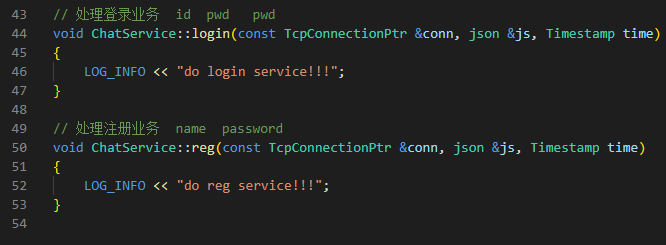
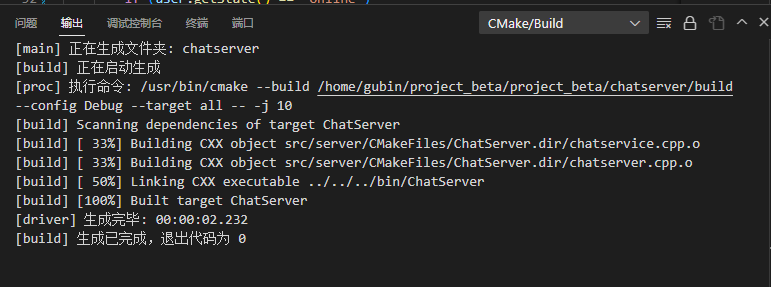
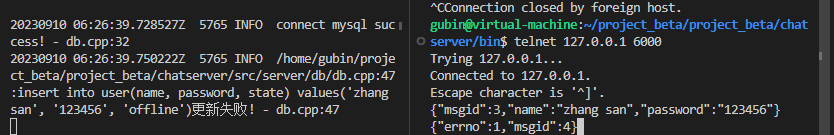
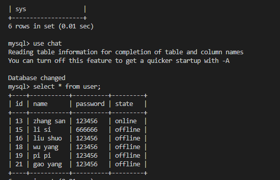
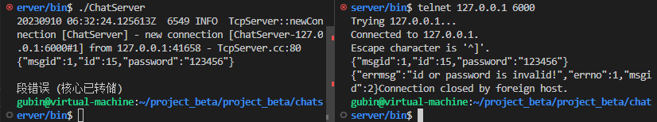
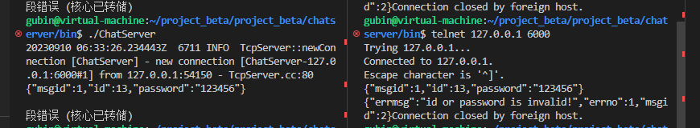
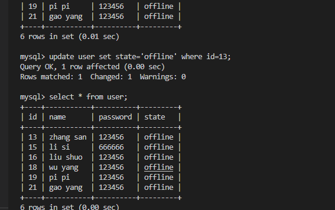

**笔记22-23内容**

主要是完善chatservice中处理登录和注册的业务代码



# 用户注册业务

## 具体代码实现

chatservice.hpp包含头文件usermodel.hpp

并且增加数据库操作类对象

```C++
#ifndef CHATSERVICE_H
#define CHATSERVICE_H

#include <muduo/net/TcpConnection.h>
#include <unordered_map>
#include <functional>
#include <mutex>


using namespace std;
using namespace muduo;
using namespace muduo::net;

#include "usermodel.hpp"
#include "json.hpp"
using json = nlohmann::json;

// 表示处理消息的事件回调方法类型
using MsgHandler = std::function<void(const TcpConnectionPtr &conn, json &js, Timestamp)>;

// 聊天服务器业务类
class ChatService
{
public:
    // 获取单例对象的接口函数
    static ChatService *instance();
    // 处理登录业务
    void login(const TcpConnectionPtr &conn, json &js, Timestamp time);
    // 处理注册业务
    void reg(const TcpConnectionPtr &conn, json &js, Timestamp time);
    // 获取消息对应的处理器
    MsgHandler getHandler(int msgid);
private:
    ChatService();
    // 存储消息id和其对应的业务处理方法
    unordered_map<int, MsgHandler> _msgHandlerMap;

    // 数据操作类对象
    UserModel _userModel;
};

#endif
```


chatservice.cpp

public.hpp消息类型中增加注册消息响应

1.根据传入的json对象（已经在onMessage函数中反序列化了），得到name，pwd，因为id是在数据库中创建后才能返回

2.生成user对象，调用usermodel类的insert()方法在数据库表中添加用户信息

3.注册成功，组织响应返回

4.注册失败，返回错误信息

```C++
// 处理注册业务  name  password
void ChatService::reg(const TcpConnectionPtr &conn, json &js, Timestamp time)
{
    string name = js["name"];
    string pwd = js["password"];

    User user;
    user.setName(name);
    user.setPwd(pwd);
    bool state = _userModel.insert(user);
    if (state)
    {
        // 注册成功
        json response;
        response["msgid"] = REG_MSG_ACK;
        response["errno"] = 0;
        response["id"] = user.getId();
        conn->send(response.dump());
    }
    else
    {
        // 注册失败
        json response;
        response["msgid"] = REG_MSG_ACK;
        response["errno"] = 1;
        conn->send(response.dump());
    }
}
```


# 用户登录业务

## 具体代码实现

用户登录响应消息类型 public.hpp

```C++
#ifndef PUBLIC_H
#define PUBLIC_H

/*
server和client的公共文件
*/
enum EnMsgType
{
    LOGIN_MSG = 1, // 登录消息
    LOGIN_MSG_ACK, // 登录响应消息
    REG_MSG, // 注册消息
    REG_MSG_ACK, // 注册响应消息
};

#endif
```


chatservice.cpp

1.从json对象获取id，pwd，并查询数据库判断该用户是否存在，密码是否正确

2.判断用户是否已经登录，不允许重复登录，发送响应

3.登录成功，更新用户状态信息 状态为在线

4.用户不存在，用户存在但是密码错误等情况

```C++
// 处理登录业务  id  pwd   pwd
void ChatService::login(const TcpConnectionPtr &conn, json &js, Timestamp time)
{
    int id = js["id"].get<int>();
    string pwd = js["password"];

    User user = _userModel.query(id);
    if (user.getId() == id && user.getPwd() == pwd)
    {
        if (user.getState() == "online")
        {
            // 该用户已经登录，不允许重复登录
            json response;
            response["msgid"] = LOGIN_MSG_ACK;
            response["errno"] = 2;
            response["errmsg"] = "this account is using, input another!";
            conn->send(response.dump());
        }
        else
        {
            // 登录成功，更新用户状态信息 state offline=>online
            user.setState("online");
            _userModel.updateState(user);

            json response;
            response["msgid"] = LOGIN_MSG_ACK;
            response["errno"] = 0;
            response["id"] = user.getId();
            response["name"] = user.getName();
        
            conn->send(response.dump());
        }
    }
    else
    {
        // 该用户不存在，用户存在但是密码错误，登录失败
        json response;
        response["msgid"] = LOGIN_MSG_ACK;
        response["errno"] = 1;
        response["errmsg"] = "id or password is invalid!";
        conn->send(response.dump());
    }
}
```

# 编译




# 测试

开启聊天服务器

```
cd bin
./ChatServer
```

先测试注册

telnet 发送注册信息

```
{"msgid":3,"name":"zhang san","password":"123456"}
```



好像已经存在了,之前数据库已经填写过了



测试错误登录

```
{"msgid":1,"id":15,"password":"123456"}
```

还是会发生很多核心已转储的错误，服务器健壮性不是很好



测试正确登录

```
{"msgid":1,"id":13,"password":"123456"}
```



测试的不是很好，需要重新测试，并且发现数据库上怎么id=13状态变成了在线


不过我们现在业务还没写完，我们手动改为下线状态

```
update user set state='offline' where id=13;
```




这个版本需要进行gdb调试