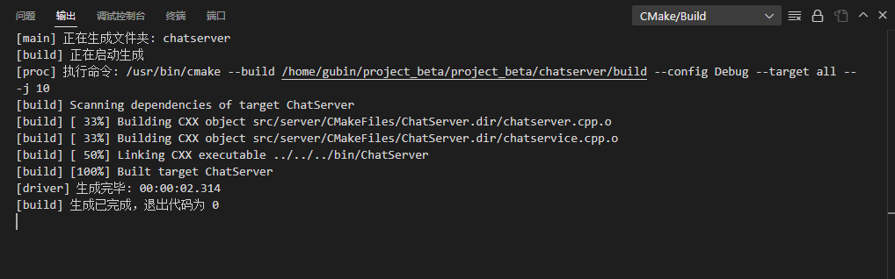

## 用户的连接信息

业务层需要记录用户的连接信息

1.存储在线用户的通信连接

2.定义互斥锁，保证_userConnMap的线程安全

```C++
#ifndef CHATSERVICE_H
#define CHATSERVICE_H

#include <muduo/net/TcpConnection.h>
#include <unordered_map>
#include <functional>
#include <mutex>


using namespace std;
using namespace muduo;
using namespace muduo::net;

#include "usermodel.hpp"
#include "json.hpp"
using json = nlohmann::json;

// 表示处理消息的事件回调方法类型
using MsgHandler = std::function<void(const TcpConnectionPtr &conn, json &js, Timestamp)>;

// 聊天服务器业务类
class ChatService
{
public:
    // 获取单例对象的接口函数
    static ChatService *instance();
    // 处理登录业务
    void login(const TcpConnectionPtr &conn, json &js, Timestamp time);
    // 处理注册业务
    void reg(const TcpConnectionPtr &conn, json &js, Timestamp time);
    // 获取消息对应的处理器
    MsgHandler getHandler(int msgid);
private:
    ChatService();
    // 存储消息id和其对应的业务处理方法
    unordered_map<int, MsgHandler> _msgHandlerMap;
    // 存储在线用户的通信连接
    unordered_map<int, TcpConnectionPtr> _userConnMap;
    // 定义互斥锁，保证_userConnMap的线程安全
    mutex _connMutex;

    // 数据操作类对象
    UserModel _userModel;
};

#endif
```


## 具体应用

由于我们的业务方法会在多线程环境下使用，这个表里涉及连接的有用户上线和用户下线

所以对于这个map的访问，要考虑线程安全问题

1.定义互斥锁保证user connection map的线程安全，并且希望锁的力度要小

```C++
// 处理登录业务  id  pwd   pwd
void ChatService::login(const TcpConnectionPtr &conn, json &js, Timestamp time)
{
    int id = js["id"].get<int>();
    string pwd = js["password"];

    User user = _userModel.query(id);
    if (user.getId() == id && user.getPwd() == pwd)
    {
        if (user.getState() == "online")
        {
            // 该用户已经登录，不允许重复登录
            json response;
            response["msgid"] = LOGIN_MSG_ACK;
            response["errno"] = 2;
            response["errmsg"] = "this account is using, input another!";
            conn->send(response.dump());
        }
        else
        {
            // 登录成功，记录用户连接信息
            {
                lock_guard<mutex> lock(_connMutex);
                _userConnMap.insert({id, conn});
            }

            // 登录成功，更新用户状态信息 state offline=>online
            user.setState("online");
            _userModel.updateState(user);

            json response;
            response["msgid"] = LOGIN_MSG_ACK;
            response["errno"] = 0;
            response["id"] = user.getId();
            response["name"] = user.getName();
        
            conn->send(response.dump());
        }
    }
    else
    {
        // 该用户不存在，用户存在但是密码错误，登录失败
        json response;
        response["msgid"] = LOGIN_MSG_ACK;
        response["errno"] = 1;
        response["errmsg"] = "id or password is invalid!";
        conn->send(response.dump());
    }
}
```


## 编译

