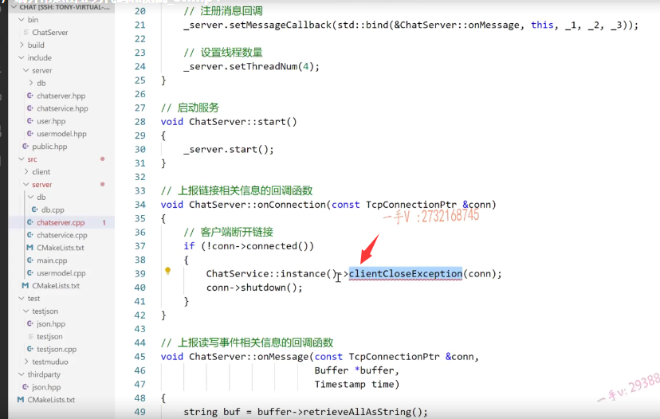
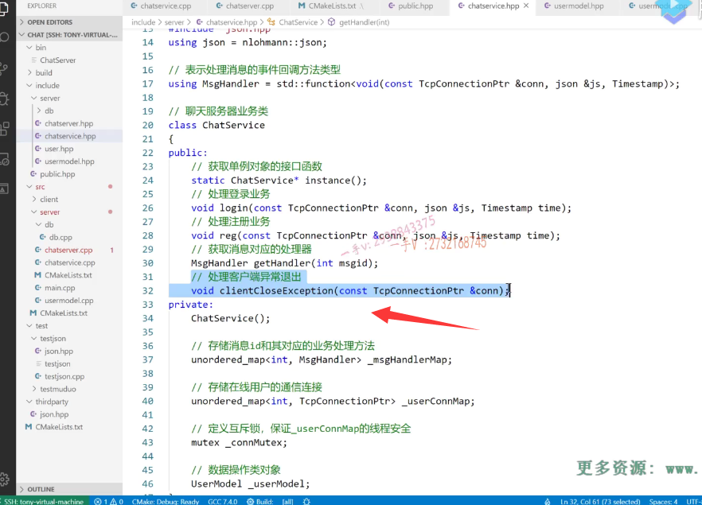
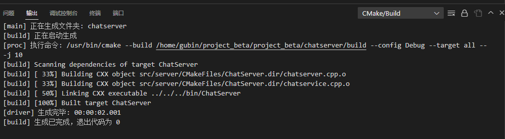

## 客户端异常退出

如果用客户端啊，异常退出，它根本就没有发送一个合法的json消息过来

写一个client close exception就是客户端关闭是异常，异常关闭了接收一个connection




### clientCloseException实现



```C++
#ifndef CHATSERVICE_H
#define CHATSERVICE_H

#include <muduo/net/TcpConnection.h>
#include <unordered_map>
#include <functional>
#include <mutex>


using namespace std;
using namespace muduo;
using namespace muduo::net;

#include "usermodel.hpp"
#include "json.hpp"
using json = nlohmann::json;

// 表示处理消息的事件回调方法类型
using MsgHandler = std::function<void(const TcpConnectionPtr &conn, json &js, Timestamp)>;

// 聊天服务器业务类
class ChatService
{
public:
    // 获取单例对象的接口函数
    static ChatService *instance();
    // 处理登录业务
    void login(const TcpConnectionPtr &conn, json &js, Timestamp time);
    // 处理注册业务
    void reg(const TcpConnectionPtr &conn, json &js, Timestamp time);
    // 获取消息对应的处理器
    MsgHandler getHandler(int msgid);
    // 处理客户端异常退出
    void clientCloseException(const TcpConnectionPtr &conn);
private:
    ChatService();
    // 存储消息id和其对应的业务处理方法
    unordered_map<int, MsgHandler> _msgHandlerMap;
    // 存储在线用户的通信连接
    unordered_map<int, TcpConnectionPtr> _userConnMap;
    // 定义互斥锁，保证_userConnMap的线程安全
    mutex _connMutex;

    // 数据操作类对象
    UserModel _userModel;
};

#endif
```


### 遍历 查找 删除异常登录用户的链接信息 并且注意线程安全问题

锁的力度设置小

用户user是独立的，map表是公共的，所以放在锁外

```C++
// 处理客户端异常退出
void ChatService::clientCloseException(const TcpConnectionPtr &conn)
{
    User user;
    {
        lock_guard<mutex> lock(_connMutex);
        for (auto it = _userConnMap.begin(); it != _userConnMap.end(); ++it)
        {
            if (it->second == conn)
            {
                // 从map表删除用户的链接信息
                user.setId(it->first);
                _userConnMap.erase(it);
                break;
            }
        }
    }

    
    // 更新用户的状态信息
    if (user.getId() != -1)
    {
        user.setState("offline");
        _userModel.updateState(user);
    }
}
```

## 编译



## 测试

