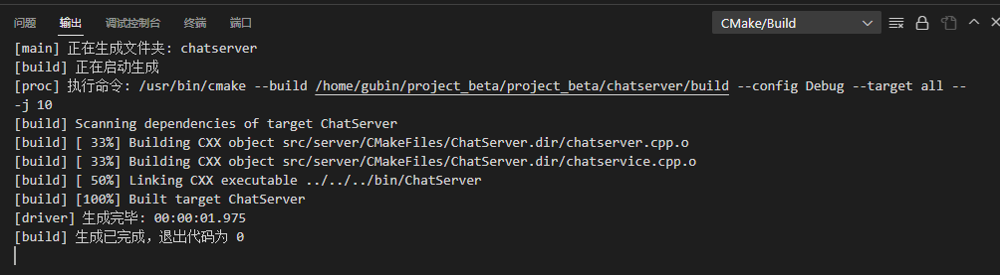

## 点对点聊天业务

定义聊天消息类型

```C++
#ifndef PUBLIC_H
#define PUBLIC_H

/*
server和client的公共文件
*/
enum EnMsgType
{
    LOGIN_MSG = 1, // 登录消息
    LOGIN_MSG_ACK, // 登录响应消息
    REG_MSG, // 注册消息
    REG_MSG_ACK, // 注册响应消息
    ONE_CHAT_MSG, // 聊天消息
};

#endif
```


注册聊天信息以及对应的回调操作，放入msghandlermap中

```C++
#ifndef CHATSERVICE_H
#define CHATSERVICE_H

#include <muduo/net/TcpConnection.h>
#include <unordered_map>
#include <functional>
#include <mutex>


using namespace std;
using namespace muduo;
using namespace muduo::net;

#include "usermodel.hpp"
#include "json.hpp"
using json = nlohmann::json;

// 表示处理消息的事件回调方法类型
using MsgHandler = std::function<void(const TcpConnectionPtr &conn, json &js, Timestamp)>;

// 聊天服务器业务类
class ChatService
{
public:
    // 获取单例对象的接口函数
    static ChatService *instance();
    // 处理登录业务
    void login(const TcpConnectionPtr &conn, json &js, Timestamp time);
    // 处理注册业务
    void reg(const TcpConnectionPtr &conn, json &js, Timestamp time);
    // 一对一聊天业务
    void oneChat(const TcpConnectionPtr &conn, json &js, Timestamp time);


    // 获取消息对应的处理器
    MsgHandler getHandler(int msgid);
    // 处理客户端异常退出
    void clientCloseException(const TcpConnectionPtr &conn);
private:
    ChatService();
    // 存储消息id和其对应的业务处理方法
    unordered_map<int, MsgHandler> _msgHandlerMap;
    // 存储在线用户的通信连接
    unordered_map<int, TcpConnectionPtr> _userConnMap;
    // 定义互斥锁，保证_userConnMap的线程安全
    mutex _connMutex;

    // 数据操作类对象
    UserModel _userModel;
};

#endif
```

chatservice.cpp中

```
// 注册消息以及对应的Handler回调操作
ChatService::ChatService()
{
    // 用户基本业务管理相关事件处理回调注册
    _msgHandlerMap.insert({LOGIN_MSG, std::bind(&ChatService::login, this, _1, _2, _3)});
    _msgHandlerMap.insert({REG_MSG, std::bind(&ChatService::reg, this, _1, _2, _3)});
    _msgHandlerMap.insert({ONE_CHAT_MSG, std::bind(&ChatService::oneChat, this, _1, _2, _3)});
}

```


## 一对一聊天业务的具体实现

先只出现在线状态

```
// 一对一聊天业务
void ChatService::oneChat(const TcpConnectionPtr &conn, json &js, Timestamp time)
{
    int toid = js["toid"].get<int>();

    {
        lock_guard<mutex> lock(_connMutex);
        auto it = _userConnMap.find(toid);
        if (it != _userConnMap.end())
        {
            // toid在线，转发消息   服务器主动推送消息给toid用户
            it->second->send(js.dump());
            return;
        }
    }

    // 查询toid是否在线 

    // toid不在线，存储离线消息
    
}
```

### 编译



### 测试


