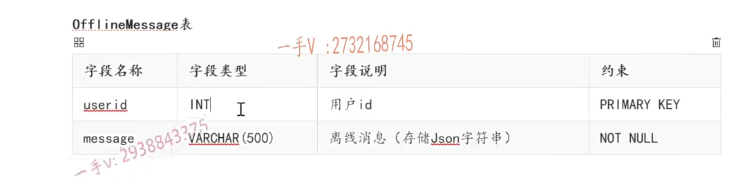
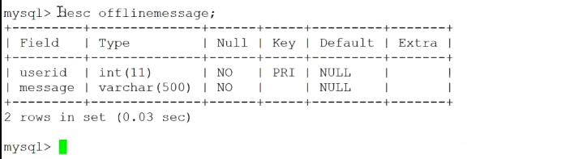
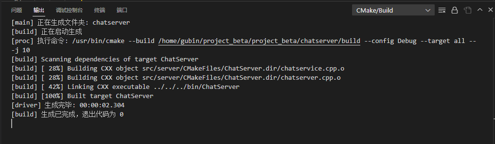

# 离线业务实现

## offlineMsgModel类实现

主要还是基于user表信息，所以不需要在model中继续封装一个offline表

有一张存储离线消息的数据表





写这个model类，提供给业务层提供相应的这个封装的方法就行，把业务代码跟数据库代码分离开

创建一个model类 offlineMsgModel


在include/server/model中创建offlinemessagemodel.hpp

1.成员方法，封装mysql类的方法

- 存储用户的离线消息
- 删除用户的离线消息
- 查询用户的离线消息

```C++
#ifndef OFFLINEMESSAGEMODEL_H
#define OFFLINEMESSAGEMODEL_H

#include <string>
#include <vector>
using namespace std;

// 提供离线消息表的操作接口方法
class OfflineMsgModel
{
public:
    // 存储用户的离线消息
    void insert(int userid, string msg);

    // 删除用户的离线消息
    void remove(int userid);

    // 查询用户的离线消息
    vector<string> query(int userid);
};

#endif
```


在src/server/model中创建offlinemessagemodel.cpp

1.存储用户的离线消息


2.删除用户的离线消息


3.查询用户的离线消息

```C++
#include "offlinemessagemodel.hpp"
#include "db.h"

// 存储用户的离线消息
void OfflineMsgModel::insert(int userid, string msg)
{
    // 1.组装sql语句
    char sql[1024] = {0};
    sprintf(sql, "insert into offlinemessage values(%d, '%s')", userid, msg.c_str());

    MySQL mysql;
    if (mysql.connect())
    {
        mysql.update(sql);
    }
}

// 删除用户的离线消息
void OfflineMsgModel::remove(int userid)
{
    // 1.组装sql语句
    char sql[1024] = {0};
    sprintf(sql, "delete from offlinemessage where userid=%d", userid);

    MySQL mysql;
    if (mysql.connect())
    {
        mysql.update(sql);
    }
}

// 查询用户的离线消息
vector<string> OfflineMsgModel::query(int userid)
{
    // 1.组装sql语句
    char sql[1024] = {0};
    sprintf(sql, "select message from offlinemessage where userid = %d", userid);

    vector<string> vec;
    MySQL mysql;
    if (mysql.connect())
    {
        MYSQL_RES *res = mysql.query(sql);
        if (res != nullptr)
        {
            // 把userid用户的所有离线消息放入vec中返回
            MYSQL_ROW row;
            while((row = mysql_fetch_row(res)) != nullptr)
            {
                vec.push_back(row[0]);
            }
            mysql_free_result(res);
            return vec;
        }
    }
    return vec;
}
```


## 实现一对一聊天业务的存储离线消息

1.chatservice.hpp中添加offlinemessagemodel.hpp头文件

2.并且成员变量增加连线表操作对象

```C++
#ifndef CHATSERVICE_H
#define CHATSERVICE_H

#include <muduo/net/TcpConnection.h>
#include <unordered_map>
#include <functional>
#include <mutex>


using namespace std;
using namespace muduo;
using namespace muduo::net;

#include "usermodel.hpp"
#include "offlinemessagemodel.hpp"
#include "json.hpp"
using json = nlohmann::json;

// 表示处理消息的事件回调方法类型
using MsgHandler = std::function<void(const TcpConnectionPtr &conn, json &js, Timestamp)>;

// 聊天服务器业务类
class ChatService
{
public:
    // 获取单例对象的接口函数
    static ChatService *instance();
    // 处理登录业务
    void login(const TcpConnectionPtr &conn, json &js, Timestamp time);
    // 处理注册业务
    void reg(const TcpConnectionPtr &conn, json &js, Timestamp time);
    // 一对一聊天业务
    void oneChat(const TcpConnectionPtr &conn, json &js, Timestamp time);


    // 获取消息对应的处理器
    MsgHandler getHandler(int msgid);
    // 处理客户端异常退出
    void clientCloseException(const TcpConnectionPtr &conn);
private:
    ChatService();
    // 存储消息id和其对应的业务处理方法
    unordered_map<int, MsgHandler> _msgHandlerMap;
    // 存储在线用户的通信连接
    unordered_map<int, TcpConnectionPtr> _userConnMap;
    // 定义互斥锁，保证_userConnMap的线程安全
    mutex _connMutex;

    // 数据操作类对象
    UserModel _userModel;//用户表操作对象
    OfflineMsgModel _offlineMsgModel;//离线表操作对象
};

#endif
```


### 离线业务具体实现

1.toid不在线，存储离线消息

```C++
// 一对一聊天业务
void ChatService::oneChat(const TcpConnectionPtr &conn, json &js, Timestamp time)
{
    int toid = js["toid"].get<int>();

    {
        lock_guard<mutex> lock(_connMutex);
        auto it = _userConnMap.find(toid);
        if (it != _userConnMap.end())
        {
            // toid在线，转发消息   服务器主动推送消息给toid用户
            it->second->send(js.dump());
            return;
        }
    }

    // toid不在线，存储离线消息
    _offlineMsgModel.insert(toid, js.dump());
}
```


登录业务中增加 登录成功后查询当前用户在离线表是否有消息

1. 查询该用户是否有离线消息 _offlineMsgModel.query(id)

```C++
// 处理登录业务  id  pwd   pwd
void ChatService::login(const TcpConnectionPtr &conn, json &js, Timestamp time)
{
    int id = js["id"].get<int>();
    string pwd = js["password"];

    User user = _userModel.query(id);
    if (user.getId() == id && user.getPwd() == pwd)
    {
        if (user.getState() == "online")
        {
            // 该用户已经登录，不允许重复登录
            json response;
            response["msgid"] = LOGIN_MSG_ACK;
            response["errno"] = 2;
            response["errmsg"] = "this account is using, input another!";
            conn->send(response.dump());
        }
        else
        {
            // 登录成功，记录用户连接信息
            {
                lock_guard<mutex> lock(_connMutex);
                _userConnMap.insert({id, conn});
            }

            // 登录成功，更新用户状态信息 state offline=>online
            user.setState("online");
            _userModel.updateState(user);

            json response;
            response["msgid"] = LOGIN_MSG_ACK;
            response["errno"] = 0;
            response["id"] = user.getId();
            response["name"] = user.getName();
            // 查询该用户是否有离线消息
            vector<string> vec = _offlineMsgModel.query(id);
            if (!vec.empty())
            {
                response["offlinemsg"] = vec;
                // 读取该用户的离线消息后，把该用户的所有离线消息删除掉
                _offlineMsgModel.remove(id);
            }
        
            conn->send(response.dump());
        }
    }
    else
    {
        // 该用户不存在，用户存在但是密码错误，登录失败
        json response;
        response["msgid"] = LOGIN_MSG_ACK;
        response["errno"] = 1;
        response["errmsg"] = "id or password is invalid!";
        conn->send(response.dump());
    }
}
```

## 编译



## 测试离线消息