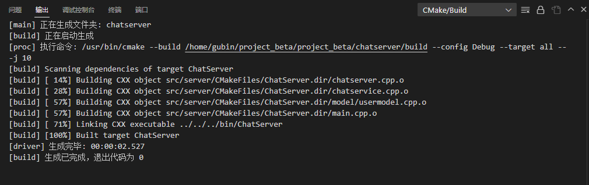

## 服务器异常退出处理

问题是服务器强制结束，没法去修改用户的状态了


截获一下这个信号（ctrl + c），做一些相应的处理


```C++
#include "chatserver.hpp"
#include "chatservice.hpp"
#include <iostream>
#include <signal.h>
using namespace std;

// 处理服务器ctrl+c结束后，重置user的状态信息
void resetHandler(int)
{
    ChatService::instance()->reset();
    exit(0);
}

int main()
{
    //捕捉服务器异常退出信号，做相应回调处理
    signal(SIGINT, resetHandler);
    
    EventLoop loop;
    InetAddress addr("127.0.0.1", 6000);
    ChatServer server(&loop, addr, "ChatServer");

    server.start();
    loop.loop();

    return 0;
}
```


## chatservice  中 实现reset()方法

chatservice.hpp中添加reset()方法声明

```C++
#ifndef CHATSERVICE_H
#define CHATSERVICE_H

#include <muduo/net/TcpConnection.h>
#include <unordered_map>
#include <functional>
#include <mutex>


using namespace std;
using namespace muduo;
using namespace muduo::net;

#include "usermodel.hpp"
#include "offlinemessagemodel.hpp"
#include "json.hpp"
using json = nlohmann::json;

// 表示处理消息的事件回调方法类型
using MsgHandler = std::function<void(const TcpConnectionPtr &conn, json &js, Timestamp)>;

// 聊天服务器业务类
class ChatService
{
public:
    // 获取单例对象的接口函数
    static ChatService *instance();
    // 处理登录业务
    void login(const TcpConnectionPtr &conn, json &js, Timestamp time);
    // 处理注册业务
    void reg(const TcpConnectionPtr &conn, json &js, Timestamp time);
    // 一对一聊天业务
    void oneChat(const TcpConnectionPtr &conn, json &js, Timestamp time);

    // 服务器异常，业务重置方法
    void reset();
    // 获取消息对应的处理器
    MsgHandler getHandler(int msgid);
    // 处理客户端异常退出
    void clientCloseException(const TcpConnectionPtr &conn);
private:
    ChatService();
    // 存储消息id和其对应的业务处理方法
    unordered_map<int, MsgHandler> _msgHandlerMap;
    // 存储在线用户的通信连接
    unordered_map<int, TcpConnectionPtr> _userConnMap;
    // 定义互斥锁，保证_userConnMap的线程安全
    mutex _connMutex;

    // 数据操作类对象
    UserModel _userModel;//用户表操作对象
    OfflineMsgModel _offlineMsgModel;//离线表操作对象
};

```


### chatservice.cpp中实现


```C++
// 服务器异常，业务重置方法
void ChatService::reset()
{
    // 把online状态的用户，设置成offline
    _userModel.resetState();
}
```


之前忘了实现用户表model类的两种方法，现在补上

顺便加上重置用户状态方法

```C++
#ifndef USERMODEL_H
#define USERMODEL_H

#include "user.hpp"

// User表的数据操作类
class UserModel {
public:
    // User表的增加方法
    bool insert(User &user);

    // 根据用户号码查询用户信息
    User query(int id);

    // 更新用户的状态信息
    bool updateState(User user);

    // 重置用户的状态信息
    void resetState();
};

#endif
```


```C++
// 根据用户号码查询用户信息
User UserModel::query(int id)
{
    // 1.组装sql语句
    char sql[1024] = {0};
    sprintf(sql, "select * from user where id = %d", id);

    MySQL mysql;
    if (mysql.connect())
    {
        MYSQL_RES *res = mysql.query(sql);
        if (res != nullptr)
        {
            MYSQL_ROW row = mysql_fetch_row(res);
            if (row != nullptr)
            {
                User user;
                user.setId(atoi(row[0]));
                user.setName(row[1]);
                user.setPwd(row[2]);
                user.setState(row[3]);
                mysql_free_result(res);
                return user;
            }
        }
    }

    return User();
}

// 更新用户的状态信息
bool UserModel::updateState(User user)
{
    // 1.组装sql语句
    char sql[1024] = {0};
    sprintf(sql, "update user set state = '%s' where id = %d", user.getState().c_str(), user.getId());

    MySQL mysql;
    if (mysql.connect())
    {
        if (mysql.update(sql))
        {
            return true;
        }
    }
    return false;
}

// 重置用户的状态信息
void UserModel::resetState()
{
    // 1.组装sql语句
    char sql[1024] = "update user set state = 'offline' where state = 'online'";

    MySQL mysql;
    if (mysql.connect())
    {
        mysql.update(sql);
    }
}
```


## 编译



## 测试