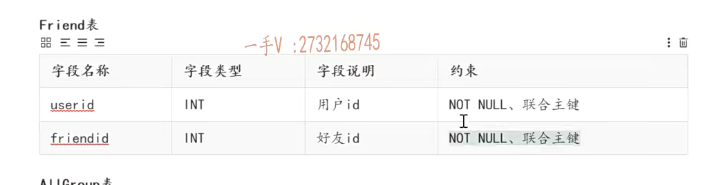
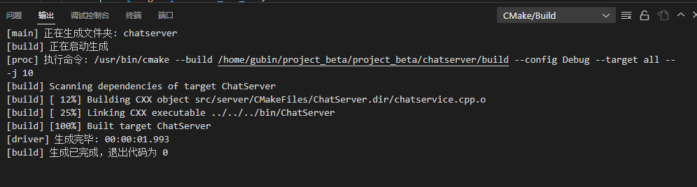
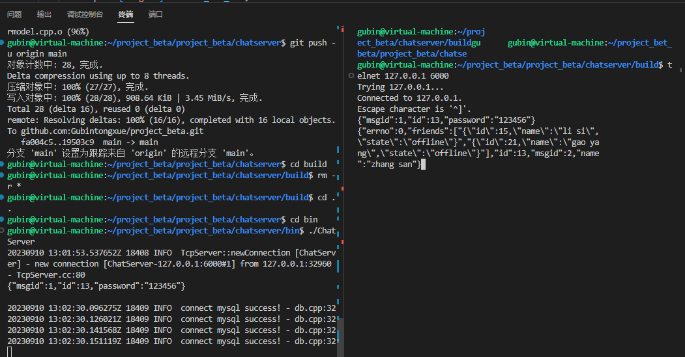

# 添加好友业务

当用户发起加好友的操作到服务器，服务器就会把我这个关系添加到friend表

我们这里不需要对方同意，做一个简单业务


为了操作这个friend好友表，我们也需要建立friendmodel类，并且它里面也是存的用户信息

==并且这个表中用户id和好友id，是使用的联合主键==




### 注册消息类型

```C++
#ifndef PUBLIC_H
#define PUBLIC_H

/*
server和client的公共文件
*/
enum EnMsgType
{
    LOGIN_MSG = 1, // 登录消息
    LOGIN_MSG_ACK, // 登录响应消息
    REG_MSG, // 注册消息
    REG_MSG_ACK, // 注册响应消息
    ONE_CHAT_MSG, // 聊天消息
    ADD_FRIEND_MSG, // 添加好友消息
};

#endif
```


### 给消息绑定回调函数 事件处理

```C++
#ifndef CHATSERVICE_H
#define CHATSERVICE_H

#include <muduo/net/TcpConnection.h>
#include <unordered_map>
#include <functional>
#include <mutex>


using namespace std;
using namespace muduo;
using namespace muduo::net;

#include "usermodel.hpp"
#include "offlinemessagemodel.hpp"
#include "json.hpp"
using json = nlohmann::json;

// 表示处理消息的事件回调方法类型
using MsgHandler = std::function<void(const TcpConnectionPtr &conn, json &js, Timestamp)>;

// 聊天服务器业务类
class ChatService
{
public:
    // 获取单例对象的接口函数
    static ChatService *instance();
    // 处理登录业务
    void login(const TcpConnectionPtr &conn, json &js, Timestamp time);
    // 处理注册业务
    void reg(const TcpConnectionPtr &conn, json &js, Timestamp time);
    // 一对一聊天业务
    void oneChat(const TcpConnectionPtr &conn, json &js, Timestamp time);
    // 添加好友业务
    void addFriend(const TcpConnectionPtr &conn, json &js, Timestamp time);

    // 服务器异常，业务重置方法
    void reset();
    // 获取消息对应的处理器
    MsgHandler getHandler(int msgid);
    // 处理客户端异常退出
    void clientCloseException(const TcpConnectionPtr &conn);
private:
    ChatService();
    // 存储消息id和其对应的业务处理方法
    unordered_map<int, MsgHandler> _msgHandlerMap;
    // 存储在线用户的通信连接
    unordered_map<int, TcpConnectionPtr> _userConnMap;
    // 定义互斥锁，保证_userConnMap的线程安全
    mutex _connMutex;

    // 数据操作类对象
    UserModel _userModel;//用户表操作对象
    OfflineMsgModel _offlineMsgModel;//离线表操作对象
};

#endif
```


chatservice.cpp

```C++
// 注册消息以及对应的Handler回调操作
ChatService::ChatService()
{
    // 用户基本业务管理相关事件处理回调注册
    _msgHandlerMap.insert({LOGIN_MSG, std::bind(&ChatService::login, this, _1, _2, _3)});
    _msgHandlerMap.insert({REG_MSG, std::bind(&ChatService::reg, this, _1, _2, _3)});
    _msgHandlerMap.insert({ONE_CHAT_MSG, std::bind(&ChatService::oneChat, this, _1, _2, _3)});
    _msgHandlerMap.insert({ADD_FRIEND_MSG, std::bind(&ChatService::addFriend, this, _1, _2, _3)});

}
```


## 实现friendmodel类


在include/server/model新建friendmodel.hpp

```C++
#ifndef FRIENDMODEL_H
#define FRIENDMODEL_H

#include "user.hpp"
#include <vector>
using namespace std;

// 维护好友信息的操作接口方法
class FriendModel
{
public:
    // 添加好友关系
    void insert(int userid, int friendid);

    // 返回用户好友列表
    vector<User> query(int userid);
};

#endif
```


在src/server/model新建friendmodel.cpp

1.

```C++
#include "friendmodel.hpp"
#include "db.h"

// 添加好友关系
void FriendModel::insert(int userid, int friendid)
{
    // 1.组装sql语句
    char sql[1024] = {0};
    sprintf(sql, "insert into friend values(%d, %d)", userid, friendid);

    MySQL mysql;
    if (mysql.connect())
    {
        mysql.update(sql);
    }
}

// 返回用户好友列表
vector<User> FriendModel::query(int userid)
{
    // 1.组装sql语句
    char sql[1024] = {0};

    sprintf(sql, "select a.id,a.name,a.state from user a inner join friend b on b.friendid = a.id where b.userid=%d", userid);

    vector<User> vec;
    MySQL mysql;
    if (mysql.connect())
    {
        MYSQL_RES *res = mysql.query(sql);
        if (res != nullptr)
        {
            // 把userid用户的所有离线消息放入vec中返回
            MYSQL_ROW row;
            while((row = mysql_fetch_row(res)) != nullptr)
            {
                User user;
                user.setId(atoi(row[0]));
                user.setName(row[1]);
                user.setState(row[2]);
                vec.push_back(user);
            }
            mysql_free_result(res);
            return vec;
        }
    }
    return vec;
}
```


### 实现添加好友用户

chatservice.hpp中

1.添加头文件friendmodel.hpp

2.添加_friendModel好友表操作对象

```C++
#ifndef CHATSERVICE_H
#define CHATSERVICE_H

#include <muduo/net/TcpConnection.h>
#include <unordered_map>
#include <functional>
#include <mutex>


using namespace std;
using namespace muduo;
using namespace muduo::net;

#include "usermodel.hpp"
#include "friendmodel.hpp"
#include "offlinemessagemodel.hpp"
#include "json.hpp"
using json = nlohmann::json;

// 表示处理消息的事件回调方法类型
using MsgHandler = std::function<void(const TcpConnectionPtr &conn, json &js, Timestamp)>;

// 聊天服务器业务类
class ChatService
{
public:
    // 获取单例对象的接口函数
    static ChatService *instance();
    // 处理登录业务
    void login(const TcpConnectionPtr &conn, json &js, Timestamp time);
    // 处理注册业务
    void reg(const TcpConnectionPtr &conn, json &js, Timestamp time);
    // 一对一聊天业务
    void oneChat(const TcpConnectionPtr &conn, json &js, Timestamp time);
    // 添加好友业务
    void addFriend(const TcpConnectionPtr &conn, json &js, Timestamp time);

    // 服务器异常，业务重置方法
    void reset();
    // 获取消息对应的处理器
    MsgHandler getHandler(int msgid);
    // 处理客户端异常退出
    void clientCloseException(const TcpConnectionPtr &conn);
private:
    ChatService();
    // 存储消息id和其对应的业务处理方法
    unordered_map<int, MsgHandler> _msgHandlerMap;
    // 存储在线用户的通信连接
    unordered_map<int, TcpConnectionPtr> _userConnMap;
    // 定义互斥锁，保证_userConnMap的线程安全
    mutex _connMutex;

    // 数据操作类对象
    UserModel _userModel;//用户表操作对象
    OfflineMsgModel _offlineMsgModel;//离线表操作对象
    FriendModel _friendModel;//好友表操作对象
};

#endif
```


### 添加好友业务具体实现


```C++
// 添加好友业务 msgid id friendid
void ChatService::addFriend(const TcpConnectionPtr &conn, json &js, Timestamp time)
{
    int userid = js["id"].get<int>();
    int friendid = js["friendid"].get<int>();

    // 存储好友信息
    _friendModel.insert(userid, friendid);
}

```


### 处理查询好友的信息

登录后做查询好友信息的业务

```C++
// 查询该用户的好友信息并返回
vector<User> userVec = _friendModel.query(id);
if (!userVec.empty())
{
    vector<string> vec2;
    for (User &user : userVec)
    {
        json js;
        js["id"] = user.getId();
        js["name"] = user.getName();
        js["state"] = user.getState();
        vec2.push_back(js.dump());
    }
    response["friends"] = vec2;
}
```


## 编译




## 测试

登录后可以看到好友信息

```
{"msgid":1,"id":13,"password":"123456"}
```



演示添加好友

```
{"msgid":6,"id":13,"friendid":"15"}
```

可能因为已经添加了，第二次添加好友好像发生了错误