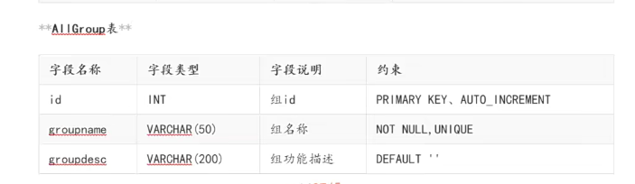
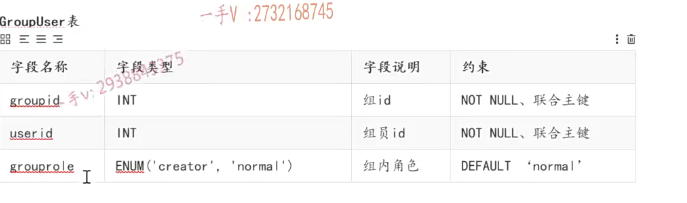
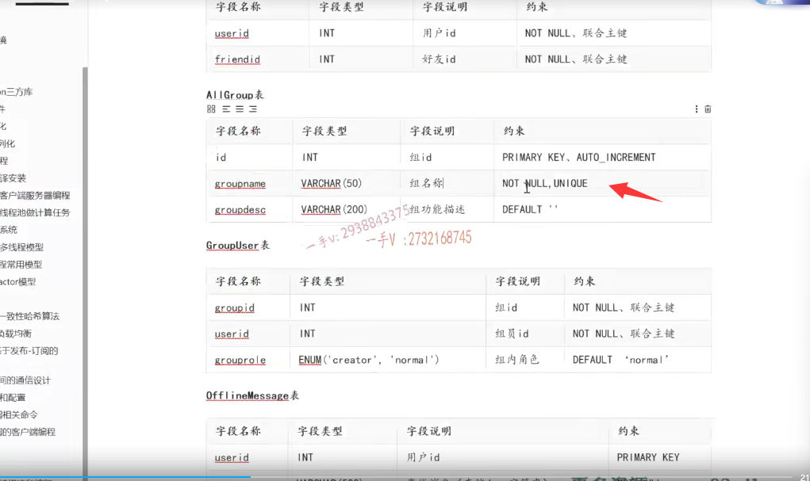
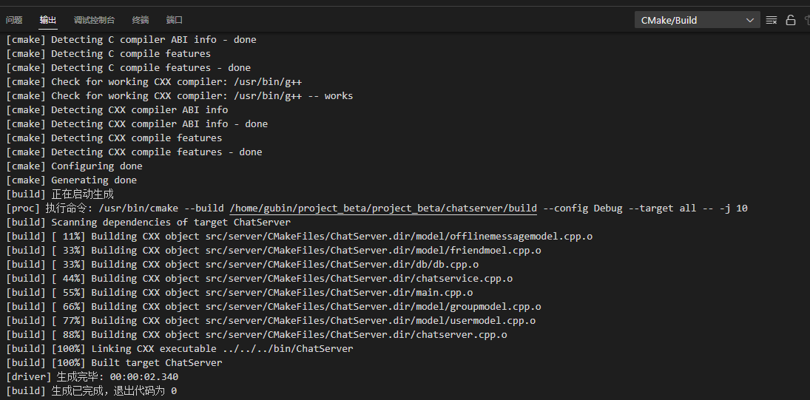

**笔记30-31内容**

## 前置知识

首先呢，跟群组相关业务相关的有两张表，

第一张表记录所有的群组，一个是主键组id，一个是组名称，一个是组描述



然后一张表是群-组员表，这是一张中间表，记录群里有什么组员，组员属于哪个群

因为群组里边包含组员，一个组员可以在多个群组里边，一个群组也可以包含多个组员，是多对多的关系。

==所以必须有一张中间表来体现它们之间的一个隶属关系==


一个group id表示是哪一个组，userid表示用户id，表示这个组中包含这个用户，最后是一个组内角色信息。




# 群组业务代码

### group类实现

第一个是group这个类,包含了四个成员变量，

一个是ID，一个是name，一个是就是组的ID，一个组的desc。

==还有成员变量中的vector是为了知道组里成员数，后面会把组的成员都放在这，给业务层使用==

==不可能去多次查询，而是进行一次联合查询==

因为在实际的项目中呢啊，这块儿呢，我们有些查询是要涉及多个表的查询。不需要在我们业务上发起多次的mysql这个连接啊，多次查询一次一次，连接一次查询进行一个多表的联合查询，就能够把数据查到了。

```C++
#ifndef GROUP_H
#define GROUP_H

#include "groupuser.hpp"
#include <string>
#include <vector>
using namespace std;

// Group表的ORM类
class Group
{
public:
    Group(int id = -1, string name = "", string desc = "")
    {
        this->id = id;
        this->name = name;
        this->desc = desc;
    }

    void setId(int id) { this->id = id; }
    void setName(string name) { this->name = name; }
    void setDesc(string desc) { this->desc = desc; }

    int getId() { return this->id; }
    string getName() { return this->name; }
    string getDesc() { return this->desc; }
    vector<GroupUser> &getUsers() { return this->users; }

private:
    int id;
    string name;
    string desc;
    vector<GroupUser> users;
};

#endif
```

### GroupUser类

GroupUser继承自user，需要展示其他信息，比如成员的角色信息，是群的管理者还是普通群员

成员变量就是role 角色

```C++
#ifndef GROUPUSER_H
#define GROUPUSER_H

#include "user.hpp"

// 群组用户，多了一个role角色信息，从User类直接继承，复用User的其它信息
class GroupUser : public User
{
public:
    void setRole(string role) { this->role = role; }
    string getRole() { return this->role; }

private:
    string role;
};

#endif
```


### groupmodel类来处理这两张表

创建以后 group id是数据库生成的，所以我们需要自己填一下。




### groupmodel.hpp

1.创建群组

2.加入群组

3.查询用户所在群组信息

4.根据指定的groupid查询群组用户id列表，除userid自己，主要用户群聊业务给群组其它成员群发消息

- 根据指定的groupid查询群组用户id列表，出userid自己，用户给群成员发消息

- 利用之前的map 存的id和connection的键值对，来转发send

```C++
#ifndef GROUPMODEL_H
#define GROUPMODEL_H

#include "group.hpp"
#include <string>
#include <vector>
using namespace std;

// 维护群组信息的操作接口方法
class GroupModel
{
public:
    // 创建群组
    bool createGroup(Group &group);
    // 加入群组
    void addGroup(int userid, int groupid, string role);
    // 查询用户所在群组信息
    vector<Group> queryGroups(int userid);
    // 根据指定的groupid查询群组用户id列表，除userid自己，主要用户群聊业务给群组其它成员群发消息
    vector<int> queryGroupUsers(int userid, int groupid);
};

#endif
```


### friendmodel.cpp

friendmodel成员方法实现

1.创建群组


2.加入群组


3.查询群组的用户信息

- 要查询群组用户信息的话，有用户的ID， name， state，还有用户在群组里边所承担的这个角色。这也相当于就是在这个多表联合查询，查询group user表和user表
- mysql_fetch_row方法

4.根据指定的groupid查询群组用户id列表，除userid自己，主要用户群聊业务给群组其它成员群发消息

```C++
#include "groupmodel.hpp"
#include "db.h"

// 创建群组
bool GroupModel::createGroup(Group &group)
{
    // 1.组装sql语句
    char sql[1024] = {0};
    sprintf(sql, "insert into allgroup(groupname, groupdesc) values('%s', '%s')",
            group.getName().c_str(), group.getDesc().c_str());

    MySQL mysql;
    if (mysql.connect())
    {
        if (mysql.update(sql))
        {
            group.setId(mysql_insert_id(mysql.getConnection()));
            return true;
        }
    }

    return false;
}

// 加入群组
void GroupModel::addGroup(int userid, int groupid, string role)
{
    // 1.组装sql语句
    char sql[1024] = {0};
    sprintf(sql, "insert into groupuser values(%d, %d, '%s')",
            groupid, userid, role.c_str());

    MySQL mysql;
    if (mysql.connect())
    {
        mysql.update(sql);
    }
}

// 查询用户所在群组信息
vector<Group> GroupModel::queryGroups(int userid)
{
    /*
    1. 先根据userid在groupuser表中查询出该用户所属的群组信息
    2. 在根据群组信息，查询属于该群组的所有用户的userid，并且和user表进行多表联合查询，查出用户的详细信息
    */
    char sql[1024] = {0};
    sprintf(sql, "select a.id,a.groupname,a.groupdesc from allgroup a inner join \
         groupuser b on a.id = b.groupid where b.userid=%d",
            userid);

    vector<Group> groupVec;

    MySQL mysql;
    if (mysql.connect())
    {
        MYSQL_RES *res = mysql.query(sql);
        if (res != nullptr)
        {
            MYSQL_ROW row;
            // 查出userid所有的群组信息
            while ((row = mysql_fetch_row(res)) != nullptr)
            {
                Group group;
                group.setId(atoi(row[0]));
                group.setName(row[1]);
                group.setDesc(row[2]);
                groupVec.push_back(group);
            }
            mysql_free_result(res);
        }
    }

    // 查询群组的用户信息
    for (Group &group : groupVec)
    {
        sprintf(sql, "select a.id,a.name,a.state,b.grouprole from user a \
            inner join groupuser b on b.userid = a.id where b.groupid=%d",
                group.getId());

        MYSQL_RES *res = mysql.query(sql);
        if (res != nullptr)
        {
            MYSQL_ROW row;
            while ((row = mysql_fetch_row(res)) != nullptr)
            {
                GroupUser user;
                user.setId(atoi(row[0]));
                user.setName(row[1]);
                user.setState(row[2]);
                user.setRole(row[3]);
                group.getUsers().push_back(user);
            }
            mysql_free_result(res);
        }
    }
    return groupVec;
}

// 根据指定的groupid查询群组用户id列表，除userid自己，主要用户群聊业务给群组其它成员群发消息
vector<int> GroupModel::queryGroupUsers(int userid, int groupid)
{
    char sql[1024] = {0};
    sprintf(sql, "select userid from groupuser where groupid = %d and userid != %d", groupid, userid);

    vector<int> idVec;
    MySQL mysql;
    if (mysql.connect())
    {
        MYSQL_RES *res = mysql.query(sql);
        if (res != nullptr)
        {
            MYSQL_ROW row;
            while ((row = mysql_fetch_row(res)) != nullptr)
            {
                idVec.push_back(atoi(row[0]));
            }
            mysql_free_result(res);
        }
    }
    return idVec;
}
```


## 群组业务代码具体实现

### 注册消息类型

一个是create group message，就是创建群组的消息，

一个是add group message，就是加入群组的消息，

一个是group chat message，就是聊群组聊天的消息。

```C++
#ifndef PUBLIC_H
#define PUBLIC_H

/*
server和client的公共文件
*/
enum EnMsgType
{
    LOGIN_MSG = 1, // 登录消息
    LOGIN_MSG_ACK, // 登录响应消息
    REG_MSG, // 注册消息
    REG_MSG_ACK, // 注册响应消息
    ONE_CHAT_MSG, // 聊天消息
    ADD_FRIEND_MSG, // 添加好友消息

    CREATE_GROUP_MSG, // 创建群组
    ADD_GROUP_MSG, // 加入群组
    GROUP_CHAT_MSG, // 群聊天
};

#endif
```


### chatservice中添加数据操作类对象，来操作数据库

1.包含头文件，和用户群组表操作对象

2.创建群组业务 createGroup()，加入群组业务addGroup，群组聊天业务声明groupChat

```C++
#ifndef CHATSERVICE_H
#define CHATSERVICE_H

#include <muduo/net/TcpConnection.h>
#include <unordered_map>
#include <functional>
#include <mutex>


using namespace std;
using namespace muduo;
using namespace muduo::net;

#include "usermodel.hpp"
#include "friendmodel.hpp"
#include "offlinemessagemodel.hpp"
#include "groupmodel.hpp"
#include "json.hpp"
using json = nlohmann::json;

// 表示处理消息的事件回调方法类型
using MsgHandler = std::function<void(const TcpConnectionPtr &conn, json &js, Timestamp)>;

// 聊天服务器业务类
class ChatService
{
public:
    // 获取单例对象的接口函数
    static ChatService *instance();
    // 处理登录业务
    void login(const TcpConnectionPtr &conn, json &js, Timestamp time);
    // 处理注册业务
    void reg(const TcpConnectionPtr &conn, json &js, Timestamp time);
    // 一对一聊天业务
    void oneChat(const TcpConnectionPtr &conn, json &js, Timestamp time);
    // 添加好友业务
    void addFriend(const TcpConnectionPtr &conn, json &js, Timestamp time);
    // 创建群组业务
    void createGroup(const TcpConnectionPtr &conn, json &js, Timestamp time);
    // 加入群组业务
    void addGroup(const TcpConnectionPtr &conn, json &js, Timestamp time);
    // 群组聊天业务
    void groupChat(const TcpConnectionPtr &conn, json &js, Timestamp time);
    
    // 服务器异常，业务重置方法
    void reset();
    // 获取消息对应的处理器
    MsgHandler getHandler(int msgid);
    // 处理客户端异常退出
    void clientCloseException(const TcpConnectionPtr &conn);
private:
    ChatService();
    // 存储消息id和其对应的业务处理方法
    unordered_map<int, MsgHandler> _msgHandlerMap;
    // 存储在线用户的通信连接
    unordered_map<int, TcpConnectionPtr> _userConnMap;
    // 定义互斥锁，保证_userConnMap的线程安全
    mutex _connMutex;

    // 数据操作类对象
    UserModel _userModel;//用户表操作对象
    OfflineMsgModel _offlineMsgModel;//离线表操作对象
    FriendModel _friendModel;//好友表操作对象
    GroupModel _groupModel;//群组表操作对象

};

#endif
```


注册消息以及对应的Handler回调操作

```C++
// 注册消息以及对应的Handler回调操作
ChatService::ChatService()
{
    // 用户基本业务管理相关事件处理回调注册
    _msgHandlerMap.insert({LOGIN_MSG, std::bind(&ChatService::login, this, _1, _2, _3)});
    _msgHandlerMap.insert({REG_MSG, std::bind(&ChatService::reg, this, _1, _2, _3)});
    _msgHandlerMap.insert({ONE_CHAT_MSG, std::bind(&ChatService::oneChat, this, _1, _2, _3)});
    _msgHandlerMap.insert({ADD_FRIEND_MSG, std::bind(&ChatService::addFriend, this, _1, _2, _3)});

    // 群组业务管理相关事件处理回调注册
    _msgHandlerMap.insert({CREATE_GROUP_MSG, std::bind(&ChatService::createGroup, this, _1, _2, _3)});
    _msgHandlerMap.insert({ADD_GROUP_MSG, std::bind(&ChatService::addGroup, this, _1, _2, _3)});
    _msgHandlerMap.insert({GROUP_CHAT_MSG, std::bind(&ChatService::groupChat, this, _1, _2, _3)});

}

```


chatservice.cpp

1.创建群组业务

- 获取用户id，群组名，群组描述
- 存储新创建的群组信息，群组id自动生成
- 存储群组创建人信息

2.加入群组业务


3.群组聊天业务

- 注意访问用户id和conn连接关系映射表的线程安全问题
- 

```C++
// 创建群组业务
void ChatService::createGroup(const TcpConnectionPtr &conn, json &js, Timestamp time)
{
    int userid = js["id"].get<int>();
    string name = js["groupname"];
    string desc = js["groupdesc"];

    // 存储新创建的群组信息
    Group group(-1, name, desc);
    if (_groupModel.createGroup(group))
    {
        // 存储群组创建人信息
        _groupModel.addGroup(userid, group.getId(), "creator");
    }
}

// 加入群组业务
void ChatService::addGroup(const TcpConnectionPtr &conn, json &js, Timestamp time)
{
    int userid = js["id"].get<int>();
    int groupid = js["groupid"].get<int>();
    _groupModel.addGroup(userid, groupid, "normal");
}

// 群组聊天业务
void ChatService::groupChat(const TcpConnectionPtr &conn, json &js, Timestamp time)
{
    int userid = js["id"].get<int>();
    int groupid = js["groupid"].get<int>();
    vector<int> useridVec = _groupModel.queryGroupUsers(userid, groupid);

    lock_guard<mutex> lock(_connMutex);
    for (int id : useridVec)
    {
        auto it = _userConnMap.find(id);
        if (it != _userConnMap.end())
        {
            // 转发群消息
            it->second->send(js.dump());
        }
        else
        {
            // 查询toid是否在线 
            User user = _userModel.query(id);
            if (user.getState() == "online")
            {
                _redis.publish(id, js.dump());
            }
            else
            {
                // 存储离线群消息
                _offlineMsgModel.insert(id, js.dump());
            }
        }
    }
}
```


## 编译

