## 添加好友和聊天功能开发

### 为什么要收发两个线程

登录成功以后就会专门去启动一个接收线程，因为我们主线程是作为发送线程，就是接收用户输入的，用户如果不输入数据的话，这个主线程相当于就是阻塞的，没法去接收远程发过来就是服务器发过来的业务消息。

所以这里肯定是收发两个线程。

==然后这个接收线程是专门接收服务器转发过来的这个业务数据的。==

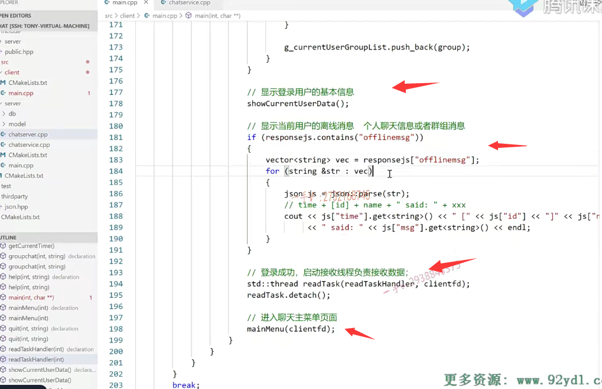


### 聊天菜单（发送线程）和接收线程都需要clientfd 都需要去读数据

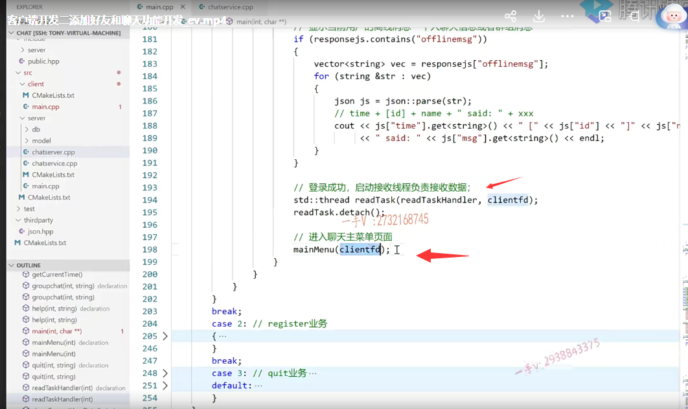


### readTaskHandler()实现 接收线程操作

接收ChatServer转发的数据，反序列化生成json数据对象

```C++
// 子线程 - 接收线程
void readTaskHandler(int clientfd)
{
    for (;;)
    {
        char buffer[1024] = {0};
        int len = recv(clientfd, buffer, 1024, 0);  // 阻塞了
        if (-1 == len || 0 == len)
        {
            close(clientfd);
            exit(-1);
        }

        // 接收ChatServer转发的数据，反序列化生成json数据对象
        json js = json::parse(buffer);
        int msgtype = js["msgid"].get<int>();
        if (ONE_CHAT_MSG == msgtype)
        {
            cout << js["time"].get<string>() << " [" << js["id"] << "]" << js["name"].get<string>()
                 << " said: " << js["msg"].get<string>() << endl;
            continue;
        }

        if (GROUP_CHAT_MSG == msgtype)
        {
            cout << "群消息[" << js["groupid"] << "]:" << js["time"].get<string>() << " [" << js["id"] << "]" << js["name"].get<string>()
                 << " said: " << js["msg"].get<string>() << endl;
            continue;
        }
    }
}
```


## 主线程进入mainMenu

### 提供系统所支持的客户端命令，commandHanderMap  存函数对象类型

进入Menu会给用户显示一下系统所支持的命令，根据用户所输入的用户进行相应的业务的处理。

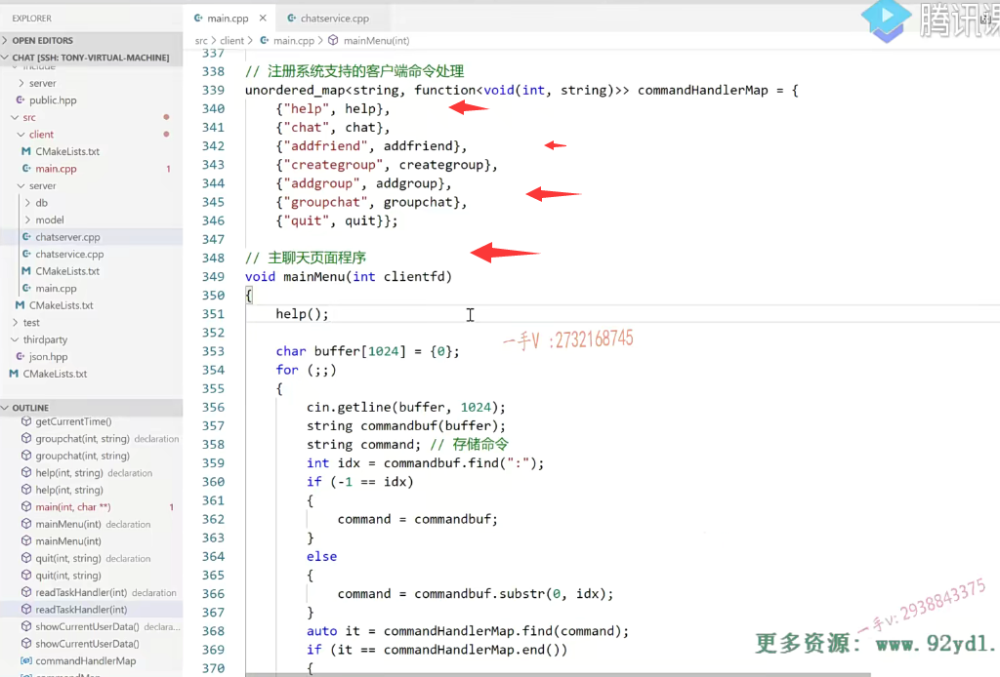


### 系统支持的客户端命令列表 help查询显示commandMap

==help查询命令含义，这里面会提供命令格式==

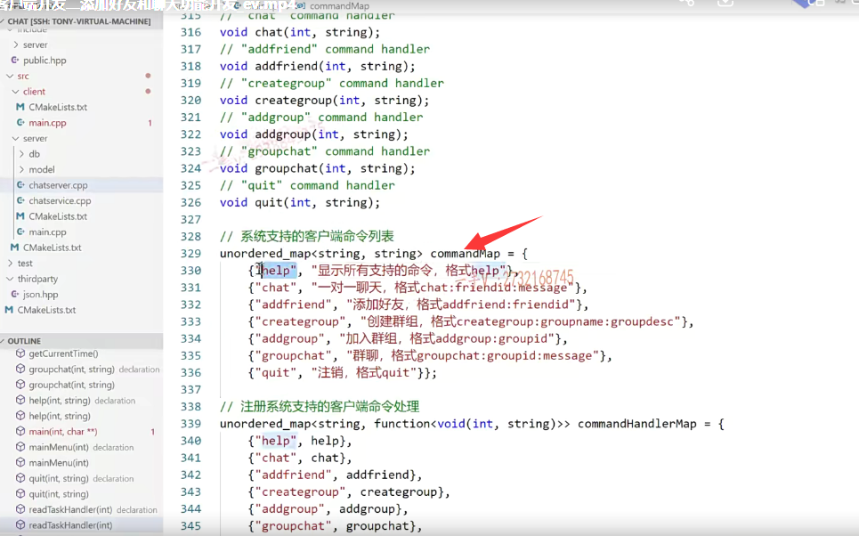


```C++
// "help" command handler
void help(int fd = 0, string str = "");
// "chat" command handler
void chat(int, string);
// "addfriend" command handler
void addfriend(int, string);
// "creategroup" command handler
void creategroup(int, string);
// "addgroup" command handler
void addgroup(int, string);
// "groupchat" command handler
void groupchat(int, string);
// "loginout" command handler
void loginout(int, string);

// 系统支持的客户端命令列表
unordered_map<string, string> commandMap = {
    {"help", "显示所有支持的命令，格式help"},
    {"chat", "一对一聊天，格式chat:friendid:message"},
    {"addfriend", "添加好友，格式addfriend:friendid"},
    {"creategroup", "创建群组，格式creategroup:groupname:groupdesc"},
    {"addgroup", "加入群组，格式addgroup:groupid"},
    {"groupchat", "群聊，格式groupchat:groupid:message"},
    {"loginout", "注销，格式loginout"}};

// 注册系统支持的客户端命令处理
unordered_map<string, function<void(int, string)>> commandHandlerMap = {
    {"help", help},
    {"chat", chat},
    {"addfriend", addfriend},
    {"creategroup", creategroup},
    {"addgroup", addgroup},
    {"groupchat", groupchat},
    {"loginout", loginout}};
```


### 主要是判断命令是否存在 并且后续需要增加命令就在map中加

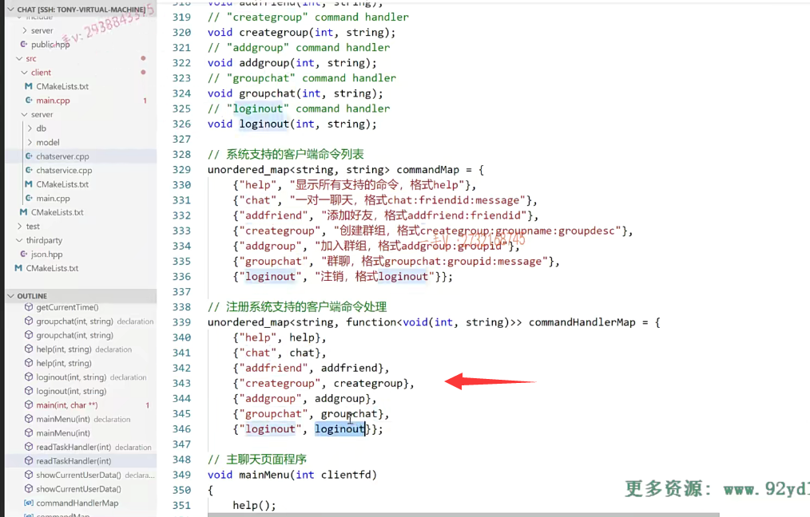


### 命令参数说明 int string  int是clientfd string是用户输入字符串

第一个int 是指clientfd

第二个int是指userid，string指的是用户的输入数据

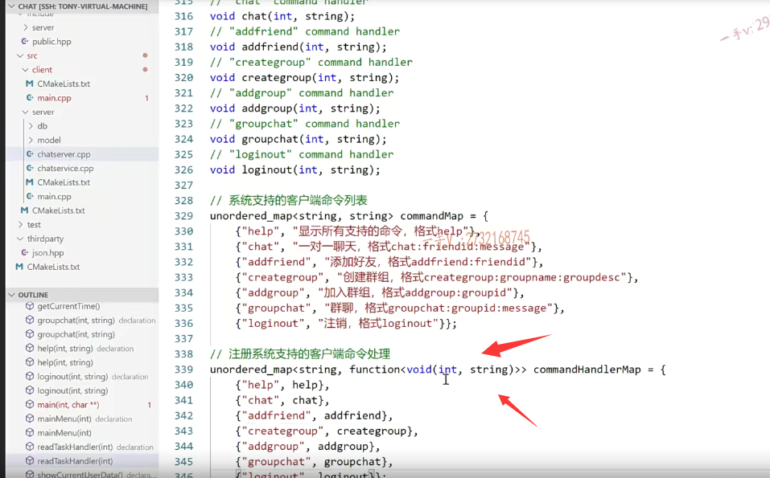

## mainMenu()实现

```C++
// 主聊天页面程序
void mainMenu(int clientfd)
{
    help();

    char buffer[1024] = {0};
    while (isMainMenuRunning)
    {
        cin.getline(buffer, 1024);
        string commandbuf(buffer);
        string command; // 存储命令
        int idx = commandbuf.find(":");
        if (-1 == idx)
        {
            command = commandbuf;
        }
        else
        {
            command = commandbuf.substr(0, idx);
        }
        auto it = commandHandlerMap.find(command);
        if (it == commandHandlerMap.end())
        {
            cerr << "invalid input command!" << endl;
            continue;
        }

        // 调用相应命令的事件处理回调，mainMenu对修改封闭，添加新功能不需要修改该函数
        it->second(clientfd, commandbuf.substr(idx + 1, commandbuf.size() - idx)); // 调用命令处理方法
    }
}
```


### help()展示命令信息


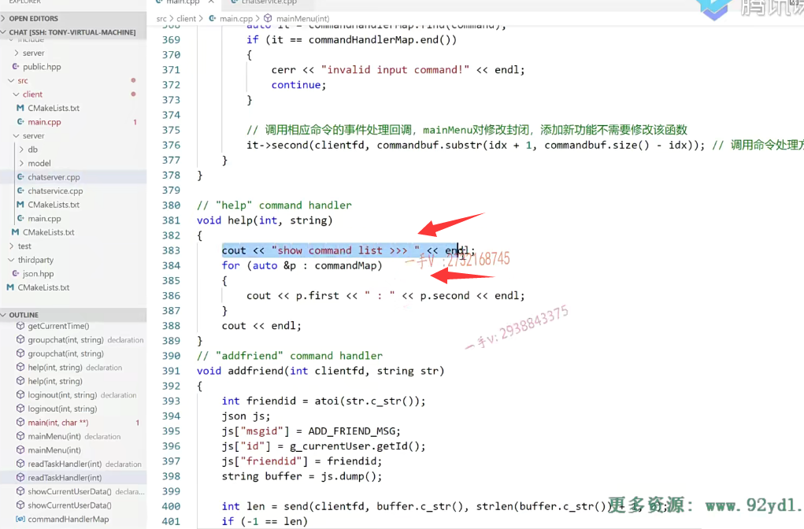

```C++
// "help" command handler
void help(int, string)
{
    cout << "show command list >>> " << endl;
    for (auto &p : commandMap)
    {
        cout << p.first << " : " << p.second << endl;
    }
    cout << endl;
}

```


### for循环一直执行


### 先去找命令的冒号

### 通过find函数来找冒号

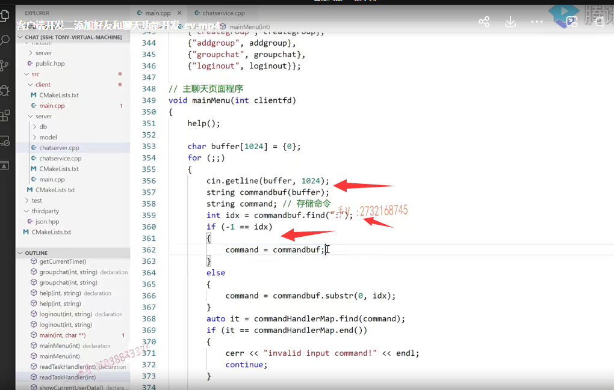

### 当我们找不到返回-1的时候，我们可以给command随便赋值，反正在map找不到，会报错


### 能找到冒号，就用substr()把冒号前面的命令字符串截取出来

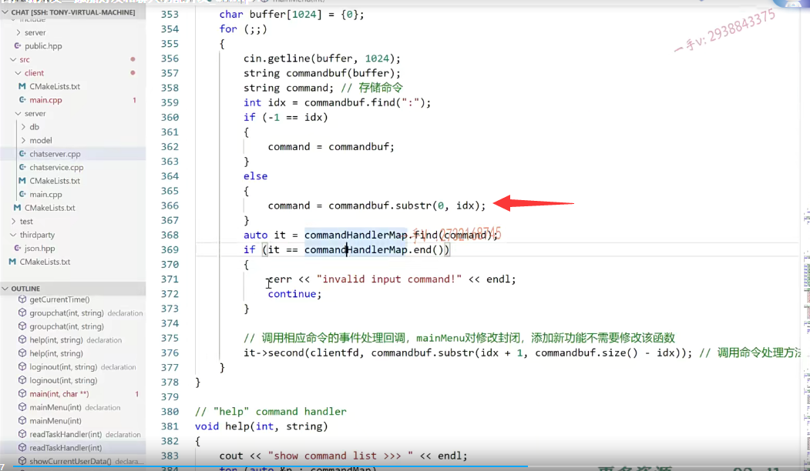


### 然后通过在commandmap中找到我们需要的处理函数it->second，后面再给他传参数 clientfd,消息内容string

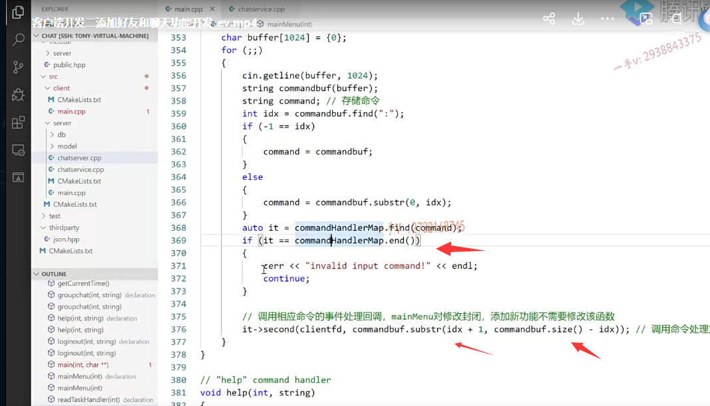


## addfriend()函数实现

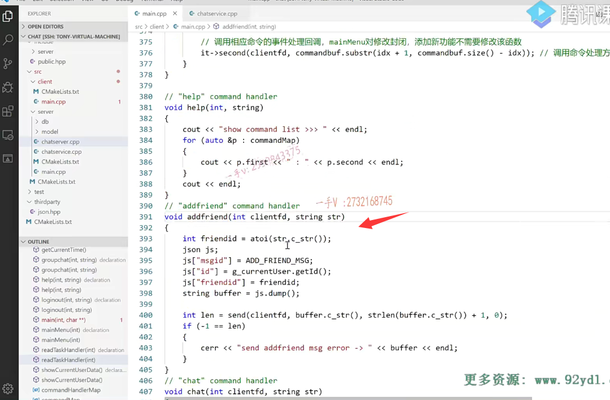

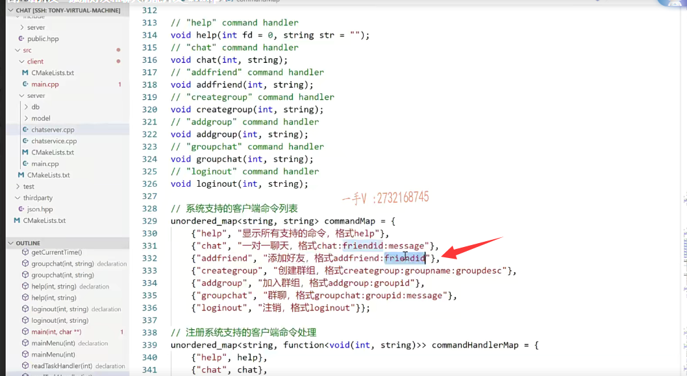

### 根据你的传进来的字符串friendid，合成json对象，发送出去

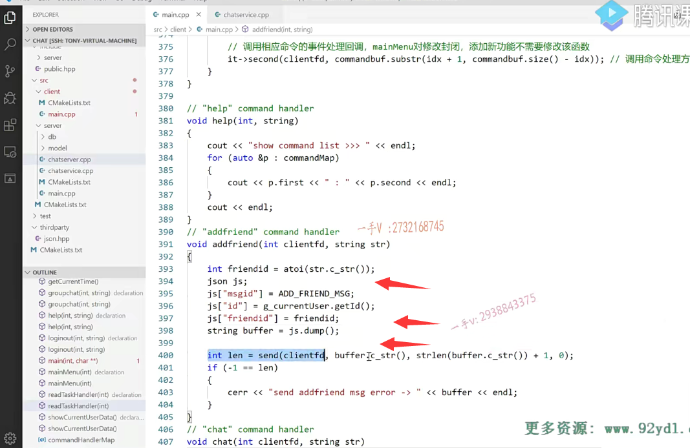

==你看服务端我们之前处理的这个add friend是不是就接收到一个ID==

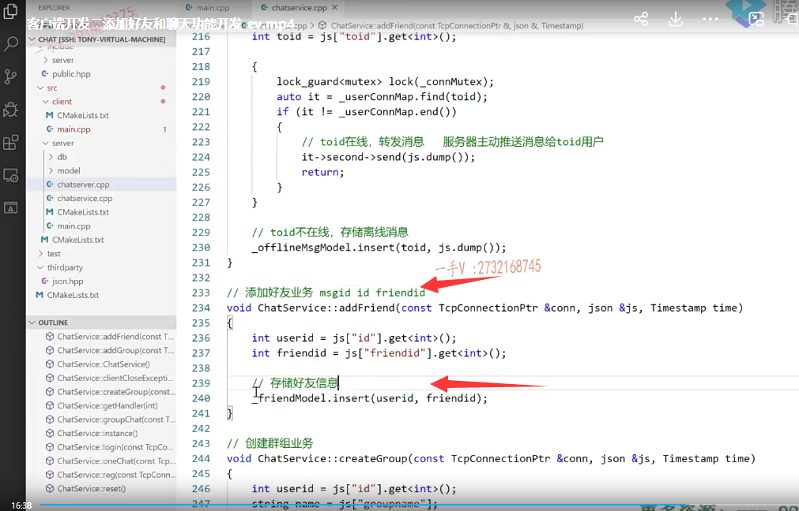


```C++
// "addfriend" command handler
void addfriend(int clientfd, string str)
{
    int friendid = atoi(str.c_str());
    json js;
    js["msgid"] = ADD_FRIEND_MSG;
    js["id"] = g_currentUser.getId();
    js["friendid"] = friendid;
    string buffer = js.dump();

    int len = send(clientfd, buffer.c_str(), strlen(buffer.c_str()) + 1, 0);
    if (-1 == len)
    {
        cerr << "send addfriend msg error -> " << buffer << endl;
    }
}
```


## chat()功能实现

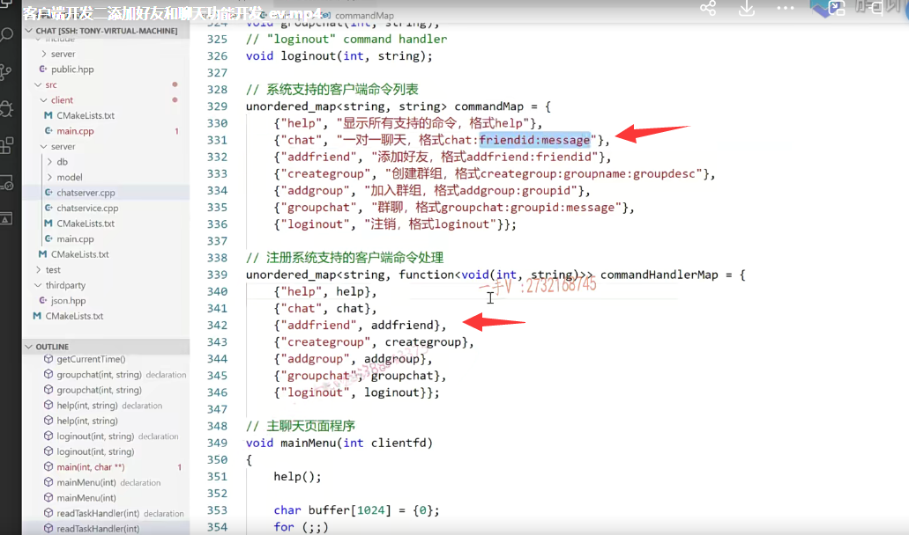

### 拿到的数据字符串中还需要找冒号，分别是friendid和消息内容

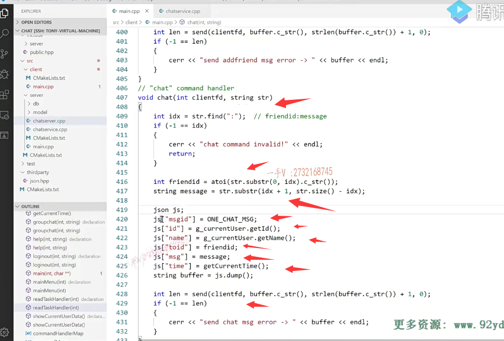

### 服务端也是接收，然后找到用户发送过去，就是分在线和不在线两种处理方式

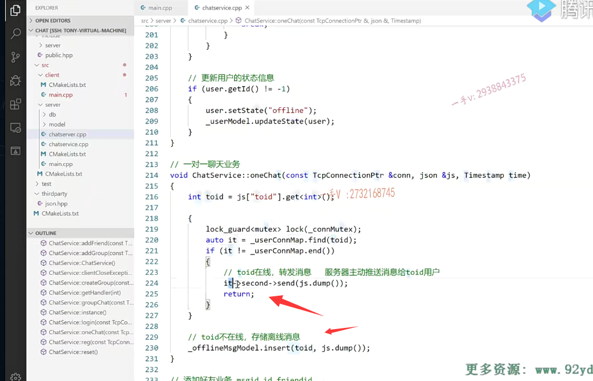


```C++
// "chat" command handler
void chat(int clientfd, string str)
{
    int idx = str.find(":"); // friendid:message
    if (-1 == idx)
    {
        cerr << "chat command invalid!" << endl;
        return;
    }

    int friendid = atoi(str.substr(0, idx).c_str());
    string message = str.substr(idx + 1, str.size() - idx);

    json js;
    js["msgid"] = ONE_CHAT_MSG;
    js["id"] = g_currentUser.getId();
    js["name"] = g_currentUser.getName();
    js["toid"] = friendid;
    js["msg"] = message;
    js["time"] = getCurrentTime();
    string buffer = js.dump();

    int len = send(clientfd, buffer.c_str(), strlen(buffer.c_str()) + 1, 0);
    if (-1 == len)
    {
        cerr << "send chat msg error -> " << buffer << endl;
    }
}
```


## 其他业务逻辑（待写）

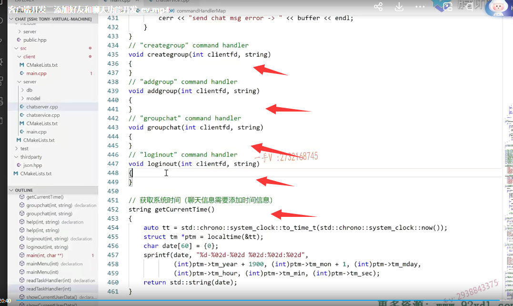


## 编译

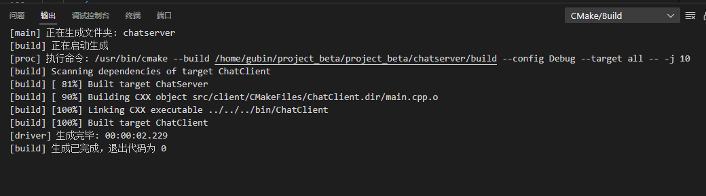


# 测试

### 测试chat help addfriend功能

### 测试help