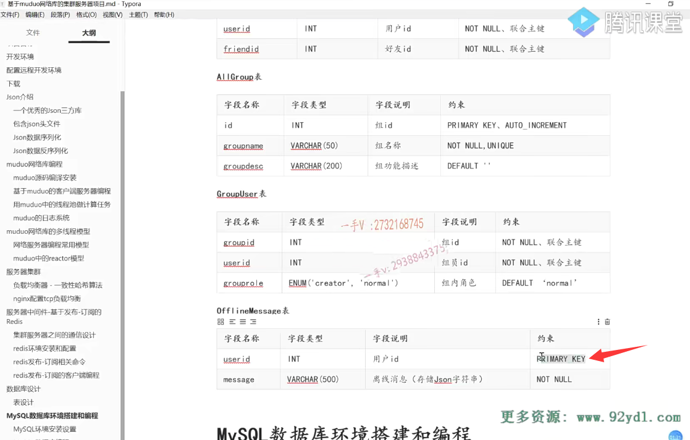
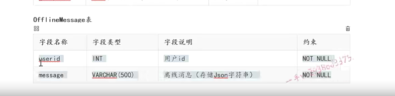
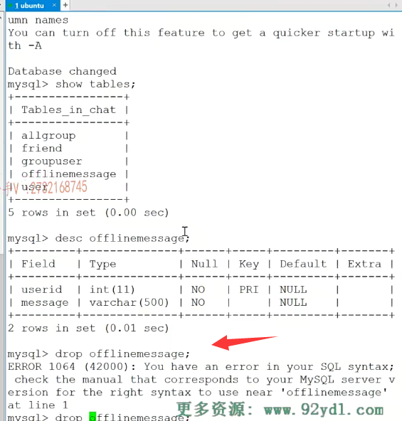
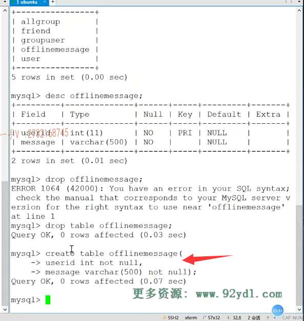
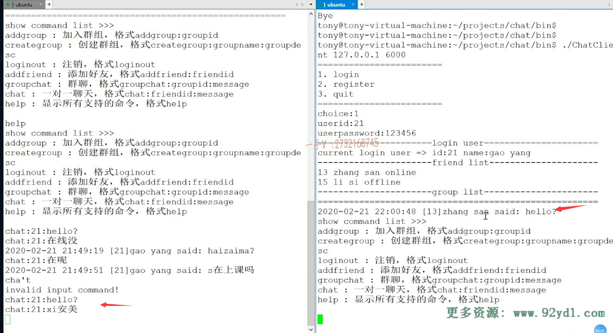
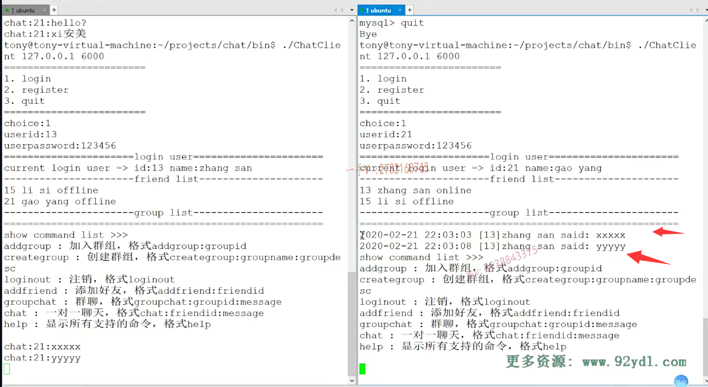

# 离线消息错误问题

### 发送了2条离线消息，但是只显示了第一个

### 错误原因：user ID给人家设计成primary key了

### 将表userid设置为not null

为什么因为离线消息某一个人可能会收着很多很多的，是不是离线消息啊？

你要是把user ID设置成主键。那也就是说，在这张表中user ID只能出现一次。好的吧，

所以这是我们在表设计上的一个问题，

在这给大家更正一下OK吧，在这我们直接把它设置成not none就行了。

### 修改一下    直接删除原来的表

### 重新创建表

完了以后重新创建一下create table offline message.

第一个是user ID对吧啊，整型not none就可以了。

第二个是一个message vr叉。500。

然后也是一个什么note nine.

就行了啊，就行了。

### 再来测试  发现还是同样的错误

### 查看一下数据库的建造过程

### 重新启动服务器，读取正确了，应该是可能读到的还是表之前的状态

