# 群组相关业务

## createGroup()创建群组业务

### 先看一看服务端的解析业务

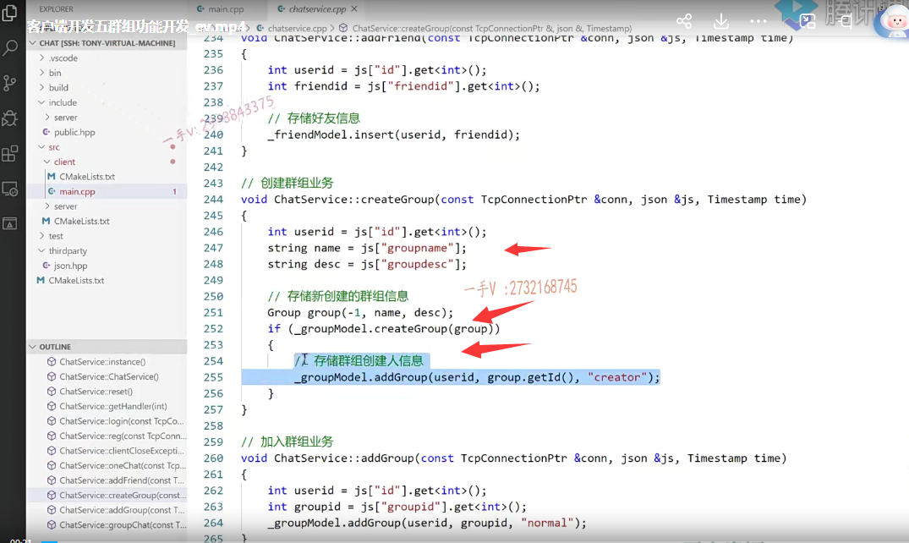

### 先找冒号 然后拆分

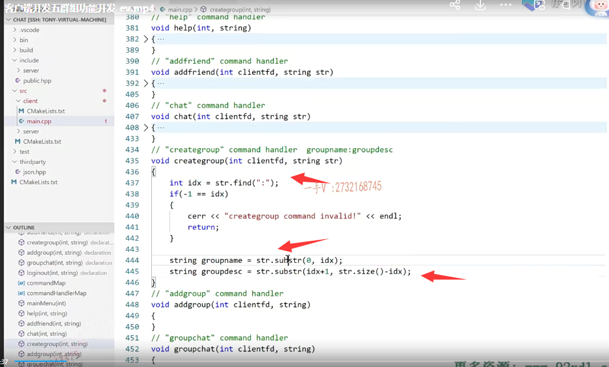

### 生成json对象，转化成字符串，发送出去

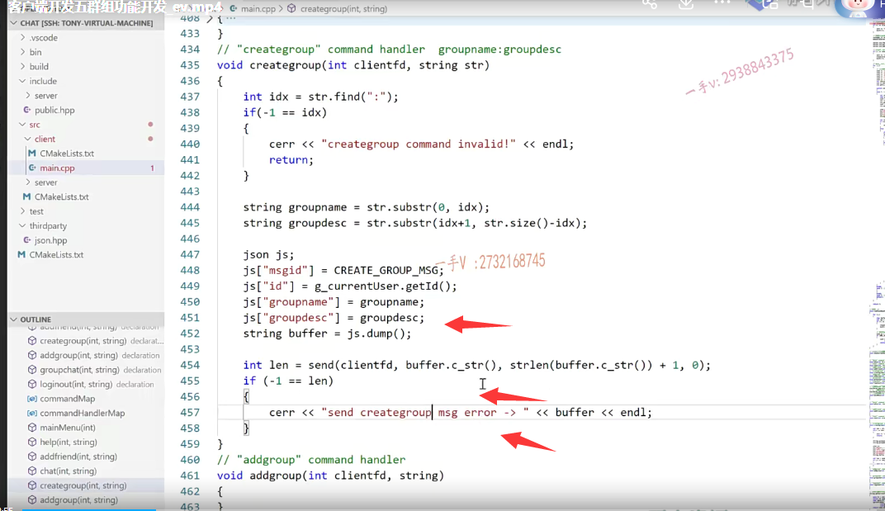


## 创建群add group

### 看一下addgroup服务器端解析

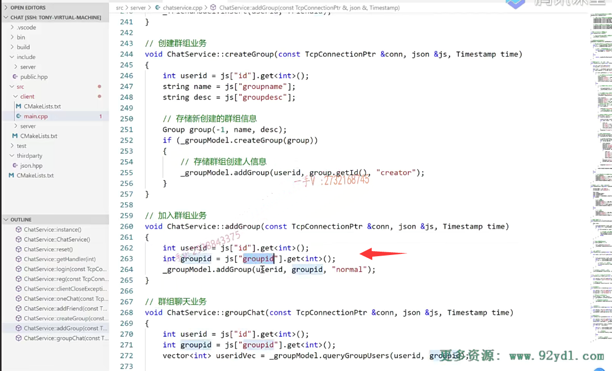


add group的这个命令

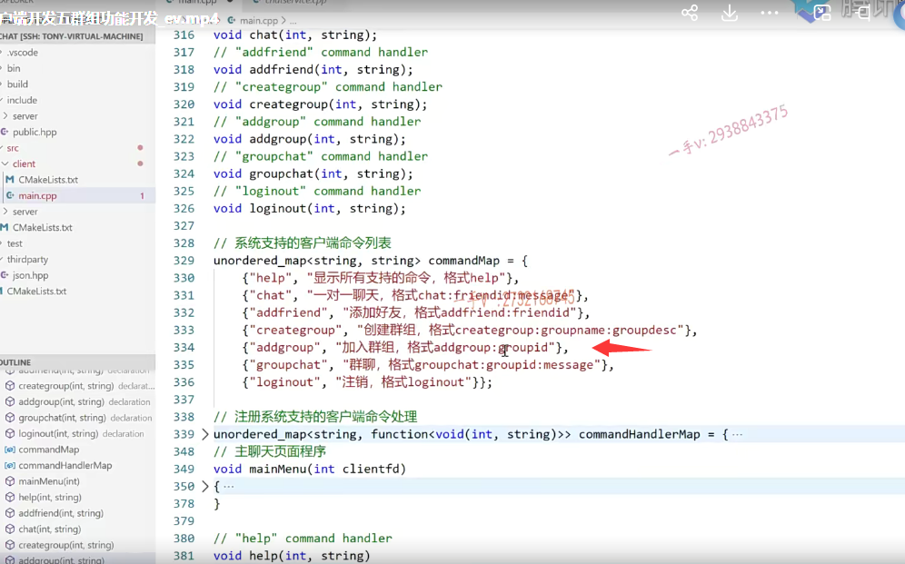


### 得到群号，然后组装json字符串，发送出去，注意我们客户端这里的userid都是获取全局变量的userid

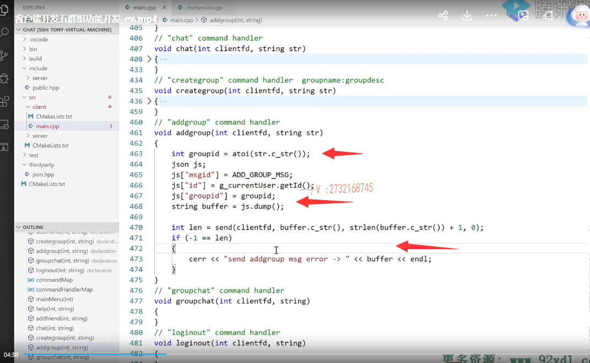


```C++
// "creategroup" command handler  groupname:groupdesc
void creategroup(int clientfd, string str)
{
    int idx = str.find(":");
    if (-1 == idx)
    {
        cerr << "creategroup command invalid!" << endl;
        return;
    }

    string groupname = str.substr(0, idx);
    string groupdesc = str.substr(idx + 1, str.size() - idx);

    json js;
    js["msgid"] = CREATE_GROUP_MSG;
    js["id"] = g_currentUser.getId();
    js["groupname"] = groupname;
    js["groupdesc"] = groupdesc;
    string buffer = js.dump();

    int len = send(clientfd, buffer.c_str(), strlen(buffer.c_str()) + 1, 0);
    if (-1 == len)
    {
        cerr << "send creategroup msg error -> " << buffer << endl;
    }
}
```


## group群聊实现

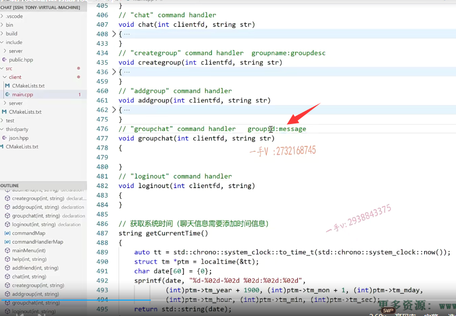

### 找到命令，拆分命令

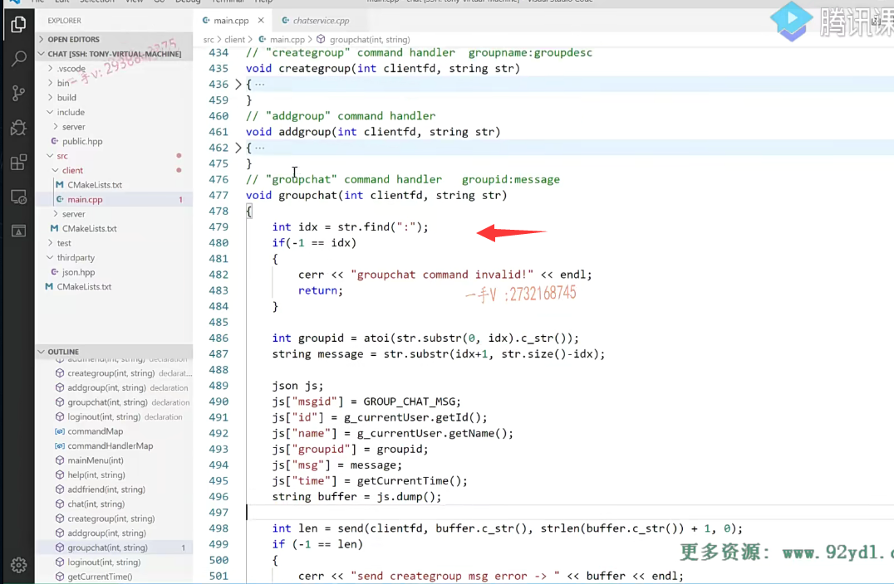

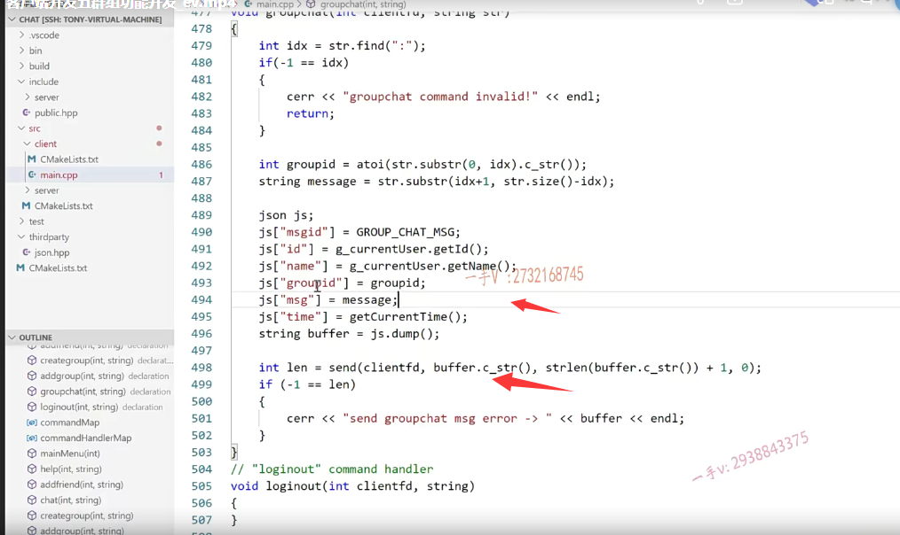


## 接收线程处理

### 接收到群组消息，打印到屏幕上

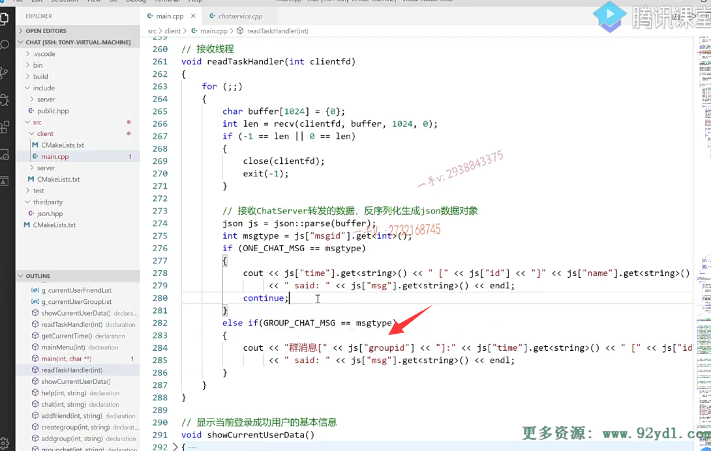


### 之前登录时只显示个人离线消息，现在增加群组消息

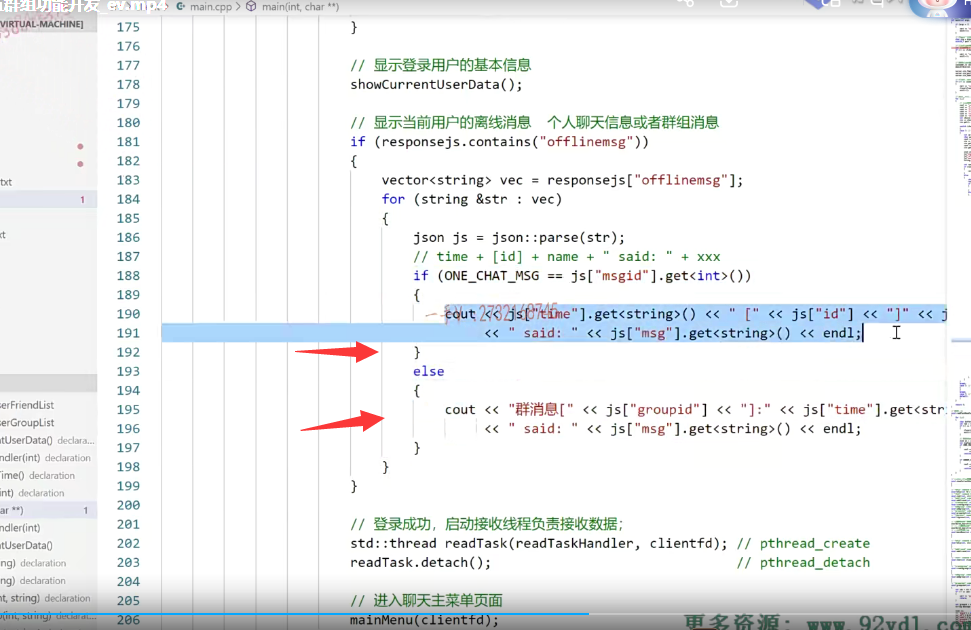


### 然后就是之前说的，在线的时候接收消息  接收线程来处理 也要区分个人和群组

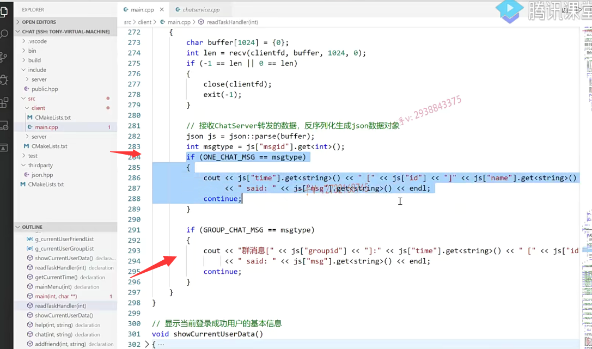


### 可以自己去扩展，比如说好友上线，给个通知


## 编译

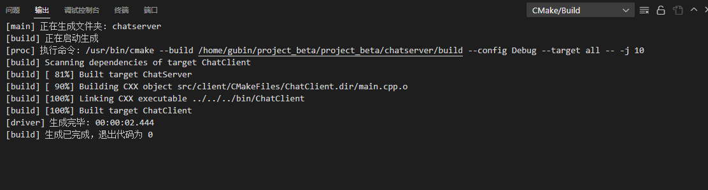

## 测试

