## 注销业务

正常的注销跟我们之前异常的这个退出啊，异常的退出呢，我们说是直接ctrl c了。是不是啊？

那实际上我们现在做的事情就是一个正常的退出，就我要发一个正常的消息告诉你，我要下线了啊。

然后呢，你就可以根据我收到的消息呢嗯，把相应的这个数据呢啊修改一下。

比如说根据我的这个ID，把我的这个连接呢，从你的这个connection map里边是不是删除一下啊？

然后呢，就是更新一下用户的状态信息。

因为我已经login out了嘛，注销了，把我表里边这个online改成offline，

就实际上跟这个closed exception一样。只不过发正常的退出消息呢，

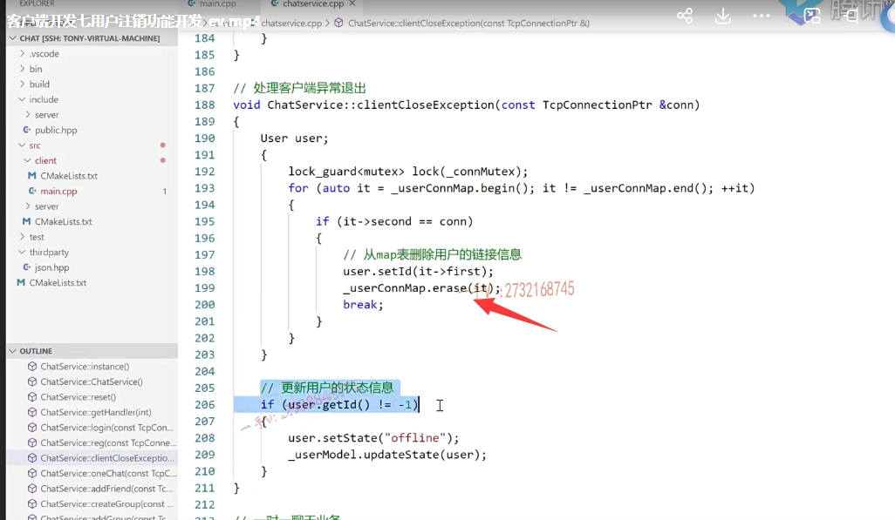

### 如果异常退出，我不知道那个用户，所以只能通过比对map中连接来找到用户id

人家是有一个ID发过来的，而不像这里边儿异常退出，也不知道谁异常退出了，就是网络层出了问题啊。

那么，这里边只拿到了这个发生异常的这个connection，那然后我只能在这里边做connection的这个对比。啊，通过比对connection是否相等来删除它？

### 如果正常退出，人家会发一个消息的，会有用户id

啊，如果正常退出的话，我就可以拿到用户的ID，

然后直接就在这个表里边儿，就找着这个用户对应的connection，直接删除它就可以了。

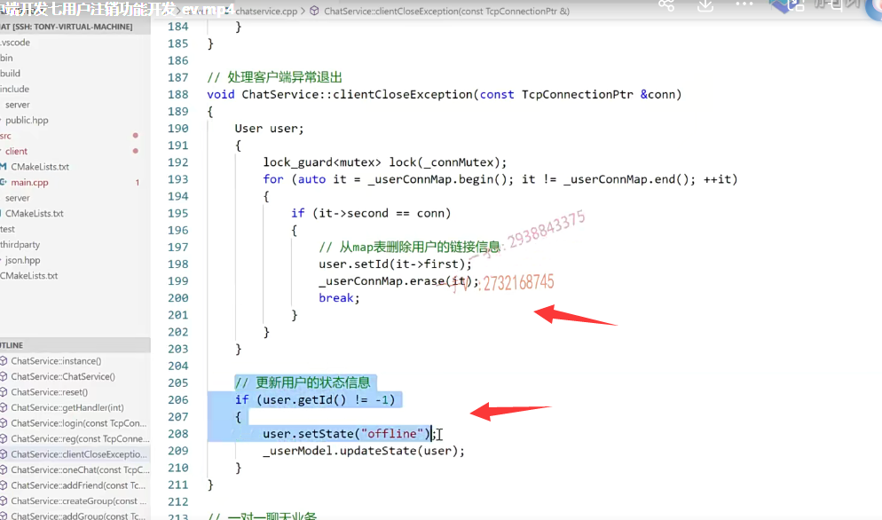

### 注册一个 注销消息 

好，那么在这里边呢？我们首先在public点hpp里边需要添加一个消息啊啊，这个消息就是login out.message.好吧，这是一个注销消息啊，

注销消息我们不如把注销消息直接填到登录啊，这个相当于登出嘛，注销是不是啊？跟登录放一块儿。

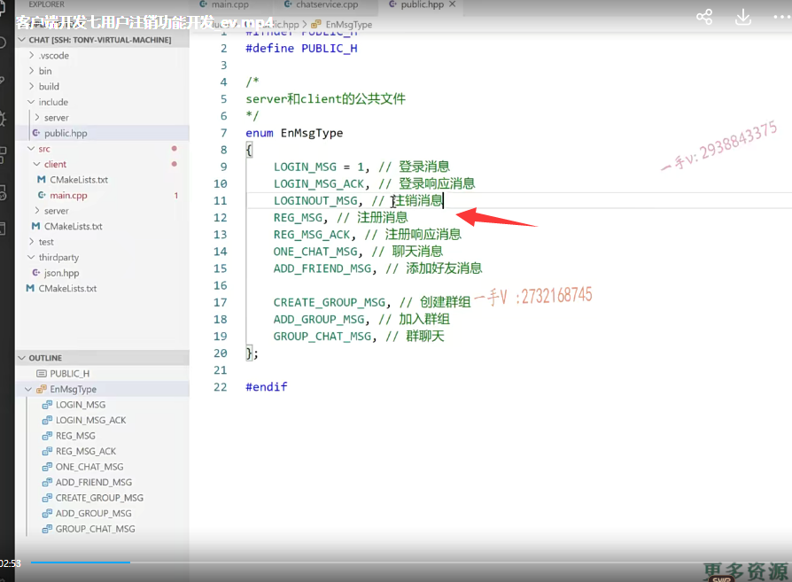

### 客户端的用户注销实现 发送消息类型和用户id

那么，大家来看，

在客户端这里边。

首先这个注销的话，命令就直接是login out啊，所以在这儿直接组织什么就行了。

直接组织这个json字符串就可以了啊。

我们把这块的代码拷贝一下，贴到log out这里边来。嗯。

首先呢，在这儿我直接组织这个json字符串了message ID，是一个login out message.

好吧ID就是我当前用户要登出了好，这个没有了。

那就是只是带一个消息ID跟一个当前要注销的这个用户的ID啊。spend login out message error啊，

返回值如果是负一的话，这个相当于就是把正常的登出消息呢。

## 服务器的注销服务实现

### loginout声明

又发送到服务端了是吧啊？那服务端在这里边进行true理，所以服务端的代码呢？

我们也需要进行一个相应的修改。

首先呢，在这我们就得先给它添加一个什么啦，添加了一个专门true理啊，登出的是不是业务的一个事件true理器啊true理这个true理注销业务啊

void。就是login。out这么一个业务。

然后呢？网络层派发业务都需要给你传递三个参数的，是不是啊？

### 在构造函数中和消息类型绑定

然后相对来说呢，我在这个构造函数这里首先要注册你。首先要注册，你写到这儿吧message handler message点insert啊。就是login out messages TD and。chat service.loge n out对吧？this杠一杠二杠三。好嘞，

这个就写好了，把这个消息跟这个事件true理器是不是绑定了？

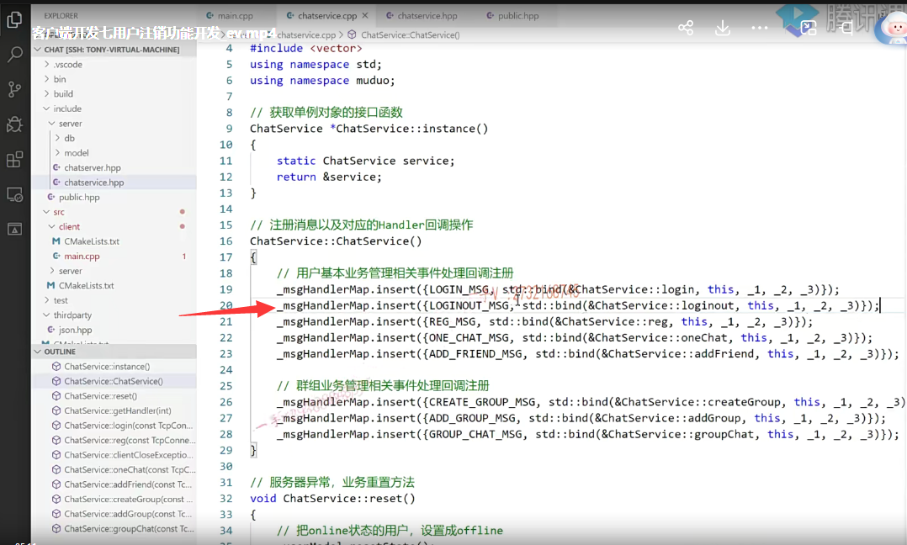

### 得到用户id,然后遍历连接map,找到连接，删除

然后呢？我们就在这来实现一下这个。

不如我们把这个直接实现到之前的异常true理。plant close exception这里。

这因为这两个是true理方法，还是比较相似的啊。

首先呢，在这呃，它可以拿到，是不是用户的ID呀诶？用户的就是user ID=gs。ID点get。

拿到这个ID以后呢，就find一下啊。

这个肯定是能算得出来的，对吧啊？那你要算的这个要操作这个什么啦？connection map的需要。进行一个是不是加锁操作啊？

就保证线成互斥

。好在这儿呢，我们再来看啊，这个需要把类的作用域呢，要加上。

然后是auto=user connection map点find谁呀？find user ID啊，那it如果不等于。

杠user map那在这里边呢？杠user map就怎么样啊？erase把它删掉了。是不是啊？就删掉了。

在这里边，大家来看一看。删掉了以后啊，不等于这个的end末尾的迭代器是不是啊？

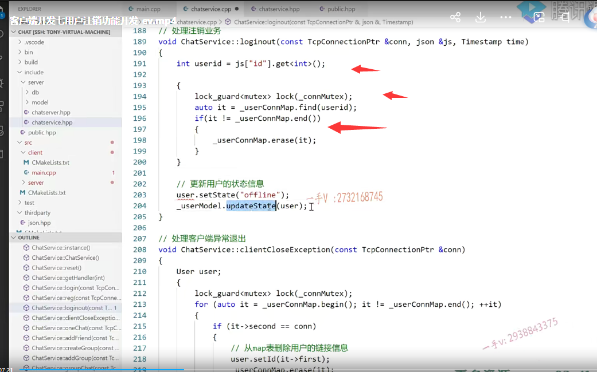

### 更新用户的状态信息，之前是会得到用户，然后设置。现在我们直接构造用户设置

这删完了以后呢？在这儿也是一样的，要更新一下用户的什么状态信息啊？

这个就是user ID。这个就不用判断了，这肯定是一个合法的用户，对吧？

呃。这个upstate upstate要更新谁呀？要更新是不是用户的一个状态信息呀？

对，主要是拿它的这个ID更新，它的状态也就是我们它需要一个user对象。

主要是把ID给它填好，是不是就可以了？

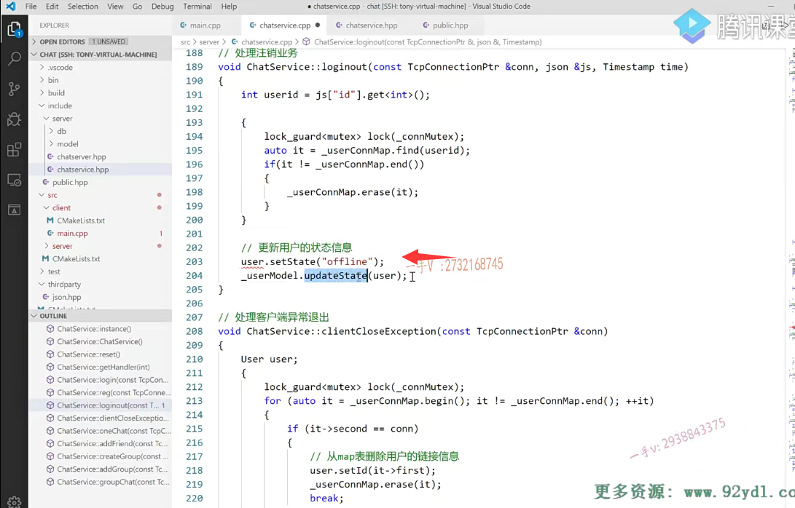

对，所以在这呢，你看一下啊，就是那个user。

user看一下它的这个构造函数。ID name password跟谁跟state，所以中间这两个实际上用空就可以了啊，

第一个是user ID第二，这都不重要，因为name跟password没用上啊，然后这是个offline。

OK，这个就把user ID这个用户的这个状态呀，更新成这个offline也把它从这个connection map里边呢删掉了，加这个括号是为了缩小线程互斥的就是临界区代码段的范围对吧啊？

要不然呢，这个是出右括号才会释放这把锁的，这里并不需要做这个线程互斥啊。

## ==客户端这里没有处理好，loginout没有回到首页面==

但是我们客户端这块儿的这个业务还没有处理好，没有回到首页面啊？

当然了，来，我们要修改一下客户端相关的这个代码。

### 原因是之前我们聊天业务菜单里面是死循环

在这儿呢，大家来看一下啊，

因为当时呢，我们是这样实现的啊，登录成功以后。

大家来看，登录成功以后啊，我们是直接进入了main menu，

main menu里边是不是又进行了一个for的死循环啊？

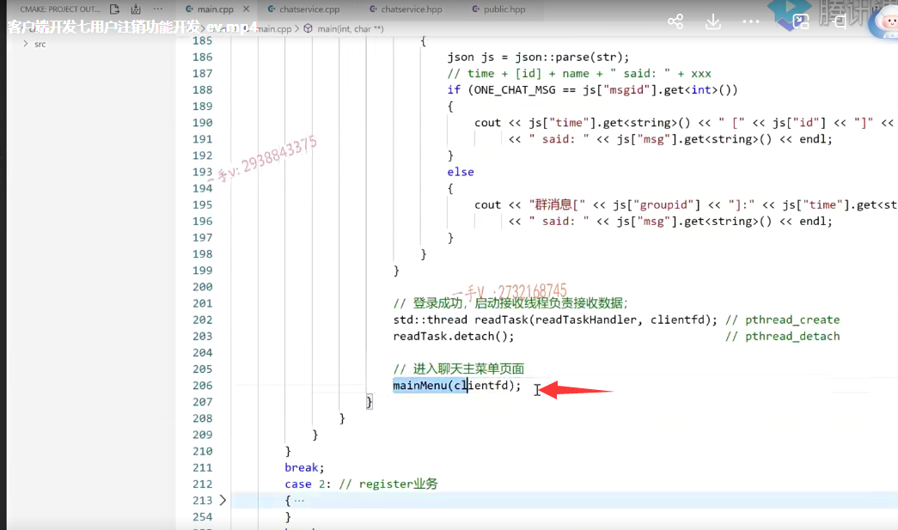

### 我们使用全局变量来控制

相当于就是这儿就一直一直循环到这个函数里边儿了，根本就嗯出不来，

所以没有办法到这个首页面好吧。

看这个main menu。是不是啊？

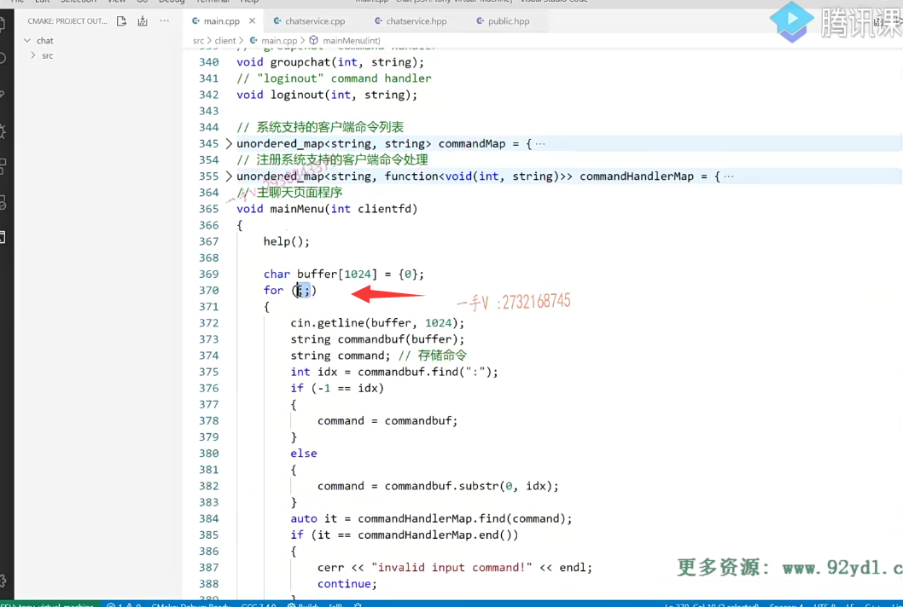

所以在这里边不要通过死循环了，我们得通过一个全局的一个变量来控制啊，

当这个什么登录成功以后呢，我们就把这个设置成true。

当我们注销的时候，就把这个设置成false，它就不会再进来了，它就退出了，

这儿退出以后呢？main menu就退出了，main menu退出以后呢？

那这块儿是不是继续向下运行，就跑到我的什么页面来了？首页面来了。

对的吧啊，这个也是很明显的啊，所以在这我们添加一个全局变量。

这个是一个控制聊天页面程序的啊布尔值。嗯。就是is me menu running。

刚开始的话呢，给它写成一个FALSE嘛。对不对？

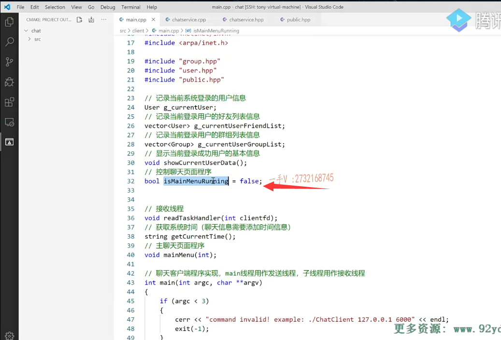

就主菜单页面是否正在进行控制呢？应该是主菜单页面程序。

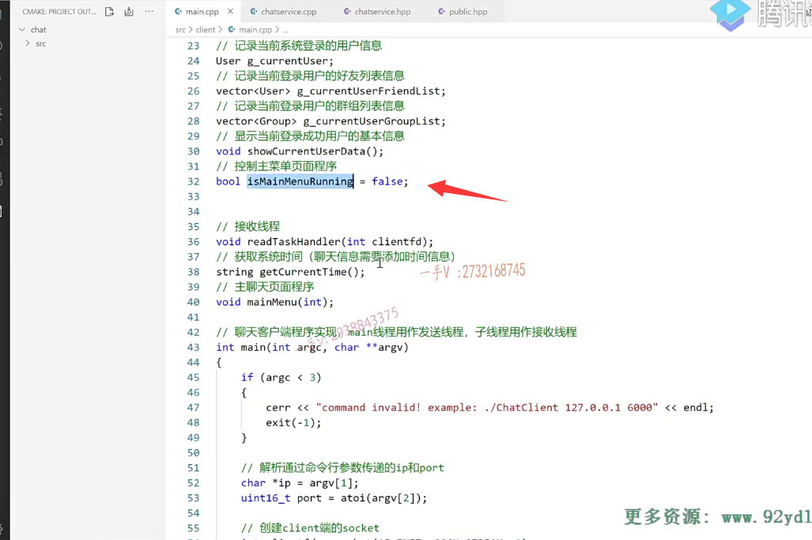

这块儿呢，什么时候制成true啊？

就在这儿登录成功了。是不是制成true啊？

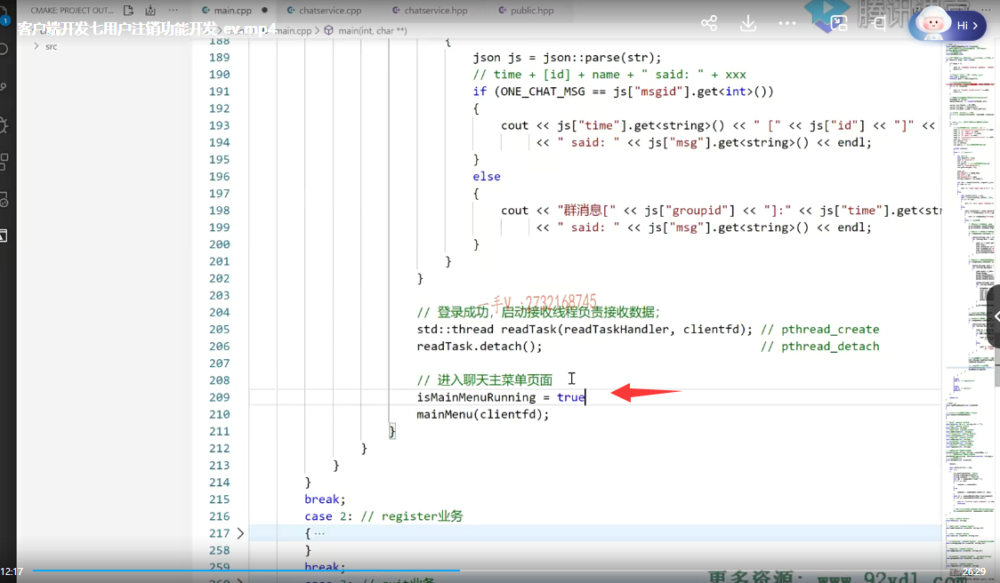

制成true以后呢，就用这个来判断。没问题吧啊，那这就写成一个while来判断它一直是true的。

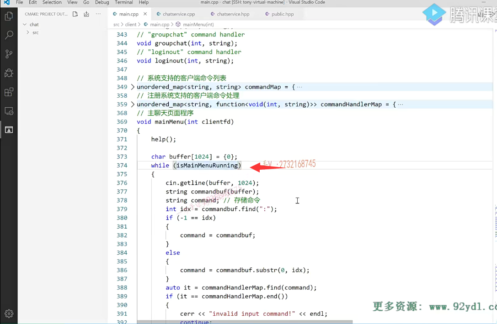

那登出的时候呢？注销了以后啊，这发送完消息以后呢？

在这儿。把它设置成什么FALSE.把它设置成FALSE了，

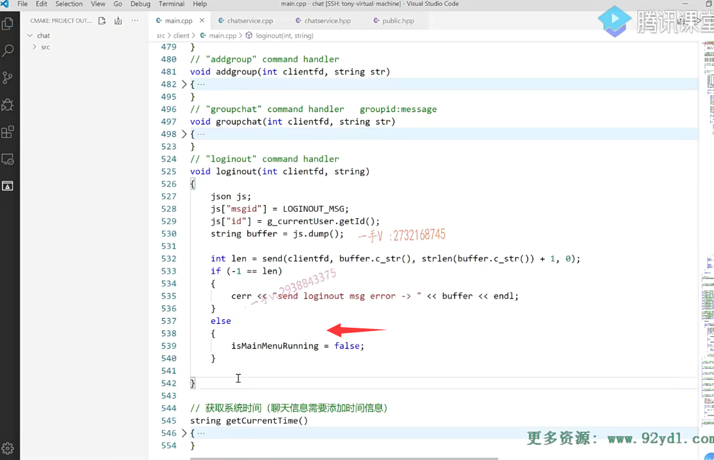

以后呢，我们main menu这块儿呢，就不再进行while循环了，就退出了，是不是啊？

就又回到这个首页面了。

### 测试是否实现退出到首页面

好，那我们重新的去编译一下。编译，完成运行服务器程序这块儿呢？

在运行这个客户端程序一二十一一二三四五六。

然后是一个login out，大家来看是不是又回到这个首页面了，

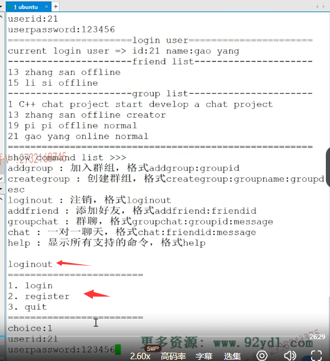

### 可以再次登录

按理说如果修改成功的话呢？呃，

那在这儿的话，我就应该是又能登录了，不会说是它还是一个online状态，对吧？

二十一一二三四五六。

没有问题的。好的吧啊，这块是没有问题，

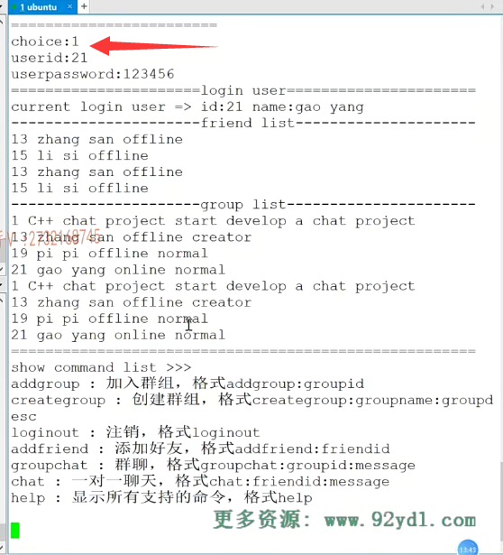

### 错误：我们发现群组列表拉了2次

但是呢。我们却发现，这里边儿有这样的一个问题呀。

他把这个群组的消息。好像是不是拉了两遍进来了？之前都是一个是吧？

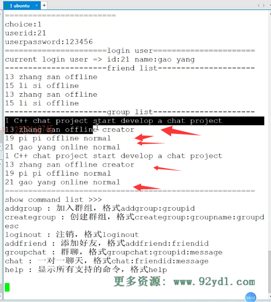

哦。那这个也是一个客户端，很明显的一个错误，

所以这个业务比较多，每一个业务就要进行详细的一个功能验证呢啊，功能验证。

这是什么意思呢？大家来看啊。我们登出以后，重新去登录的话。我们又会从服务器是不是去拉这些个人的群组信息，好友列表信息呀？

往这个current user friend list放。往这些current user group list里边放，

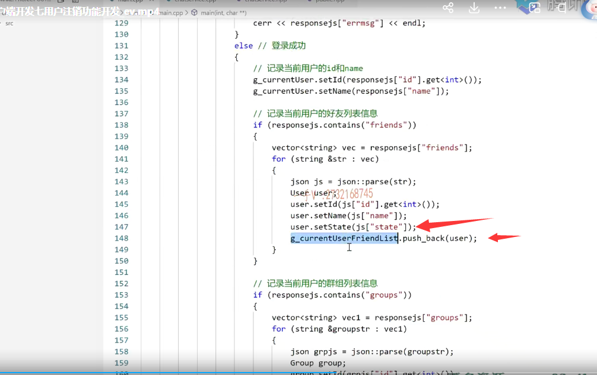

但实际上我们之前登录的时候呢，是不是它都已经放了一回了？

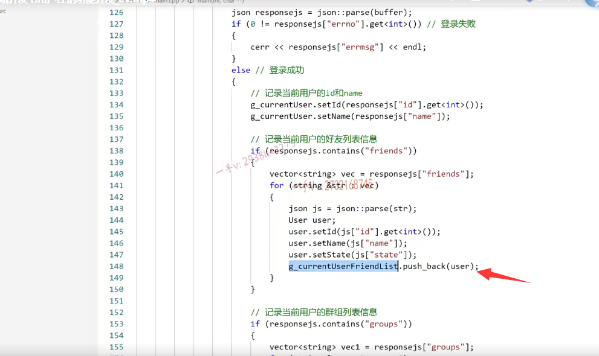

### 虽然是注销，但是程序没有停止，又去往全局vec中又放了聊天列表

当初虽然是注销，但是程序没接触啊，

所以这些全局变量里边原先的这个好友信息群组信息都有。

而你现在再登录一次。是不是相当于从服务器再拉一次，还是往里边继续放啊？

哎，所以呢，这就放了成多份了。看到了吧啊，

### 为了防止vec多份，我们进行vec的初始化

为了防止这样的一个问题啊，我们在这儿。

你看这是如果有好友这个列表信息的话啊，那在这我们先做一个初始化操作。就是先把这个干嘛呀？

先clear掉。然后给它里边进行重新装入对吧啊，因为这是一个新的登录操作嘛。

这也是一个初始化操作。这也算是呢，我们随着业务的增长，在马上的这个逻辑上就会出现一些漏洞，

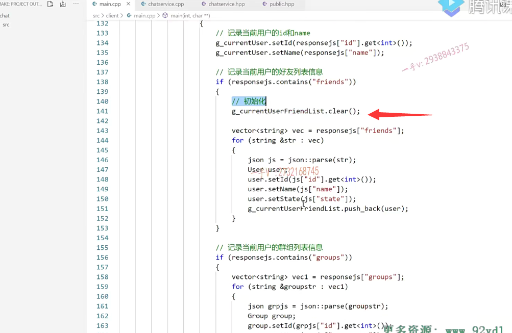

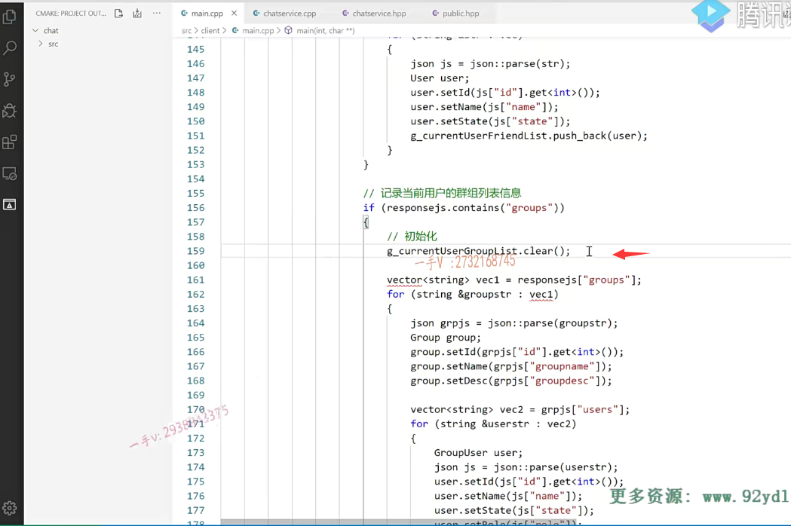

对吧啊？我们需要去修补这些漏洞。

好，那这个应该就是我们所搞定的啊，这块就再也没有了。

因为这个login这块呢，会被多次执行注销了以后，又开始是不是啊？

你看从上往下，我们再仔细检查一下啊。这块没有问题。这是登录成功，那你又以另你可能换了一个账号，登录成功了，

所以这个ID跟name肯定是要重新写的。要往friends里边放，所以这个friends list应该是得先清清理一下，清空一下，

再往群组列表里边放，群组列表得清空一下是不是？

show count user data那相当于就是打印它的好友信息跟列表，这个群组信息这就没什么问题啊。

然后看有没有这个离线消息，因为这里边没有涉及到全局变量。

所以呢，你每一次登录都会拉你这个账号，相关的一些离线消息，这个没有什么问题，

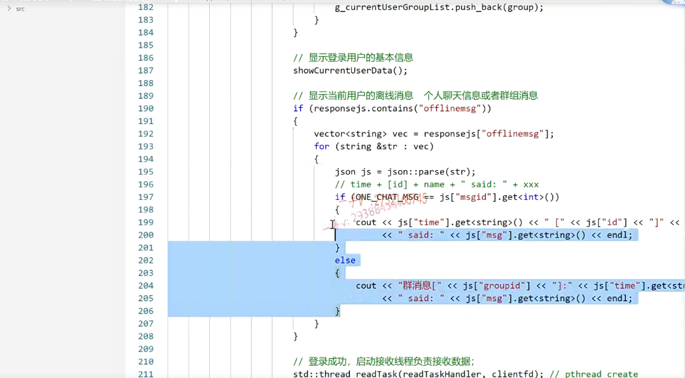

## 这里有问题，登出 再登录 会再起接收线程

但是呢，这块儿就有问题啦。为什么？

因为在这个地方来看一下，当你登出了以后啊，你这个负责接收数据的这个线程。又怎么样啊？

也要结束，要不然呢，你看之前的你第一次登录成功以后，

你这个线程是不是就已经启动了？你是个死循环，又出不去，对吧？

你登出来以后再进行登录，你这个线程是不是又起个线程？还是在做是不是这件事情啊？现在又有两个线程都在这个receive了。这肯定是不允许的啊，

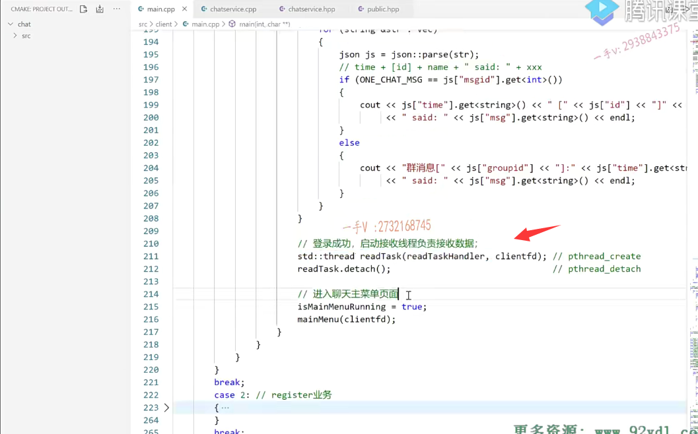

### 继续使用这个isMainMenuRunning来控制一下

所以呢，在这里边我们都用这个变量来控制一下。

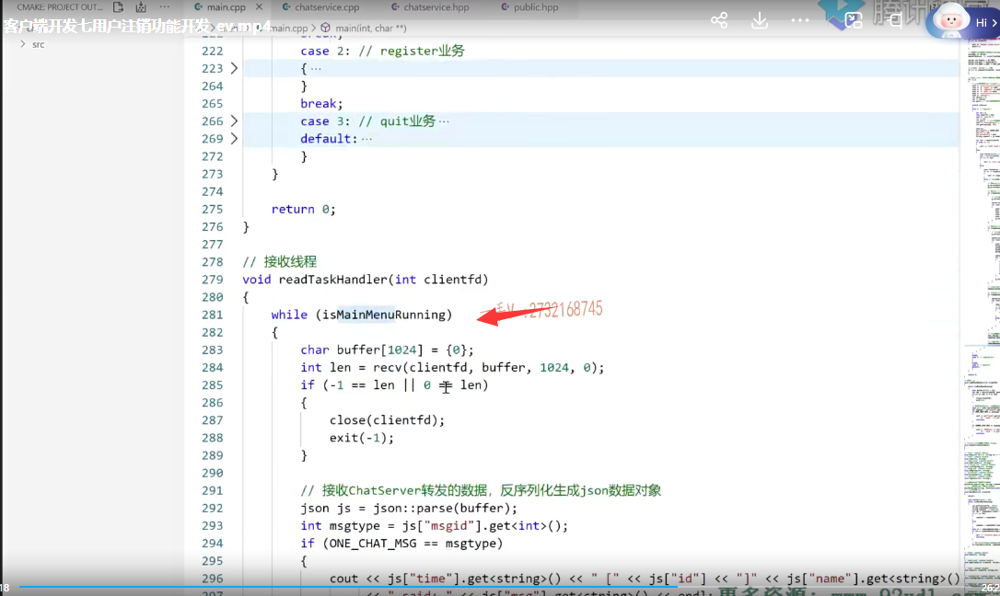

当第一个用户呢，登出了以后啊，当第一个用户登出了以后。

首先，main menu会结束的话，

### 发现这个全局变量没用，还是会阻塞

但是呢，在这里边的问题就是什么？就是这个地方receive会阻塞到这里。

因为第一次它的这个接收线程启动成功了，是不是？

所以呢，也根本没有机会运行到这。它在这里边儿阻塞了嘛，

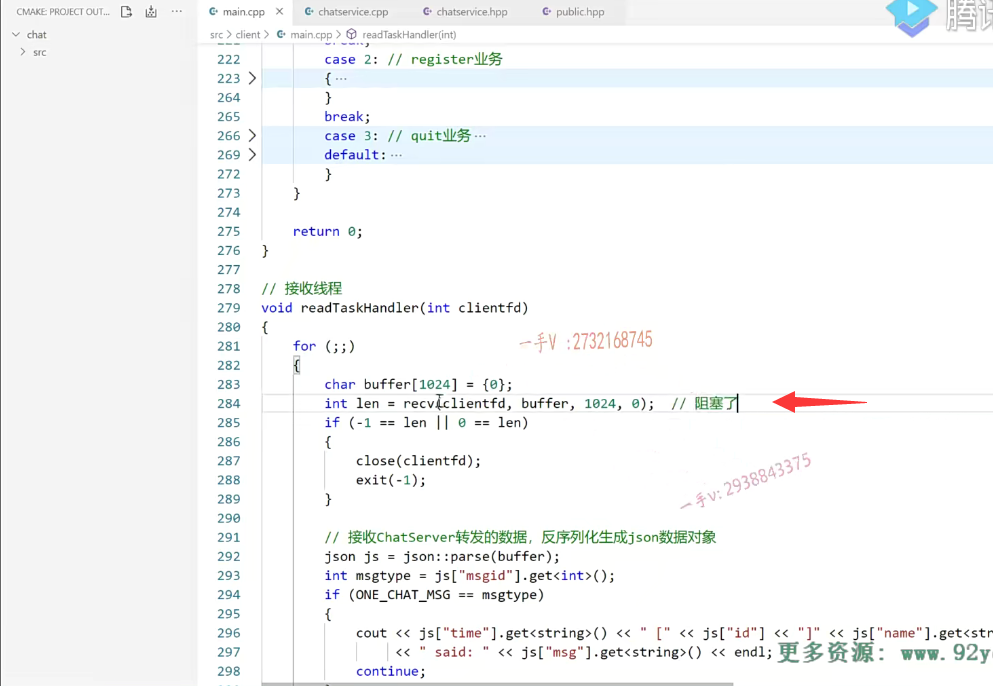

### 所以只能设置这个线程只能启动一次 

你就是当前用户，你登出了。这个线程是不是它也响应不了任何东西呀？

对的吧啊，响应不了任何的东西。

==所以对于这个线程来说，整个只启动一次就可以了。==

==没问题吧啊，该线程只启动一次，不会启动第二次的啊，==

第二次你第一次的用户，你登出了第二次再来一个新的用户的话，只需要改变这个true，进入新的聊天页面就行了。

啊，这块儿呢，不需要做任何这个启动，

### 定义一个局部变量来解决多次创建线程的问题

所以我们在这里边很简单，true理一下，这不是函数的这个局部嘛，对吧？

这里边我定义它的局部变量啊int就是thread number等于零。

那么，如果这个thread number 加加等于零的情况下，我才启动这个线程。

或者说是别每次进来都加了。你看这样的话呢。我这是一个静态的局部变量嘛，数据段呢，是不是啊？

第一次为零的时候呢，它会进来，但加一就成一了。

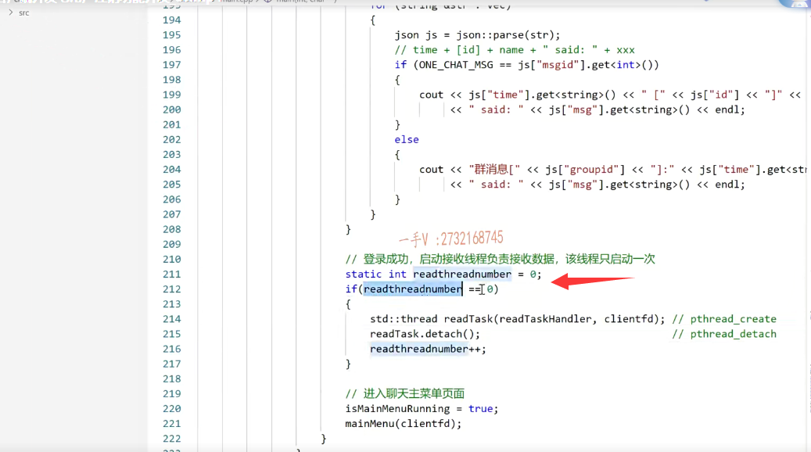

后边再进行一个登录操作的话，这个就不为零了，

不为零它会它是不是就不会再进来了啊？

这块我控制一下thread number。如果是没有开启这个。read thread number的话。

没有开启这个独线程，那开启一下啊，已经不已经它不等于零了，就说明已经开启了，

就不会再开启了，是不是啊？这也是呢。我们要重复进行登录的话呢嗯，

## 再重新编译测试

这里边儿所要涉及的业务，我们必须要考虑的地方啊。

读线程不能取多个。起一个就可以了，

重新编译一下。okay，

这里边呢，把我们的客户端呢，重新编译了啊。这我重新启动一下服务器。

这块儿是一登录二十一一二三四五六。OK，这块是可以的，对吧？

login out。就退出来了，

一二十一一二三四五六，这又登录成功了，

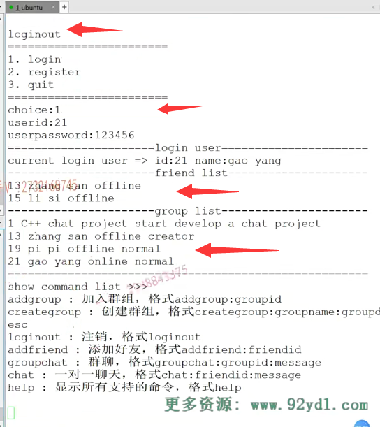

### 测试一下能够正常通信

我们看一下。看能否正常进行一个通信啊？

一幺三。一二三四五六。chat，21。

这没有问题了吧啊chat 13。可以的啊，

group group chat 1。都可以收到啊okay啊。

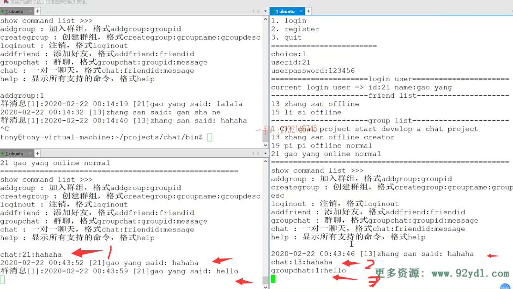

用户的这么一个正常的login out功能，注销功能，那就实现到这里

==选择三  这块儿就退出整个的客户端程序了啊。==

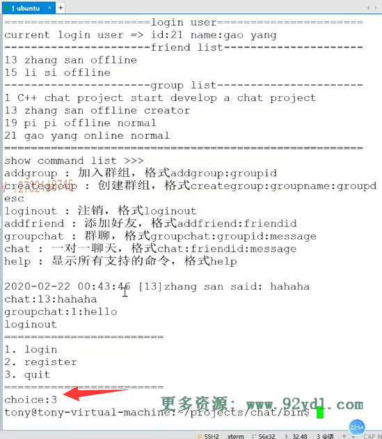

## 总结

好，那这节课的主要内容就给大家说到这里到这儿呢，我们的这个提供单机服务的这个聊天服务器啊，

跟这个客户端，我们的整个的业务功能就全部开发完了。

这个客户端的代码大概有个560行啊，560行。

### 代码行数

我们来看大致看一下这个服务器的这个主要的这个代码。这300行杠是560，这是860行，对吧？900行。那还有这些代码，整个下来现在就是客户端跟服务器的整个的代码加起来应该有1300行左右啊，1300行左右。

还有包括我们网络模块的代码啊，1300行左右。
学到这节课，大家是光听了呢，还是跟着我的这个项目课呢把所有的功能代码啊，都写完了呢，

对于里边的这个代码的设计啊，模块的这个设计，网络层

### 主要知识点

==尤其是对于服务层muduo库的这个编程是否熟悉了它的这个网络模型，就是epoll加多线程的这么一个模型啊？==

==然后呢，包括网络层怎么派发json到服务层，==

==服务层又是怎么去通过添加一层muduo层来解偶服务层和数据库操作的这么一个代码设计呢，对吧啊？==

==我们给大家设计的代码在业务层上，你绝对是看不到数据库相关的sql语句或者说是字段名称的，==

### 操作的都是面向对象的操作

==我们操作的都是面向对象的操作，对吧？==

那是因为我们定义了很多or m，就是映射数据库表的像group类啊user类啊group user这样的类是不是？

还希望呢，跟着我的这个视呃视频课程呢，好好的把我在视频上啊，在领着大家写项目代码的过程中所强调的一些设计呀啊，

这个容器的一些应用啊，包括线程的这个互斥啊，

线程安全的这个引入啊啊，怎么考虑具体业务应用场景的啊，仔细的去推理，去思考一下好吧，

因为你思考的越多。这样呢，你把这个项目的这个内容呢，写到简历上，

到面试的时候呢，你才会表达的更清晰，说起来心里边儿也就会更有底儿。

你千万不要死记硬背，这些东西好吧啊，

