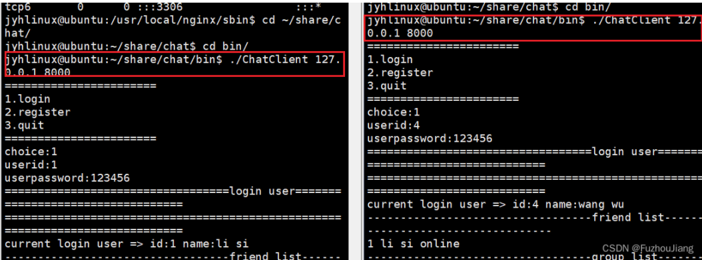
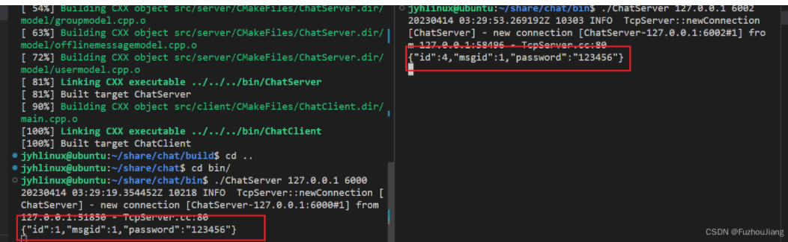

## 负载均衡模块

### 为什么要加入负载均衡模块

原因是：单台服务器并发量最多两三万，不够大。

### 负载均衡器 Nginx的用处或意义\*\*（面试题）\*\*

-   把client请求按**负载算法分发**到具体业务服务器Chatserver
-   能和ChatServer保持**心跳机制**，检测ChatServer保持心跳机制，检测ChatServer故障
-   能发现新添加的ChatServer设备方便服务器**扩展**数量

> 客户端和某台服务器可建立**IP隧道**
>
> 想要更大并发量可以对负载均衡器再做集群

负载均衡模块在整个程序中的位置如下图


### 如何配置nginx的TCP负载均衡模块

首先解压nginx的安装包 （tar zxvf）；

```
tar zxvf nginx-1.12.2.tar.gz 
```


进入[nginx安装](https://so.csdn.net/so/search?q=nginx%E5%AE%89%E8%A3%85&spm=1001.2101.3001.7020)包中编译加入`--with-stream`参数激活tcp负载均衡模块

```sh
~/package/nginx-1.12.2# ./configure --with-stream
```

安装时缺少一些库，那就安装一下这个PCRE正则表达式库

```
sudo apt-get install libpcre3-dev
```


安装完成


编译

```
~/package/nginx-1.12.2# make && make install
```

编译完成后，默认安装在 `/usr/local/nginx`

```sh
$ cd /usr/local/nginx/
/usr/local/nginx$ ls
```


可执行文件在`sbin`目录里面,配置文件在`conf`目录里面。

```sh
nginx -s reload #重新加载配置文件启动
nginx -s stop #停止nginx服务
```

nginx.conf的补充内容如下

```ini
events {
    worker_connections  1024; #最大连接数1024，默认为512
}
#-------------------------------添加的内容------------------------

stream {
      upstream MyServer {
          # max_fails最大失败次数，若超过则判断连接失败
          # fail_timeout，发出心跳包超过改时间没收到回包就算一次失败
          server 127.0.0.1:6000 weight=1 max_fails=3 fail_timeout=30s;
          server 127.0.0.1:6002 weight=1 max_fails=3 fail_timeout=30s;
      }
  
      server {      
          proxy_connect_timeout 1s;
          listen 8000;
          proxy_pass MyServer; # 所有连接到8000端口的请求都往MyServer指定的主机里负载均衡
          tcp_nodelay on;
      }
  }
#---------------------------------------------------------------
```

其中 `weight`表示权重

上面配置也就是说，客户端连接服务器时端口号填8000就是连接到负载均衡器上，它会帮助我们把请求分发到 `127.0.0.1:6000`和`127.0.0.1:6002`端口上.

配置修改后可用 `./nginx -s reload`平滑重启。

> 注意：这么修改了之后，客户端连接服务端的地址都要为127.0.0.1:8000，也就是连接到负载均衡器上而不是确定的服务器端口上。

`sudo netstat -anp`查看`nginx`进程是否启动在8000端口监听




服务器通过负载均衡器按权重分别接收一个连接



