## redis发布订阅消息队列

### 背景

当客户端登录到不同的服务器时，应该如何解决**跨服务器通信**问题？

假如采用两两服务器之间建立连接

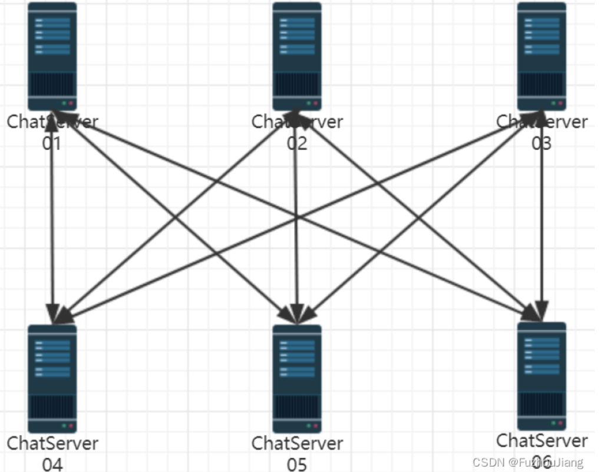

上图设计相当于在服务器网络之间进行广播。这样的设计使得各个服务器之间**耦合度**太高，不利于系统扩展，并且会占用系统大量的**socket资源**，各服务器之间的带宽压力很大，不能够节省资源给更多的客户端提供服务，因此绝对不是一个好的设计。  
集群部署的服务器之间进行通信，最好的方式就是引入**中间件消息队列**，**解耦**各个服务器，使整个系统**松耦合**，提高服务器的响应能力，节省服务器的带宽资源，如下图所示：

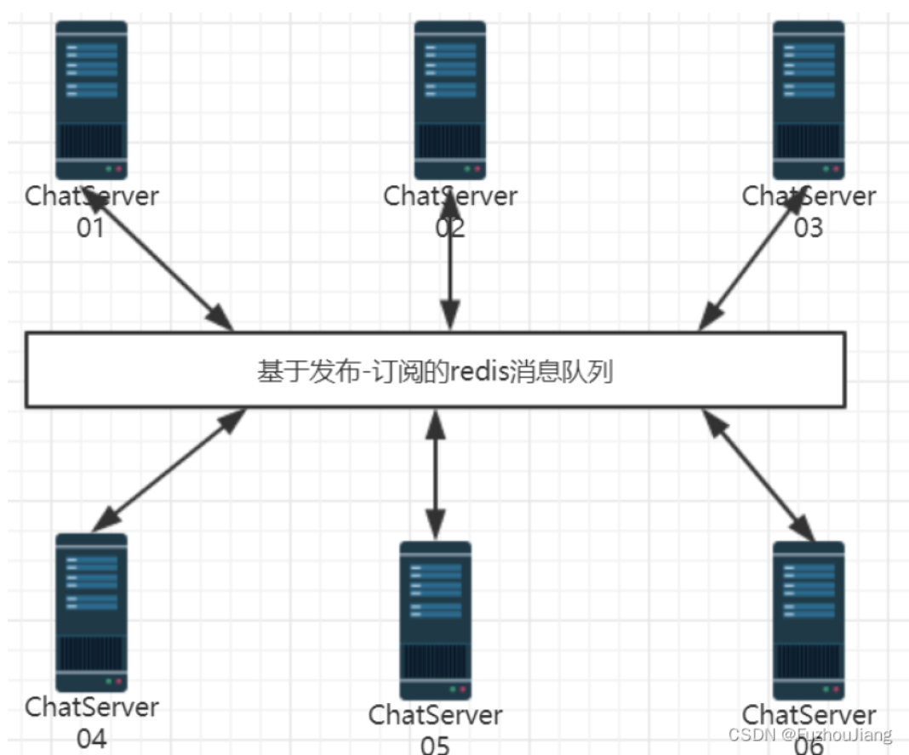

集群分布式环境中，经常使用的中间件消息队列`ActiveMQ`、`RabbitMQ`、`Kafka`等，都是应用场景广泛并且性能很好的消息队列，供集群服务器之间，分布式服务之间进行消息通信。

发布订阅是**观察者**模式的使用场景。

消息队列是**长连接跨服务器聊天通用方法**,工作流程大致如下

客户端c1在某个服务器上连接后，要把该连接在redis队列上订阅一个通道ch1

别的客户端c2在不同的服务器上登录要给c1发消息，会直接发到redis队列上的通道ch1,客户端c1可接受到信息发布到通道ch1

要开一个单独线程进行监听通道上的事件，有消息给业务层上报。

当服务器发现发送的对象id没有在自己的`_userConnMap`上，就要往消息队列上`publish`，消息队列就会把消息发布给订阅者。


## redis环境安装

```
sudo apt-get update#首先来对软件包进行更新
sudo apt-get install redis-server#可能由于网络问题会造成安装失败，多次尝试
```

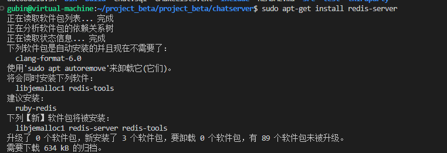

```
ps -ef | grep redis
```

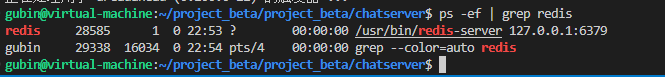

```
sudo netstat -tanp
```

==redis server正常啊，listen监听在这个六三七九==

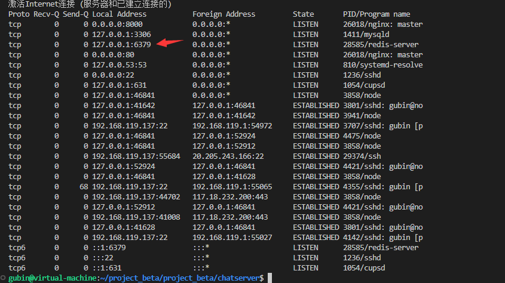

```
redis-cli
set "abc" "hello world"
get "abc"
```

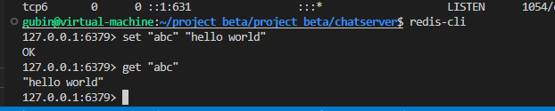

订阅消息 subscribe channel 它是一个阻塞的方式

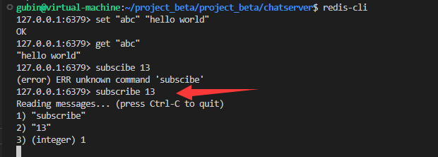


测试客户端发送消息 发布消息

```
redis-cli
publish 13 "hello world"

```

订阅的通道会收到发布在通道的消息

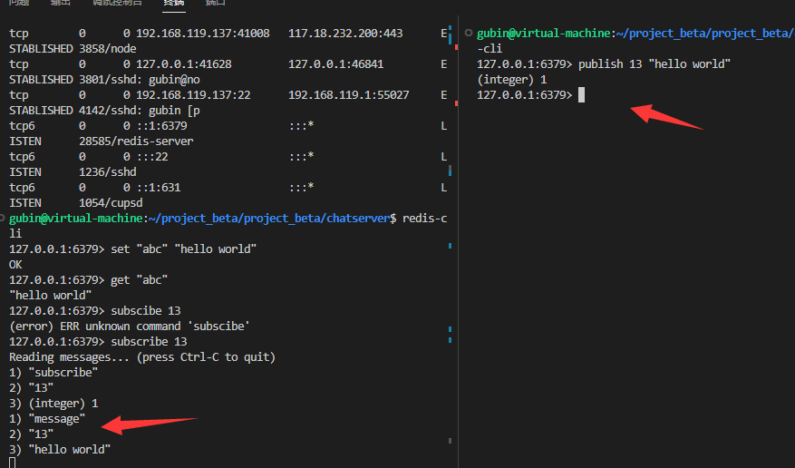

### 业务上redis的流程

首先。用户登录成功以后相应的。服务器呢chat server需要向redis上啊，根据用户的ID是不是去subscribe一下，去订阅一下，

以用户的ID号为通道号的是不是这么一个通道的消息啊？

嗯，然后呢这是第一件要做的事情，


第二件就是当这个服务器上需要有一个用户要给另外一个人发送消息的话啊，

但是发现这个用户呢，却没有在这台服务器上，是在其他服务器上。

那么就要向这个通道里边publish发布消息了。是不是发布消息了啊？发布消息了，

因为它肯定在其他服务器上，它在chat server 2上，chat server 2肯定在redis里边，以它的用户ID作为通道ID。订阅过相应的通道事件消息呀啊，

那么。如果13给21讲话的话呢，这里边publish就往21这个通道上publish一个讲话的json字符串，

那么这块儿呢，redis发现通道21有消息发生了，就会给chat server 2来返回，你有消息发生了处理吧，对不对啊？


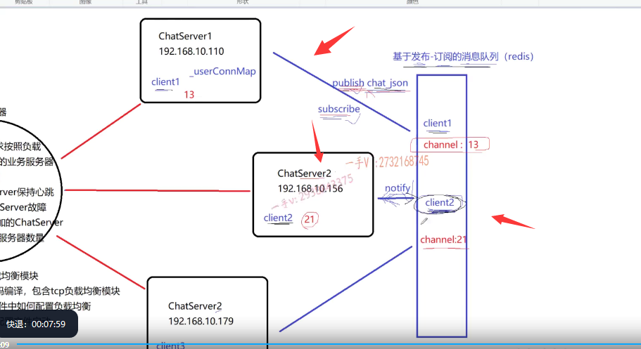


## redis发布-订阅的客户端编程


```
git clone https://github.com/redis/hiredis
```


```
cd hiredis
make
```

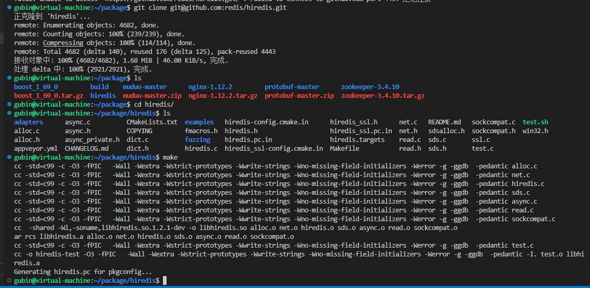

```
sudo make install
```


拷贝生成的动态库到/usr/local/lib目录下(不需要做好了)

```

```


```
sudo ldconfig /usr/local/lib
```

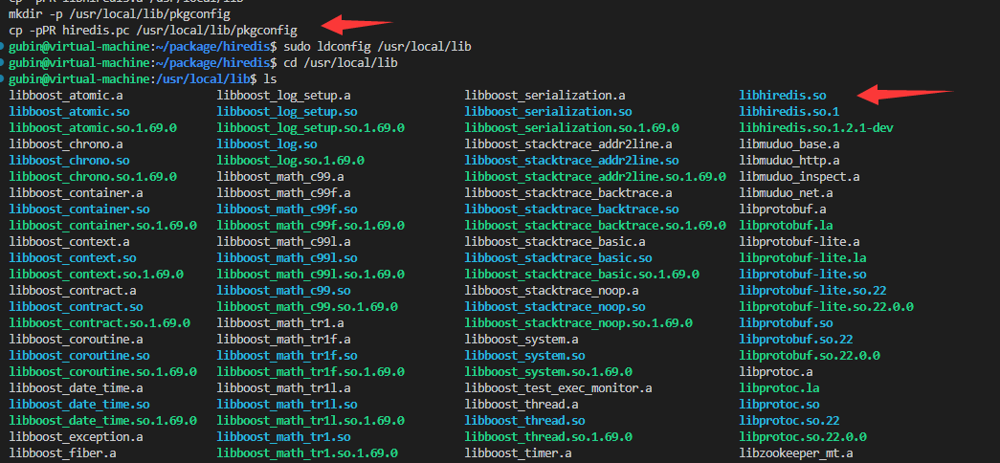

redis服务器**后台**运行输入如下指令

```sh
redis-server --daemonize yes
```

发布订阅功能要开两条`redis`连接即两个`redisContext *`,一条用于订阅和接收消息，一条用于发布消息，这么做的原因是因为订阅 `SUBSCRIBE`时会进入阻塞状态，代码如下

```cpp
// 向redis指定通道channel发布消息
bool Redis::publish(int channel, string message)
{
    redisReply *reply = (redisReply *)redisCommand(_publish_context, "PUBLISH %d %s", channel, message);
    if (nullptr == reply)
    {
        cerr << "publish command failed!" << endl;
        return false;
    }
    freeReplyObject(reply);
    return true;
}

// 向redis指定通道subscribe订阅消息
bool Redis::subscribe(int channel)
{
    // SUBSCRIBE命令本身会造成线程阻塞等待通道里发生消息，这里只做订阅通道，不接受通道消息
    // 通道消息接收专门在 observer_channel_message 函数中的独立线程中进行
    // 只负责发送命令，不阻塞接收redis server响应消息，否则和notifyMsg线程抢占响应资源
    if (REDIS_ERR == redisAppendCommand(this->_subscribe_context, "SUBSCRIBE %d", channel))
    {
        cerr << "subscribe command failed!" << endl;
        return false;
    }
    // redisBufferWrite可循环发送缓冲区累积的命令，知道缓冲区数据发送完毕（done被置1）
    int done = 0;
    while (!done)
    {
        if (REDIS_ERR == redisBufferWrite(this->_subscribe_context, &done))
        {
            cerr << "subscribe command failed!" << endl;
            return false;
        }
    }
    return true;
}
```

本项目使用`hiredis`进行`redis`编程,加入redis的发布订阅消息队列后，**业务层**的改动大致如下：

-   `chatservice`构造中连接`redis`即调用`connect`,并设置上报消息的回调，`connect`中会开启一条新线程调用 `observer_channel_message`函数进行循环接收订阅通道上的消息，有消息到来给业务层上报。
-   登录时订阅`subscribe channel`
-   聊天时遇到用户在别的服务器上登录(`userid`不在`map`中，但状态为`online`)就`publish`
-   注销就取消订阅 `unsubscribe channel`

### 杂项

- 若不满意`Nginx`负载均衡效果前面可加`LVS`（Linux Virtual Server）

- 负载均衡器 - 一致性哈希算法学有余力可了解

- IP隧道

  IP隧道（IP Tunnel）是一种**虚拟的网络连接**方式，它允许**将一个IP数据包传输到另一个IP网络中**，同时保留原始数据包的源和目的地址。它通常用于将两个不同的IP网络连接起来，使它们看起来像一个单一的网络。IP隧道的主要目的是为了解决**网络互联**问题，特别是当两个不兼容的网络需要进行通信时。

  在IP隧道中，数据包被封装在另一个IP数据包中，以便在一个网络上传输到另一个网络。这个封装过程称为“隧道ing”，隧道的两端点被称为“入口”和“出口”。入口点将原始IP数据包封装在另一个IP数据包中，将其发送到出口点。出口点接收到封装后的数据包，然后解封装出原始的IP数据包，并将其传送到目的地。

  IP隧道的优点是它可以**让不同的网络连接起来**，同时保持原有的网络拓扑结构和地址分配。但是，它也会带来一些缺点，例如会增加**网络延迟**和

- 降低网络性能。