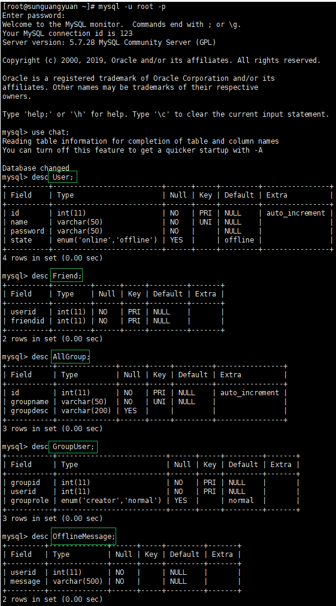

**笔记14内容**

### 数据库的表设计：



#### User表：

用途说明：在**登录**的时，需通过该表中信息对用户身份进行验证；在**注册**的时，需给该表写入数据。

| 字段名称 |         字段类型          |   字段说明   |             约束             |
| :------: | :-----------------------: | :----------: | :--------------------------: |
|    id    |            INT            |    用户id    | PRIMARY KEY、AUTO\_INCREMENT |
|   name   |        VARCHAR(50)        |    用户名    |       NOT NULL、UNIQUE       |
| password |        VARCHAR(50)        |   用户密码   |           NOT NULL           |
|  state   | ENUM(‘online’, ‘offline’) | 当前登录状态 |      DEFAULT ‘offline’       |

```mysql
create table User (
    id INT PRIMARY KEY AUTO_INCREMENT, 
    name VARCHAR(50) NOT NULL UNIQUE, 
    password VARCHAR(50) NOT NULL, 
    state ENUM('online', 'offline') DEFAULT 'offline'
);
```

#### Friend表：

用途说明：在**加好友**时，需给该表写入信息；在**一对一聊天**时，查询好友的信息，之后去看好友是否在线。

| 字段名称 | 字段类型 | 字段说明 |        约束        |
| :------: | :------: | :------: | :----------------: |
|  userid  |   INT    |  用户id  | NOT NULL、联合主键 |
| friendid |   INT    |  好友id  | NOT NULL、联合主键 |

```mysql
create table Friend(
    userid INT NOT NULL, 
    friendid INT NOT NULL
);
# 添加联合主键：
alter table Friend add PRIMARY KEY(userid, friendid);
```

#### OfflineMessage表：

用途说明：有**离线消息**（离线消息的三个问题：发给谁，谁发的，发的什么）时，需给该表写入数据。

| 字段名称 | 字段类型     | 字段说明                   | 约束     |
| -------- | ------------ | -------------------------- | -------- |
| userid   | INT          | 用户id                     | NOT NULL |
| message  | VARCHAR(500) | 离线消息（存储Json字符串） | NOT NULL |

```mysql
create table OfflineMessage(
userid INT NOT NULL, 
message VARCHAR(500) NOT NULL
);
```

注意：每个`userid`可以有多条记录在`OfflineMessage`表中。

#### AllGroup表：

用途说明：在**创建群**时，给该表写入数据，用来记录群组信息。

| 字段名称  |   字段类型   |  字段说明  |             约束             |
| :-------: | :----------: | :--------: | :--------------------------: |
|    id     |     INT      |    组id    | PRIMARY KEY、AUTO\_INCREMENT |
| groupname | VARCHAR(50)  |    组名    |       NOT NULL、UNIQUE       |
| groupdesc | VARCHAR(200) | 组功能描述 |          DEFAULT ‘’          |

```mysql
create table AllGroup(
    id INT PRIMARY KEY AUTO_INCREMENT, 
    groupname VARCHAR(50) NOT NULL UNIQUE, 
    groupdesc VARCHAR(200) DEFAULT ''
);
```

#### GroupUser表：

用途说明：在**加入群**时，给该表写入信息，并在**发送群消息**时查询该表后由服务器向这些成员转发消息。

| 字段名称  |         字段类型          | 字段说明 |        约束        |
| :-------: | :-----------------------: | :------: | :----------------: |
|  groupid  |            INT            |   组id   | NOT NULL、联合主键 |
|  userid   |            INT            |  组员id  | NOT NULL、联合主键 |
| grouprole | ENUM(‘creator’, ‘normal’) | 组内角色 |  DEFAULT ‘normal’  |

```mysql
create table GroupUser(
    groupid INT NOT NULL, 
    userid INT NOT NULL, 
    grouprole ENUM('creator', 'normal') DEFAULT 'normal'
);
# 添加联合主键：
alter table GroupUser add PRIMARY KEY(groupid, userid);
```

注意，因上述表中涉及到主键列，最好在重置数据库时，使用`truncate from tablename`代替`delete from tablename`。