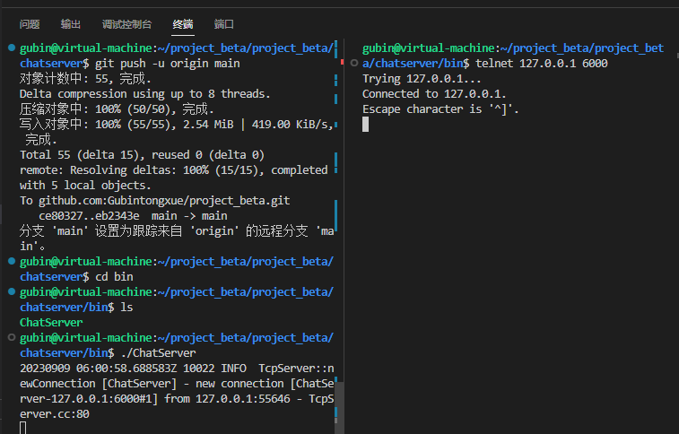

**笔记16内容**

# 代码实现

在include/server创建chatserver.hpp文件

聊天服务器的主类，主要封装muduo网络库

1.网络IO模块主要基于muduo网络库，先包含muduo头文件

2.成员变量就是TcpServer类和EventLoop*类，成员函数就是上报链接相关信息的回调函数onConnection(),上报读写事件相关信息的回调函数onMessage()

3.构造函数(参数是Eventloop,服务器绑定的监听地址，服务器名称），启动服务方法

```C++
#ifndef CHATSERVER_H
#define CHATSERVER_H

#include <muduo/net/TcpServer.h>
#include <muduo/net/EventLoop.h>
using namespace muduo;
using namespace muduo::net;

// 聊天服务器的主类
class ChatServer
{
public:
    // 初始化聊天服务器对象
    ChatServer(EventLoop *loop,
               const InetAddress &listenAddr,
               const string &nameArg);

    // 启动服务
    void start();

private:
    // 上报链接相关信息的回调函数
    void onConnection(const TcpConnectionPtr &);

    // 上报读写事件相关信息的回调函数
    void onMessage(const TcpConnectionPtr &,
                   Buffer *,
                   Timestamp);

    TcpServer _server; // 组合的muduo库，实现服务器功能的类对象
    EventLoop *_loop;  // 指向事件循环对象的指针
};

#endif
```


### 聊天服务器的具体实现

在src/server下新建chatserver.cpp

1.构造函数，使用TcpServer类的setConnectionCallback注册链接回调，使用TcpServer类的setMessageCallback注册消息回调，使用TcpServer类的setThreadNum设置线程数量，muduo会设置为一个主线程，3个工作线程。

==为什么使用bind器呢？因为setConnectionCallback的参数就需要一个参数的回调函数，当然我们可以使用lambda表示来修改。后面去做==

2.启动服务，调用TcpServer的start方法

2.完成2个业务方法（本节不实现)

- 上报链接相关信息的回调函数

- 上报读写事件相关信息的回调函数

  

```C++
#include "chatserver.hpp"
#include "json.hpp"
#include "chatservice.hpp"

#include <iostream>
#include <functional>
#include <string>
using namespace std;
using namespace placeholders;
using json = nlohmann::json;

// 初始化聊天服务器对象
ChatServer::ChatServer(EventLoop *loop,
                       const InetAddress &listenAddr,
                       const string &nameArg)
    : _server(loop, listenAddr, nameArg), _loop(loop)
{
    // 注册链接回调
    _server.setConnectionCallback(std::bind(&ChatServer::onConnection, this, _1));

    // 注册消息回调
    _server.setMessageCallback(std::bind(&ChatServer::onMessage, this, _1, _2, _3));

    // 设置线程数量
    _server.setThreadNum(4);
}

// 启动服务
void ChatServer::start()
{
    _server.start();
}

// 上报链接相关信息的回调函数
void ChatServer::onConnection(const TcpConnectionPtr &conn)
{
   
}

// 上报读写事件相关信息的回调函数
void ChatServer::onMessage(const TcpConnectionPtr &conn,
                           Buffer *buffer,
                           Timestamp time)
{
    
}
```


### main函数

在src/server中建立main.cpp

```C++
#include "chatserver.hpp"
#include <iostream>
using namespace std;


int main()
{

    EventLoop loop;
    InetAddress addr("127.0.0.1", 6000);
    ChatServer server(&loop, addr, "ChatServer");

    server.start();
    loop.loop();

    return 0;
}
```


## 编译测试

顶级CMakeLists.txt

```shell
cmake_minimum_required(VERSION 3.0)
project(chat)

# 配置编译选项
set(CMAKE_CXX_FLAGS ${CMAKE_CXX_FLAGS} -g)

# 配置最终的可执行文件输出的路径
set(EXECUTABLE_OUTPUT_PATH ${PROJECT_SOURCE_DIR}/bin)

# 配置头文件的搜索路径
include_directories(${PROJECT_SOURCE_DIR}/include)
include_directories(${PROJECT_SOURCE_DIR}/include/server)
include_directories(${PROJECT_SOURCE_DIR}/thirdparty)

# 加载子目录
add_subdirectory(src)
```


src/server下CMakeLists.txt

```shell
# 定义了一个SRC_LIST变量，包含了该目录下所有的源文件
aux_source_directory(. SRC_LIST)
# 指定生成可执行文件
add_executable(ChatServer ${SRC_LIST})
# 指定可执行文件链接时需要依赖的库文件
target_link_libraries(ChatServer muduo_net muduo_base pthread)
```



