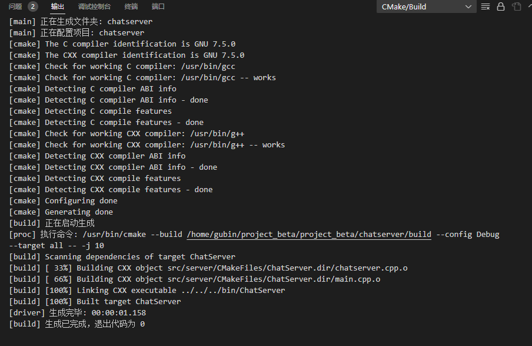

**笔记17内容**

## 前置知识

onMessage()处理上报读写事件相关的回调函数中会涉及到对客户端请求的业务数据的处理

业务里可能会涉及到message type message id业务类型 业务标识之类的

我们不希望在这里写switch case或者if else之类的，将我们的网络模块和业务模块代码强耦合到一起。


我们希望只解析到业务标识，然后去调用相应的回调处理。一个di对应一个操作。


一般解耦模块之间的耦合关系，有两种方法

- 一种是面向抽象基类的编程
- 一种是基于回调操作


## 聊天服务器业务类

在include/server中新建chatservice.hpp

1.单例模式来设计，获取单例对象的接口函数

2.处理登录业务

3.处理注册业务

4.存储消息id和其对应的业务处理方法的映射表msgHandlerMap

- 没有使用typedef而使用C++11 using来创建表示处理消息的事件回调方法类型

```C++
#ifndef CHATSERVICE_H
#define CHATSERVICE_H

#include <muduo/net/TcpConnection.h>
#include <unordered_map>
#include <functional>
#include <mutex>
using namespace std;
using namespace muduo;
using namespace muduo::net;

#include "json.hpp"
using json = nlohmann::json;

// 表示处理消息的事件回调方法类型
using MsgHandler = std::function<void(const TcpConnectionPtr &conn, json &js, Timestamp)>;

// 聊天服务器业务类
class ChatService
{
public:
    // 获取单例对象的接口函数
    static ChatService *instance();
    // 处理登录业务
    void login(const TcpConnectionPtr &conn, json &js, Timestamp time);
    // 处理注册业务
    void reg(const TcpConnectionPtr &conn, json &js, Timestamp time);
    
private:
    ChatService();
    // 存储消息id和其对应的业务处理方法
    unordered_map<int, MsgHandler> _msgHandlerMap;
};

#endif
```


需要定义message消息类型

src下新建public.hpp

```C++
#ifndef PUBLIC_H
#define PUBLIC_H

/*
server和client的公共文件
*/
enum EnMsgType
{
    LOGIN_MSG = 1, // 登录消息
    REG_MSG, // 注册消息
};

#endif
```

### 编译

