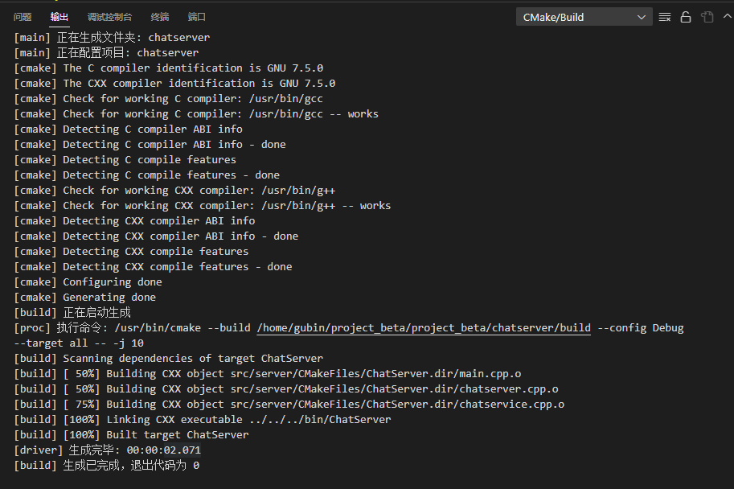
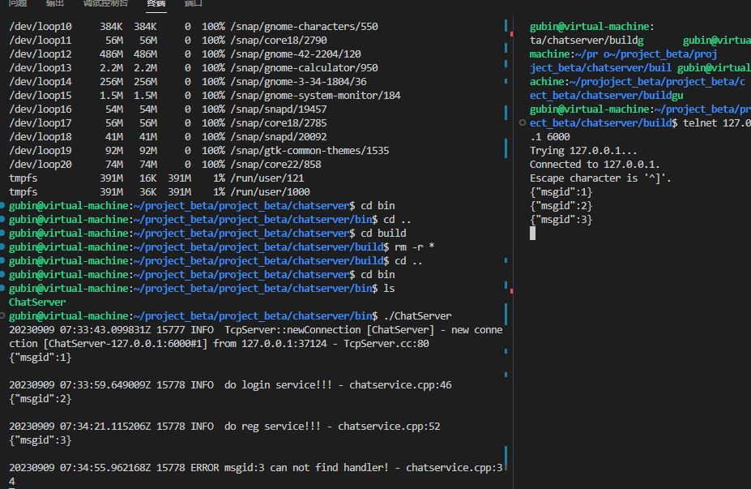

**笔记18 - 19内容**

## chatservice业务模块代码实现

在src/server下新建chatservice.cpp

1.单例模式返回业务服务对象

2.注册消息id以及对应的Handler回调操作,`std::bind(&ChatService::login, this, _1, _2, _3)` 将 `ChatService` 类的成员函数 `login` 转化为一个可调用的普通函数对象。这个操作通常被称为**绑定**。使用bind器来创建一个函数对象，将成员函数和对象的指针绑定在一起，以使其与 `std::function` 的签名匹配。

如果你不使用 `std::bind`，而是直接将函数名 `&ChatService::login` 放在 `_msgHandlerMap` 中，编译器会认为你在尝试将一个成员函数与一个没有指定对象的普通函数指针进行匹配，因此会导致编译错误。因此，必须使用 `std::bind` 或者 Lambda 表达式等方式来正确地绑定成员函数和对象指针

- ```C++
  不使用bind,而使用lambda表达式
  _msgHandlerMap.insert({LOGIN_MSG, [this](const TcpConnectionPtr &conn, json &js, Timestamp) {
      this->login(conn, js, Timestamp);
  }});
  ```

  在这个 Lambda 表达式中，我们捕获了 `this` 指针，以便在 Lambda 表达式中可以访问 `ChatService` 类的成员函数。Lambda 表达式的主体部分包含了对 `login` 函数的调用，将 `conn`、`js` 和 `Timestamp` 参数传递给它。这样，你就可以将这个 Lambda 表达式存储在 `_msgHandlerMap` 中，而不需要使用 `std::bind`。

3.获取消息对应的处理器，轮询msgHandlermap表查询

```C++
#include "chatservice.hpp"
#include "public.hpp"
#include <muduo/base/Logging.h>
#include <vector>
using namespace std;
using namespace muduo;

// 获取单例对象的接口函数
ChatService *ChatService::instance()
{
    static ChatService service;
    return &service;
}

// 注册消息以及对应的Handler回调操作
ChatService::ChatService()
{
    // 用户基本业务管理相关事件处理回调注册
    _msgHandlerMap.insert({LOGIN_MSG, std::bind(&ChatService::login, this, _1, _2, _3)});
    _msgHandlerMap.insert({REG_MSG, std::bind(&ChatService::reg, this, _1, _2, _3)});

}


// 获取消息对应的处理器
MsgHandler ChatService::getHandler(int msgid)
{
    // 记录错误日志，msgid没有对应的事件处理回调
    auto it = _msgHandlerMap.find(msgid);
    if (it == _msgHandlerMap.end())
    {
        // 返回一个默认的处理器，空操作
        return [=](const TcpConnectionPtr &conn, json &js, Timestamp) {
            LOG_ERROR << "msgid:" << msgid << " can not find handler!";
        };
    }
    else
    {
        return _msgHandlerMap[msgid];
    }
}

// 处理登录业务  id  pwd   pwd
void ChatService::login(const TcpConnectionPtr &conn, json &js, Timestamp time)
{
    LOG_INFO << "do login service!!!";
}

// 处理注册业务  name  password
void ChatService::reg(const TcpConnectionPtr &conn, json &js, Timestamp time)
{
    LOG_INFO << "do reg service!!!";
}

```

## 网络模块分发业务事件回调操作

### 完善chatserver.cpp内容

onConnection上报链接相关信息的回调函数

- 处理客户端断开的情况

onMessage上报读写事件相关信息的回调函数

- muduo库中buffer类retrieveAllAsString()方法获取客户端请求消息字符串
- json库中parse反序列化字符串信息，得到具体的js对象中的msgid
- 通过js["msgid"] 获取message类型=》业务handler=》conn  js  time
- 回调消息绑定好的事件处理器msgHandler，来执行相应的业务处理

```C++
#include "chatserver.hpp"
#include "chatservice.hpp"
#include "json.hpp"

#include <iostream>
#include <functional>
#include <string>
using namespace std;
using namespace placeholders;
using json = nlohmann::json;

// 初始化聊天服务器对象
ChatServer::ChatServer(EventLoop *loop,
                       const InetAddress &listenAddr,
                       const string &nameArg)
    : _server(loop, listenAddr, nameArg), _loop(loop)
{
    // 注册链接回调
    _server.setConnectionCallback(std::bind(&ChatServer::onConnection, this, _1));

    // 注册消息回调
    _server.setMessageCallback(std::bind(&ChatServer::onMessage, this, _1, _2, _3));

    // 设置线程数量
    _server.setThreadNum(4);
}

// 启动服务
void ChatServer::start()
{
    _server.start();
}

// 上报链接相关信息的回调函数
void ChatServer::onConnection(const TcpConnectionPtr &conn)
{
    // 客户端断开链接
    if (!conn->connected())
    {
        conn->shutdown();
    }
}

// 上报读写事件相关信息的回调函数
void ChatServer::onMessage(const TcpConnectionPtr &conn,
                           Buffer *buffer,
                           Timestamp time)
{
    string buf = buffer->retrieveAllAsString();

    // 测试，添加json打印代码
    cout << buf << endl;

    // 数据的反序列化
    json js = json::parse(buf);
    // 达到的目的：完全解耦网络模块的代码和业务模块的代码
    // 通过js["msgid"] 获取=》业务handler=》conn  js  time
    auto msgHandler = ChatService::instance()->getHandler(js["msgid"].get<int>());
    // 回调消息绑定好的事件处理器，来执行相应的业务处理
    msgHandler(conn, js, time);
}
```


## 编译



## 测试




## 客户端异常断开处理

可能后面需要做

客户端的一些异常断开（ctrl c）就是并没有给我们发下线的消息