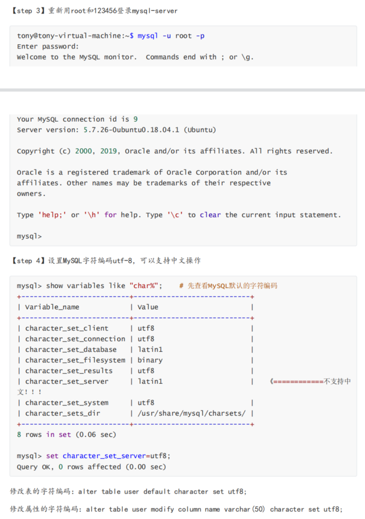

## 前置知识

项目前面已经将网络模块与业务模块流向打通

现在需要把业务层和数据库层（DAO）代码逻辑完全区分开，不能再业务层代码直接去写数据库

### orm框架

object relation map就是对象关系映射

就是我们在业务层操作的都是对象，所以要进行数据层封装所有数据库响应的操作


### 数据库的安装

mysql开发包安装，包含mysql头文件和动态库文件

```
sudo apt-get install mysql-server
sudo apt-get install libmysqlclient-dev
```

我们客户端登录的密码是我们设置的，但是ubuntu服务端的密码是初始生成的，我们可以修改

```
sudo cat /etc/mysql/debian.cnf
```


可以修改密码




登录

```
mysql -u debian-sys-maint -pJXuRGeLvQO36ZaAo
```

更新密码

```
update mysql.user set authentication_string=password('123456') where
user='root' and host='localhost';
```

```
update mysql.user set plugin="mysql_native_password";
```

重新用root和123456登录mysql-server

```
mysql -u root -p
```

设置MySQL字符编码utf-8，可以支持中文操作

```
set character_set_server=utf8;
```


查看下so库是否存在

```
sudo find /usr -name libmysqlclient*
```


### 数据库内容准备

```
mysql -uroot -p
show databases;
create database chat;
use chat;
#使用chat.sql文件创建
source /home/gubin/project_beta/project_beta/chatserver/chat.sql
show tables;
```


## MySQL数据库代码封装

顶级CMakeLists.txt包含目录

```shell
cmake_minimum_required(VERSION 3.0)
project(chat)

# 配置编译选项
set(CMAKE_CXX_FLAGS ${CMAKE_CXX_FLAGS} -g)

# 配置最终的可执行文件输出的路径
set(EXECUTABLE_OUTPUT_PATH ${PROJECT_SOURCE_DIR}/bin)

# 配置头文件的搜索路径
include_directories(${PROJECT_SOURCE_DIR}/thirdparty)
include_directories(${PROJECT_SOURCE_DIR}/include)
include_directories(${PROJECT_SOURCE_DIR}/include/server)
include_directories(${PROJECT_SOURCE_DIR}/include/server/db)


# 加载子目录
add_subdirectory(src)
```

src/server下的添加依赖数据库的动态库

```shell
# 定义了一个SRC_LIST变量，包含了该目录下所有的源文件
aux_source_directory(. SRC_LIST)
# 指定生成可执行文件
add_executable(ChatServer ${SRC_LIST})
# 指定可执行文件链接时需要依赖的库文件
target_link_libraries(ChatServer muduo_net muduo_base mysqlclient pthread)
```


### 具体代码实现

在include/server/db文件夹下新建db.h

1.成员变量MYSQL *_conn，数据库连接的句柄

2.构造函数，初始化数据库连接

3.析构函数，释放数据库连接资源

4.connect()连接数据库操作

5.update()更新操作

6.query()查询操作

7.getConnection()获取连接

```C++
#ifndef DB_H
#define DB_H

#include <mysql/mysql.h>
#include <string>
using namespace std;

// 数据库操作类
class MySQL
{
public:
    // 初始化数据库连接
    MySQL();
    // 释放数据库连接资源
    ~MySQL();
    // 连接数据库
    bool connect();
    // 更新操作
    bool update(string sql);
    // 查询操作
    MYSQL_RES *query(string sql);
    // 获取连接
    MYSQL* getConnection();
private:
    MYSQL *_conn;
};

```


在src/server/db文件夹下新建db.cpp

修改src/server中的CMakeLists.txt 增加db文件下db.cpp文件

```shell
# 定义了一个SRC_LIST变量，包含了该目录下所有的源文件
aux_source_directory(. SRC_LIST)
aux_source_directory(./db DB_LIST)
# 指定生成可执行文件
add_executable(ChatServer ${SRC_LIST} ${DB_LIST})
# 指定可执行文件链接时需要依赖的库文件
target_link_libraries(ChatServer muduo_net muduo_base mysqlclient pthread)
```

数据库一些操作的封装的具体实现

1.数据库配置信息

2.构造函数，初始化数据库连接

3.析构函数，释放数据库连接资源

4.connect()连接数据库操作

5.update()更新操作

6.query()查询操作

7.getConnection()获取连接

```C++
#include "db.h"
#include <muduo/base/Logging.h>

// 数据库配置信息
static string server = "127.0.0.1";
static string user = "root";
static string password = "123456";
static string dbname = "chat";

// 初始化数据库连接
MySQL::MySQL()
{
    _conn = mysql_init(nullptr);
}

// 释放数据库连接资源
MySQL::~MySQL()
{
    if (_conn != nullptr)
        mysql_close(_conn);
}

// 连接数据库
bool MySQL::connect()
{
    MYSQL *p = mysql_real_connect(_conn, server.c_str(), user.c_str(),
                                  password.c_str(), dbname.c_str(), 3306, nullptr, 0);
    if (p != nullptr)
    {
        // C和C++代码默认的编码字符是ASCII，如果不设置，从MySQL上拉下来的中文显示？
        mysql_query(_conn, "set names gbk");
        LOG_INFO << "connect mysql success!";
    }
    else
    {
        LOG_INFO << "connect mysql fail!";
    }

    return p;
}

// 更新操作
bool MySQL::update(string sql)
{
    if (mysql_query(_conn, sql.c_str()))
    {
        LOG_INFO << __FILE__ << ":" << __LINE__ << ":"
                 << sql << "更新失败!";
        return false;
    }

    return true;
}

// 查询操作
MYSQL_RES *MySQL::query(string sql)
{
    if (mysql_query(_conn, sql.c_str()))
    {
        LOG_INFO << __FILE__ << ":" << __LINE__ << ":"
                 << sql << "查询失败!";
        return nullptr;
    }
    
    return mysql_use_result(_conn);
}

// 获取连接
MYSQL* MySQL::getConnection()
{
    return _conn;
}
```


## 编译

