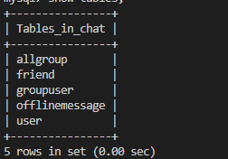
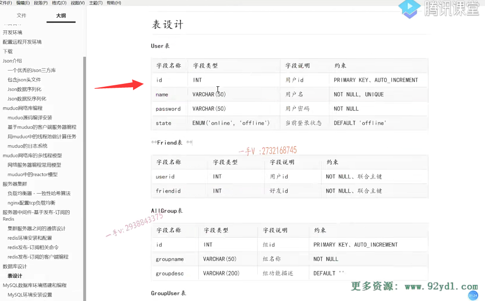

### 笔记21内容

业务层和数据层之间定义一个Model层

希望业务代码看见的都是对象


## Model层设计

### 头文件

在include/server新建model文件夹

然后开始设计数据库中的每一张表





第一个设计User表


在model文件夹下新建user.hpp

==这个User类就是相当于映射类==

1.成员变量：用户id，用户名，用户密码，用户状态

2.构造方法

3.成员方法,set和get两类

- setId,setName,SetPwd,SetState
- getId,getName,getPwd,getState

```C++
#ifndef USER_H
#define USER_H

#include <string>
using namespace std;

// User表的ORM类
class User
{
public:
    User(int id = -1, string name = "", string pwd = "", string state = "offline")
    {
        this->id = id;
        this->name = name;
        this->password = pwd;
        this->state = state;
    }

    void setId(int id) { this->id = id; }
    void setName(string name) { this->name = name; }
    void setPwd(string pwd) { this->password = pwd; }
    void setState(string state) { this->state = state; }

    int getId() { return this->id; }
    string getName() { return this->name; }
    string getPwd() { return this->password; }
    string getState() { return this->state; }

protected:
    int id;
    string name;
    string password;
    string state;
};

#endif
```


在include/server/model中新建usermodel.hpp提供usermodel方法

1.UserModel是User表的数据操作类

- insert()User表的增加方法，返回值是bool
- query()根据用户号码查询用户信息，返回用户类
- updateState()更新用户的状态信息，返回值是bool
- resetState()重置用户的状态信息

```C++
#ifndef USERMODEL_H
#define USERMODEL_H

#include "user.hpp"

// User表的数据操作类
class UserModel {
public:
    // User表的增加方法
    bool insert(User &user);

    // 根据用户号码查询用户信息
    User query(int id);

    // 更新用户的状态信息
    bool updateState(User user);

    // 重置用户的状态信息
    void resetState();
};

#endif
```


### 源文件

在src/server/model中提供usermodel.cpp

修改顶级CMakeLists.txt,增加搜索头文件目录db

```shell
cmake_minimum_required(VERSION 3.0)
project(chat)

# 配置编译选项
set(CMAKE_CXX_FLAGS ${CMAKE_CXX_FLAGS} -g)

# 配置最终的可执行文件输出的路径
set(EXECUTABLE_OUTPUT_PATH ${PROJECT_SOURCE_DIR}/bin)

# 配置头文件的搜索路径
include_directories(${PROJECT_SOURCE_DIR}/thirdparty)
include_directories(${PROJECT_SOURCE_DIR}/include)
include_directories(${PROJECT_SOURCE_DIR}/include/server)
include_directories(${PROJECT_SOURCE_DIR}/include/server/db)
include_directories(${PROJECT_SOURCE_DIR}/include/server/model)

# 加载子目录
add_subdirectory(src)
```

修改src/server下的CMakeLists.txt

```shell
# 定义了一个SRC_LIST变量，包含了该目录下所有的源文件
aux_source_directory(. SRC_LIST)
aux_source_directory(./db DB_LIST)
aux_source_directory(./model MODEL_LIST)
# 指定生成可执行文件
add_executable(ChatServer ${SRC_LIST} ${DB_LIST} ${MODEL_LIST})
# 指定可执行文件链接时需要依赖的库文件
target_link_libraries(ChatServer muduo_net muduo_base mysqlclient pthread)
```


1.User表的增加方法

- 组装sql语句，insert into user(, , ) values(, , ) 后 ，连接数据库
- 再调用封装好的mysql类中的update()和mysql库原生API mysql_insert_id （参数是mysql连接句柄，通过封装的getConnection()方法获取）获取插入成功的用户数据生成的主键id，update底层为mysql提供的query方法
- 用户id是自动生成的，自增减的  （ 数据生成的主键ID   这个ID当做这个用户号给用户返回回去）
- state是有默认值的，不写就是offline的


其他sql方法后面完成

```C++
#include "usermodel.hpp"
#include "db.h"
#include <iostream>
using namespace std;

// User表的增加方法
bool UserModel::insert(User &user)
{
    // 1.组装sql语句
    char sql[1024] = {0};
    sprintf(sql, "insert into user(name, password, state) values('%s', '%s', '%s')",
            user.getName().c_str(), user.getPwd().c_str(), user.getState().c_str());

    MySQL mysql;
    if (mysql.connect())
    {
        if (mysql.update(sql))
        {
            // 获取插入成功的用户数据生成的主键id
            user.setId(mysql_insert_id(mysql.getConnection()));
            return true;
        }
    }

    return false;
}

// 根据用户号码查询用户信息
User UserModel::query(int id)
{
    
}

// 更新用户的状态信息
bool UserModel::updateState(User user)
{
    
}

// 重置用户的状态信息
void UserModel::resetState()
{
    
}
```

