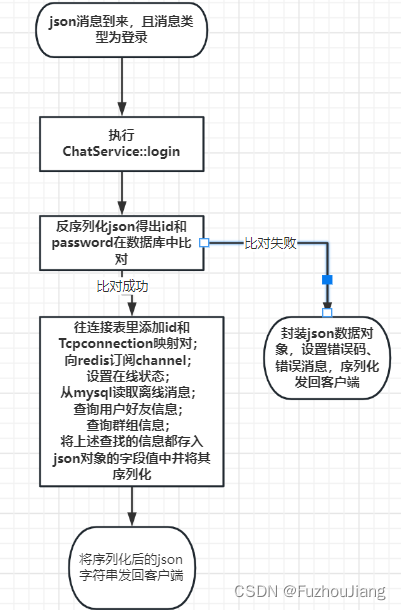
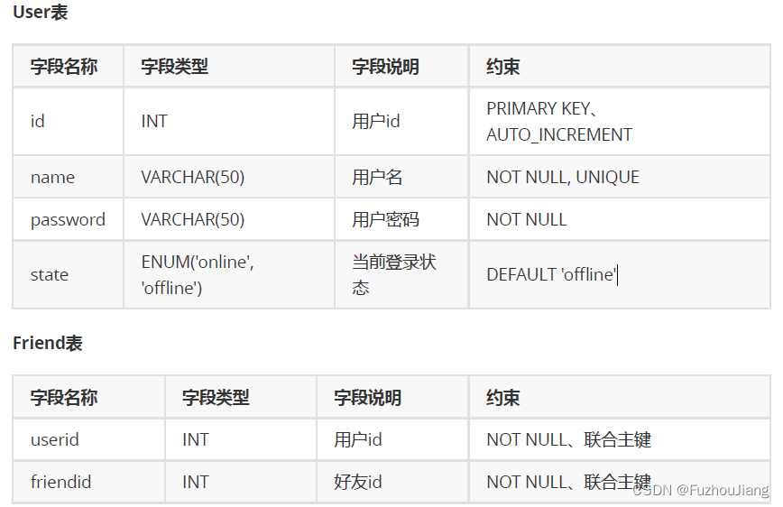
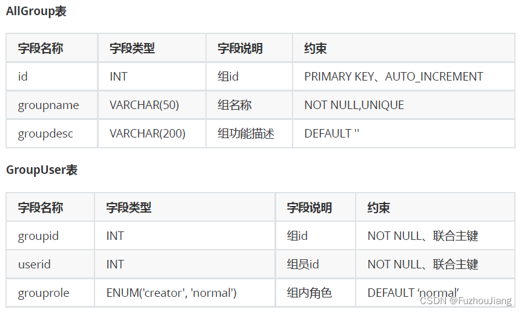
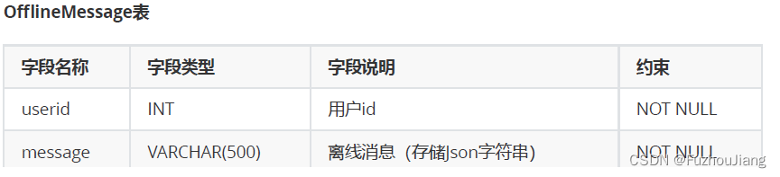

本项目对程序不同功能进行分层设计，分为[网络层](https://so.csdn.net/so/search?q=%E7%BD%91%E7%BB%9C%E5%B1%82&spm=1001.2101.3001.7020)、业务层、和数据层。

C++[面向接口编程](https://so.csdn.net/so/search?q=%E9%9D%A2%E5%90%91%E6%8E%A5%E5%8F%A3%E7%BC%96%E7%A8%8B&spm=1001.2101.3001.7020)也就是面向**抽象类**，网络模块和业务模块尽量解耦。

### 网络层

网络层主要封装的是网络连接方面的一些功能，即`socket`相关操作,这里该项目采用的是`muduo`网络库作为网络层的底层支撑，主要是设置**连接到来**和**消息到来**的回调设置以及服务器基本设置(如子Loop数、启动服务)。

本项目消息使用`json`格式，通过解析消息格式，来确定调用**业务层**的某一具体功能：

```cpp
void ChatServer::onMessage(const TcpConnectionPtr &conn,
                    Buffer *buffer,
                    Timestamp time)
{
    string buf = buffer->retrieveAllAsString();

    // 数据的反序列化
    json js = json::parse(buf);
    auto msgHandler = ChatService::instance()->getHandler(js["msgid"].get<int>());
    // 回调指定的绑定好的事件处理器，来执行相应的业务处理
    msgHandler(conn, js, time);
}
```

### 业务层

业务层主要处理具体的业务，如登录业务、注册业务、一对一聊天业务、群聊业务等，其中业务类`ChatService`是一个**单例**模式，其中使用`unordered_map`存储函数表，通过消息id来映射具体的业务处理函数。还要用一个`unordered_map`来存储用户id与其对应的`TcpConnectionPtr`,使其能够对某一客户端连接进行IO操作。

对于某一具体业务，以**登录**业务举例，其流程如下



```cpp
// 处理登录业务
// 检测id 和 pwd是否在user表中存在，并将状态修改
void ChatService::login(const TcpConnectionPtr &conn, json &js, Timestamp time)
{
    int id = js["id"].get<int>();
    string pwd = js["password"];

    User user = _userModel.query(id);
    if (user.getId() == id && user.getPwd() == pwd)
    {
        if (user.getState() == "online")
        {
            // 该用户已登录，不允许重复登录
            json response;
            response["msgid"] = LOGIN_MSG_ACK;
            response["errno"] = 2;
            response["errmsg"] = "The account has already been logged in. Please enter again.";
            conn->send(response.dump());
        }
        else
        {
            // 登录成功，记录用户连接信息
            {
                // 锁粒度不要太大，过大就丧失并发性
                lock_guard<mutex> lock(_connMutex);
                _userConnMap.insert({id, conn});
            }

            // 用户登录成功后向redis订阅channel （用户id）
            _redis.subscribe(id);

            // 登录成功，更新用户状态信息
            json response;

            user.setState("online");
            _userModel.updateState(user);

            response["msgid"] = LOGIN_MSG_ACK;
            response["errno"] = 0;
            response["id"] = user.getId();
            response["name"] = user.getName();
            // 查询该用户是否有离线消息，若有则读取
            vector<string> vec = _offlineMsgModel.query(id);
            if (!vec.empty())
            {
                response["offlinemsg"] = vec;
                // 读取该用户离线消息后，把该用户所有离线消息从数据库中删除
                _offlineMsgModel.remove(id);
            }

            // 查询该用户好友信息并返回
            vector<User> userVec = _friendModel.query(id);
            if (!userVec.empty())
            {
                vector<string> vec2;
                for (User &user : userVec)
                {
                    json js;
                    js["id"] = user.getId();
                    js["name"] = user.getName();
                    js["state"] = user.getState();
                    vec2.push_back(js.dump());
                }
                response["friends"] = vec2; // 嵌套使用
            }

            // 查询用户群组信息,一个用户有多个群组，一个群组有多个组员
            vector<Group> groupuserVec = _groupModel.queryGroups(id);
            if (!groupuserVec.empty())
            {
                // "group":[{groupid:[xxx, xxx, xxx, xxx]}]
                vector<string> groupV; // 存储一个用户的所有组的信息
                for (Group &group : groupuserVec)
                {
                    json grpjson;
                    grpjson["id"] = group.getId();
                    grpjson["groupname"] = group.getName();
                    grpjson["groupdesc"] = group.getDesc();
                    vector<string> userV; // 存储一个组内所有组员信息
                    // 遍历每个组内的所有组员信息
                    for (GroupUser &user : group.getUsers())
                    {
                        json js;
                        js["id"] = user.getId();
                        js["name"] = user.getName();
                        js["state"] = user.getState();
                        js["role"] = user.getRole();
                        userV.push_back(js.dump());
                    }
                    grpjson["users"] = userV;
                    groupV.push_back(grpjson.dump());
                }
                response["groups"] = groupV;
            }

            conn->send(response.dump());
        }
    }
    else
    {
        // 登录失败，密码错误
        json response;
        response["msgid"] = LOGIN_MSG_ACK;
        response["errno"] = 1;
        response["errmsg"] = "id or password is invalid!";
        conn->send(response.dump());
    }
}
```

其他业务处理函数都类似。

### 数据层

为了使**数据模块**和**业务模块**分离

加入 `ORM`（object Relation Model）类也就是将表的字段封装为一个类并提供对应的 `get` 和 `set` 方法，业务层操作的都是对象，`DAO`层（数据访问层）即`xxxmodel`类才访问数据。

例如，`userModel`层提供的方法接受的数据都是`User`对象，而不是直接裸数据传递.

`model`类是`db`类和`ORM`类的桥梁，model类使用db类提供的方法，使用ORM类对象成员进行SQL的CRUD操作。

### 数据库的表设计







一般来讲，本项目在表数据量为5w以内都能比较高效的进行表查询操作而不需要修改表结构或者是分库分表操作。