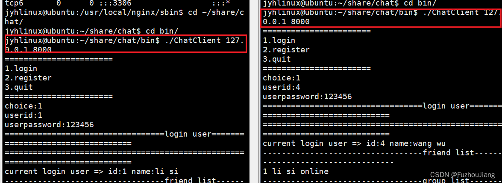
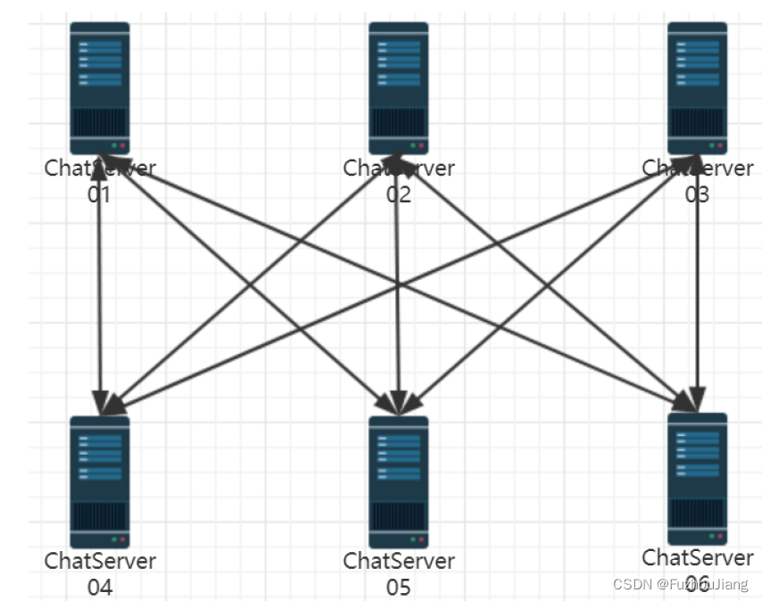

## 负载均衡模块

### 为什么要加入负载均衡模块

原因是：单台服务器并发量最多两三万，不够大。

### 负载均衡器 Nginx的用处或意义\*\*（面试题）\*\*

-   把client请求按**负载算法分发**到具体业务服务器Chatserver
-   能和ChatServer保持**心跳机制**，检测ChatServer保持心跳机制，检测ChatServer故障
-   能发现新添加的ChatServer设备方便服务器**扩展**数量

> 客户端和某台服务器可建立**IP隧道**
>
> 想要更大并发量可以对负载均衡器再做集群

负载均衡模块在整个程序中的位置如下图


### 如何配置nginx的TCP负载均衡模块

首先解压nginx的安装包 （tar zxvf）；

进入[nginx安装](https://so.csdn.net/so/search?q=nginx%E5%AE%89%E8%A3%85&spm=1001.2101.3001.7020)包中编译加入`--with-stream`参数激活tcp负载均衡模块

```sh
~/package/nginx-1.12.2# ./configure --with-stream
~/package/nginx-1.12.2# make && make install
```

编译完成后，默认安装在 `/usr/local/nginx`

```sh
$ cd /usr/local/nginx/
/usr/local/nginx$ ls
```

可执行文件在`sbin`目录里面,配置文件在`conf`目录里面。

```sh
nginx -s reload #重新加载配置文件启动
nginx -s stop #停止nginx服务
```

nginx.conf的补充内容如下

```ini
events {
    worker_connections  1024; #最大连接数1024，默认为512
}
#-------------------------------添加的内容------------------------

stream {
      upstream MyServer {
          # max_fails最大失败次数，若超过则判断连接失败
          # fail_timeout，发出心跳包超过改时间没收到回包就算一次失败
          server 127.0.0.1:6000 weight=1 max_fails=3 fail_timeout=30s;
          server 127.0.0.1:6002 weight=1 max_fails=3 fail_timeout=30s;
      }
  
      server {      
          proxy_connect_timeout 1s;
          listen 8000;
          proxy_pass MyServer; # 所有连接到8000端口的请求都往MyServer指定的主机里负载均衡
          tcp_nodelay on;
      }
  }
#---------------------------------------------------------------
```

其中 `weight`表示权重

上面配置也就是说，客户端连接服务器时端口号填8000就是连接到负载均衡器上，它会帮助我们把请求分发到 `127.0.0.1:6000`和`127.0.0.1:6002`端口上.

配置修改后可用 `./nginx -s reload`平滑重启。

> 注意：这么修改了之后，客户端连接服务端的地址都要为127.0.0.1:8000，也就是连接到负载均衡器上而不是确定的服务器端口上。

`sudo netstat -anp`查看`nginx`进程是否启动在80端口监听



服务器通过负载均衡器按权重分别接收一个连接


## redis发布订阅消息队列

### 背景

当客户端登录到不同的服务器时，应该如何解决**跨服务器通信**问题？

假如采用两两服务器之间建立连接



上图设计相当于在服务器网络之间进行广播。这样的设计使得各个服务器之间**耦合度**太高，不利于系统扩展，并且会占用系统大量的**socket资源**，各服务器之间的带宽压力很大，不能够节省资源给更多的客户端提供服务，因此绝对不是一个好的设计。  
集群部署的服务器之间进行通信，最好的方式就是引入**中间件消息队列**，**解耦**各个服务器，使整个系统**松耦合**，提高服务器的响应能力，节省服务器的带宽资源，如下图所示：


集群分布式环境中，经常使用的中间件消息队列`ActiveMQ`、`RabbitMQ`、`Kafka`等，都是应用场景广泛并且性能很好的消息队列，供集群服务器之间，分布式服务之间进行消息通信。

发布订阅是**观察者**模式的使用场景。

消息队列是**长连接跨服务器聊天通用方法**,工作流程大致如下

客户端c1在某个服务器上连接后，要把该连接在redis队列上订阅一个通道ch1

别的客户端c2在不同的服务器上登录要给c1发消息，会直接发到redis队列上的通道ch1,客户端c1可接受到信息发布到通道ch1

要开一个单独线程进行监听通道上的事件，有消息给业务层上报。

当服务器发现发送的对象id没有在自己的`_userConnMap`上，就要往消息队列上`publish`，消息队列就会把消息发布给订阅者。

redis服务器**后台**运行输入如下指令

```sh
redis-server --daemonize yes
```

发布订阅功能要开两条`redis`连接即两个`redisContext *`,一条用于订阅和接收消息，一条用于发布消息，这么做的原因是因为订阅 `SUBSCRIBE`时会进入阻塞状态，代码如下

```cpp
// 向redis指定通道channel发布消息
bool Redis::publish(int channel, string message)
{
    redisReply *reply = (redisReply *)redisCommand(_publish_context, "PUBLISH %d %s", channel, message);
    if (nullptr == reply)
    {
        cerr << "publish command failed!" << endl;
        return false;
    }
    freeReplyObject(reply);
    return true;
}

// 向redis指定通道subscribe订阅消息
bool Redis::subscribe(int channel)
{
    // SUBSCRIBE命令本身会造成线程阻塞等待通道里发生消息，这里只做订阅通道，不接受通道消息
    // 通道消息接收专门在 observer_channel_message 函数中的独立线程中进行
    // 只负责发送命令，不阻塞接收redis server响应消息，否则和notifyMsg线程抢占响应资源
    if (REDIS_ERR == redisAppendCommand(this->_subscribe_context, "SUBSCRIBE %d", channel))
    {
        cerr << "subscribe command failed!" << endl;
        return false;
    }
    // redisBufferWrite可循环发送缓冲区累积的命令，知道缓冲区数据发送完毕（done被置1）
    int done = 0;
    while (!done)
    {
        if (REDIS_ERR == redisBufferWrite(this->_subscribe_context, &done))
        {
            cerr << "subscribe command failed!" << endl;
            return false;
        }
    }
    return true;
}
```

本项目使用`hiredis`进行`redis`编程,加入redis的发布订阅消息队列后，**业务层**的改动大致如下：

-   `chatservice`构造中连接`redis`即调用`connect`,并设置上报消息的回调，`connect`中会开启一条新线程调用 `observer_channel_message`函数进行循环接收订阅通道上的消息，有消息到来给业务层上报。
-   登录时订阅`subscribe channel`
-   聊天时遇到用户在别的服务器上登录(`userid`不在`map`中，但状态为`online`)就`publish`
-   注销就取消订阅 `unsubscribe channel`

### 杂项

-   若不满意`Nginx`负载均衡效果前面可加`LVS`（Linux Virtual Server）
    
-   负载均衡器 - 一致性哈希算法学有余力可了解
    
-   IP隧道
    
    IP隧道（IP Tunnel）是一种**虚拟的网络连接**方式，它允许**将一个IP数据包传输到另一个IP网络中**，同时保留原始数据包的源和目的地址。它通常用于将两个不同的IP网络连接起来，使它们看起来像一个单一的网络。IP隧道的主要目的是为了解决**网络互联**问题，特别是当两个不兼容的网络需要进行通信时。
    
    在IP隧道中，数据包被封装在另一个IP数据包中，以便在一个网络上传输到另一个网络。这个封装过程称为“隧道ing”，隧道的两端点被称为“入口”和“出口”。入口点将原始IP数据包封装在另一个IP数据包中，将其发送到出口点。出口点接收到封装后的数据包，然后解封装出原始的IP数据包，并将其传送到目的地。
    
    IP隧道的优点是它可以**让不同的网络连接起来**，同时保持原有的网络拓扑结构和地址分配。但是，它也会带来一些缺点，例如会增加**网络延迟**和降低网络性能。