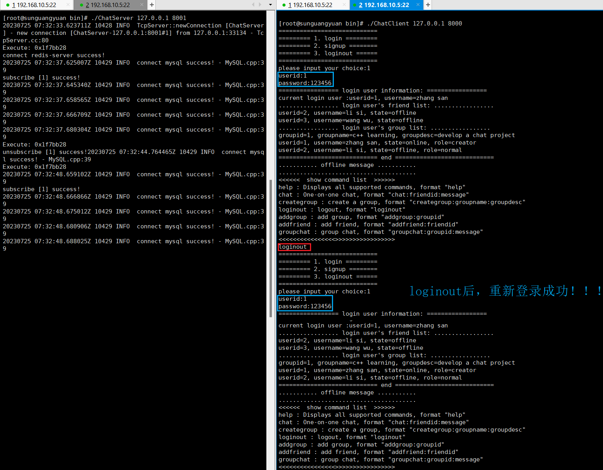

### 文章目录

-   [项目地址和部署：](https://blog.csdn.net/qq_44599368/article/details/131929941#_1)
-   [技术栈：](https://blog.csdn.net/qq_44599368/article/details/131929941#_5)
-   [项目需求：](https://blog.csdn.net/qq_44599368/article/details/131929941#_9)
-   [项目目标：](https://blog.csdn.net/qq_44599368/article/details/131929941#_19)
-   [开发环境：](https://blog.csdn.net/qq_44599368/article/details/131929941#_29)
-   [准备工作：](https://blog.csdn.net/qq_44599368/article/details/131929941#_49)
-   -   [gcc升级：](https://blog.csdn.net/qq_44599368/article/details/131929941#gcc_51)
    -   [重新编译muduo库：](https://blog.csdn.net/qq_44599368/article/details/131929941#muduo_88)
    -   [CMake使用：](https://blog.csdn.net/qq_44599368/article/details/131929941#CMake_108)
    -   -   [查看cmake的版本：](https://blog.csdn.net/qq_44599368/article/details/131929941#cmake_112)
        -   [cmake的使用简介：](https://blog.csdn.net/qq_44599368/article/details/131929941#cmake_118)
        -   [静态库和动态库的编译控制：](https://blog.csdn.net/qq_44599368/article/details/131929941#_176)
        -   [一个正式的工程构建：](https://blog.csdn.net/qq_44599368/article/details/131929941#_182)
        -   [CMake常用的预定义变量：](https://blog.csdn.net/qq_44599368/article/details/131929941#CMake_192)
-   [Json介绍：](https://blog.csdn.net/qq_44599368/article/details/131929941#Json_226)
-   -   [一个优秀的Json三方库：](https://blog.csdn.net/qq_44599368/article/details/131929941#Json_234)
    -   [Json数据序列化：](https://blog.csdn.net/qq_44599368/article/details/131929941#Json_257)
    -   -   [普通数据序列化：](https://blog.csdn.net/qq_44599368/article/details/131929941#_259)
        -   [容器序列化：](https://blog.csdn.net/qq_44599368/article/details/131929941#_295)
    -   [Json数据反序列化：](https://blog.csdn.net/qq_44599368/article/details/131929941#Json_331)
-   [项目各模块：](https://blog.csdn.net/qq_44599368/article/details/131929941#_404)
-   -   [总的业务逻辑：](https://blog.csdn.net/qq_44599368/article/details/131929941#_406)
    -   [数据模块的设计：](https://blog.csdn.net/qq_44599368/article/details/131929941#_411)
    -   -   [数据库的表设计：](https://blog.csdn.net/qq_44599368/article/details/131929941#_413)
        -   -   [User表：](https://blog.csdn.net/qq_44599368/article/details/131929941#User_418)
            -   [Friend表：](https://blog.csdn.net/qq_44599368/article/details/131929941#Friend_438)
            -   [OfflineMessage表：](https://blog.csdn.net/qq_44599368/article/details/131929941#OfflineMessage_456)
            -   [AllGroup表：](https://blog.csdn.net/qq_44599368/article/details/131929941#AllGroup_474)
            -   [GroupUser表：](https://blog.csdn.net/qq_44599368/article/details/131929941#GroupUser_492)
        -   [数据模块代码结构：](https://blog.csdn.net/qq_44599368/article/details/131929941#_514)
    -   [网络模块和业务模块：](https://blog.csdn.net/qq_44599368/article/details/131929941#_521)
    -   -   [网络模块：](https://blog.csdn.net/qq_44599368/article/details/131929941#_523)
        -   [网络模块和业务模块解耦合：](https://blog.csdn.net/qq_44599368/article/details/131929941#_588)
        -   [业务模块：](https://blog.csdn.net/qq_44599368/article/details/131929941#_645)
        -   -   [注册\`signup\`：](https://blog.csdn.net/qq_44599368/article/details/131929941#signup_670)
            -   [登录\`login\`：](https://blog.csdn.net/qq_44599368/article/details/131929941#login_677)
            -   [加好友\`addfriend\`：](https://blog.csdn.net/qq_44599368/article/details/131929941#addfriend_688)
            -   [一对一聊天\`chat\`：](https://blog.csdn.net/qq_44599368/article/details/131929941#chat_695)
            -   [创建群\`creategroup\`：](https://blog.csdn.net/qq_44599368/article/details/131929941#creategroup_708)
            -   [加入群\`addgroup\`：](https://blog.csdn.net/qq_44599368/article/details/131929941#addgroup_715)
            -   [群聊\`chatgroup\`：](https://blog.csdn.net/qq_44599368/article/details/131929941#chatgroup_722)
            -   [注销\`loginout\`：](https://blog.csdn.net/qq_44599368/article/details/131929941#loginout_733)
-   [ChatServer服务器集群：](https://blog.csdn.net/qq_44599368/article/details/131929941#ChatServer_740)
-   -   [集群引入负载均衡器：](https://blog.csdn.net/qq_44599368/article/details/131929941#_742)
    -   -   [项目中的应用：](https://blog.csdn.net/qq_44599368/article/details/131929941#_748)
        -   [nginx安装和配置tcp负载均衡：](https://blog.csdn.net/qq_44599368/article/details/131929941#nginxtcp_769)
        -   [nginx负载均衡器的均衡结果：](https://blog.csdn.net/qq_44599368/article/details/131929941#nginx_844)
    -   [引入redis中间件解决跨服务器通信：](https://blog.csdn.net/qq_44599368/article/details/131929941#redis_877)
    -   -   [集群服务器之间的通信设计：](https://blog.csdn.net/qq_44599368/article/details/131929941#_881)
        -   [redis发布-订阅相关命令：](https://blog.csdn.net/qq_44599368/article/details/131929941#redis_899)
        -   [redis发布-订阅的客户端编程：](https://blog.csdn.net/qq_44599368/article/details/131929941#redis_1030)
        -   -   [安装\`hiredis\`的步骤：](https://blog.csdn.net/qq_44599368/article/details/131929941#hiredis_1034)
            -   [hiredis 数据库客户端：](https://blog.csdn.net/qq_44599368/article/details/131929941#hiredis__1049)
            -   -   [redisConnect()：](https://blog.csdn.net/qq_44599368/article/details/131929941#redisConnect_1053)
                -   [redisCommand()：](https://blog.csdn.net/qq_44599368/article/details/131929941#redisCommand_1061)
                -   [redisAppendCommand()：](https://blog.csdn.net/qq_44599368/article/details/131929941#redisAppendCommand_1109)
                -   [redisGetReply() ：](https://blog.csdn.net/qq_44599368/article/details/131929941#redisGetReply__1121)
                -   [freeReplyObject()：](https://blog.csdn.net/qq_44599368/article/details/131929941#freeReplyObject_1144)
                -   [redisFree()：](https://blog.csdn.net/qq_44599368/article/details/131929941#redisFree_1153)
                -   [struct redisReply：](https://blog.csdn.net/qq_44599368/article/details/131929941#struct_redisReply_1161)
                -   [struct redisContext：](https://blog.csdn.net/qq_44599368/article/details/131929941#struct_redisContext_1197)
                -   [redis\_err：](https://blog.csdn.net/qq_44599368/article/details/131929941#redis_err_1289)
                -   [举例：](https://blog.csdn.net/qq_44599368/article/details/131929941#_1300)
        -   [项目中涉及的redis发布-订阅消息队列模块：](https://blog.csdn.net/qq_44599368/article/details/131929941#redis_1319)
        -   -   [\`redis.h\`：](https://blog.csdn.net/qq_44599368/article/details/131929941#redish_1321)
            -   [\`redis.cpp\`：](https://blog.csdn.net/qq_44599368/article/details/131929941#rediscpp_1369)
    -   [整个服务器集群的设计图：](https://blog.csdn.net/qq_44599368/article/details/131929941#_1555)
-   [Bug问题：](https://blog.csdn.net/qq_44599368/article/details/131929941#Bug_1569)
-   -   [无法进行redis订阅的重大错误排查：](https://blog.csdn.net/qq_44599368/article/details/131929941#redis_1571)
    -   [客户端loginout并重新登录后出现阻塞的不正常状态：](https://blog.csdn.net/qq_44599368/article/details/131929941#loginout_1596)
    -   -   [bug-问题描述：](https://blog.csdn.net/qq_44599368/article/details/131929941#bug_1598)
        -   [debug-问题排查：](https://blog.csdn.net/qq_44599368/article/details/131929941#debug_1605)
        -   [问题分析：](https://blog.csdn.net/qq_44599368/article/details/131929941#_1627)
        -   [bugfix-解决方法：](https://blog.csdn.net/qq_44599368/article/details/131929941#bugfix_1631)
-   [进一步改进涉及的问题：](https://blog.csdn.net/qq_44599368/article/details/131929941#_1928)

# 项目地址和部署：

[ChatServer-based-on-NginxTcpLoadBalance-RedisPubSub](https://github.com/brouseii/ChatServer-based-on-NginxTcpLoadBalance-RedisPubSub)。

# 技术栈：

[Json序列化](https://so.csdn.net/so/search?q=Json%E5%BA%8F%E5%88%97%E5%8C%96&spm=1001.2101.3001.7020)和反序列化、muduo网络库的服务端程序开发、nginx（源码编译安装和环境部署、tcp负载均衡器配置）、存储和服务端中间件redis（基于发布-订阅的服务器中间件redis消息队列编程实现跨服务器通信）、MySQL数据库编程、CMake构建编译环境、聊天功能的基本实现。

# 项目需求：

1.  客户端用户注册、登录
2.  添加好友和添加群组
3.  好友聊天
4.  群组聊天
5.  离线消息
6.  nginx配置tcp负载均衡
7.  redis支持的客户端跨服务器通信

# 项目目标：

1.  使用`muduo`网络库作为项目的网络核心模块，提供高并发的网络IO服务、解耦网络和业务模块代码。
2.  使用json序列化和反序列化消息，作为私有通信协议。
3.  配置nginx基于tcp的负载均衡，实现ChatServer的集群功能，提高了后端服务器的并发能力。
4.  基于redis的发布-订阅消息队列功能，实现跨服务器的消息通信。
5.  使用mysql关系型数据库作为项目的数据持久化存储模块。
6.  使用连接池提高数据库的数据存取性能。
7.  掌握CMake构建自动化编译环境

# 开发环境：

1.  安装Json开发库：直接使用`json.hpp`头文件即可。
    
2.  安装boost + CMake + [muduo](https://so.csdn.net/so/search?q=muduo&spm=1001.2101.3001.7020)网络库开发环境：
    
    [muduo库源码编译安装和环境搭建、编程，参考本人写的另一个博客。](https://blog.csdn.net/qq_44599368/article/details/131833423?spm=1001.2014.3001.5501)
    
3.  安装redis环境：[redis安装和环境搭建、编程，参考本人写的另一个博客](https://blog.csdn.net/qq_44599368/article/details/131773602?spm=1001.2014.3001.5501)
    
4.  安装mysql数据库环境：
    
    [MySQL在CentOS7上的安装和配置，参考参考别人写的博客。](https://blog.csdn.net/qq_45363033/article/details/107011716)
    
    [MySQL基础知识学习笔记，参考本人写的另一个博客。](https://blog.csdn.net/qq_44599368/article/details/127067092?spm=1001.2014.3001.5501)
    
    [C++写的MySQL连接池，参考本人写的另一篇博客。](https://blog.csdn.net/qq_44599368/article/details/130630606?spm=1001.2014.3001.5501)
    
5.  安装nginx：参考本文后续内容。
    

# 准备工作：

## gcc升级：

centos7 默认支持的 gcc 的版本为 4.8.5，但其对 c++11 新特性的编译支持存在许多 bug，故这里需要将 gcc 从 4.8 升级到 7.3 版本。

```shell
yum -y install centos-release-scl
yum install devtoolset-7-gcc*
# 注意可能存在冲突问题：（执行下列命令可解决）
sudo yum remove gcc-base-debuginfo-4.8.5-44.el7.x86_64 gcc-debuginfo-4.8.5-44.el7.x86_64

# 查找g++所在的目录：
# /usr/bin/g++（4.8版本的g++）
# /opt/rh/devtoolset-7/root/usr/bin/g++（7.3版本的g++）
find / -name g++
# 查找gcc所在的目录：
# /usr/bin/gcc（4.8版本的gcc）
# /opt/rh/devtoolset-7/root/usr/bin/gcc（7.3版本的gcc）
find / -name gcc

# 备份 gcc/g++ 4.8 版本
mv /usr/bin/gcc /usr/bin/gcc-4.8
mv /usr/bin/g++ /usr/bin/g++-4.8
mv /usr/bin/cc /usr/bin/cc-4.8
mv /usr/bin/c++ /usr/bin/c++-4.8

# 创建指向新的编译器gcc/g++的软连接
ln -s /opt/rh/devtoolset-7/root/usr/bin/gcc /usr/bin/gcc
ln -s /opt/rh/devtoolset-7/root/usr/bin/g++ /usr/bin/g++
ln -s /usr/bin/gcc /usr/bin/cc
ln -s /usr/bin/g++ /usr/bin/c++

# 查看升级后的gcc/g++版本
gcc -v / g++ -v
```

注意：升级 gcc/g++ 到 7.3 版本后，需要重新编译安装 muduo 网络库。

## 重新编译muduo库：

```shell
unzip muduo-master.zip
# 由于之前编译 muduo库，在 /opt/build 文件中存在记录，需要将其备份
mv ./build ./build_old

cd ./muduo-master 

./build.sh            # 运行源码编译构建程序 
./build.sh install    # 安装muduo库
# 注意：这里实际上是将muduo的include和lib文件夹，放在了同级目录下./build/release-install-cpp11下，即并没有把它们拷贝到系统路径下，导致我们每次编译程序都需要指定muduo库的头文件和库文件路径，太麻烦！！！
# 故需要直接把inlcude（头文件）和lib（库文件）目录下的文件拷贝到系统目录下，之后就不用再指定头文件和lib库文件路径信息了（g++会自动从`/usr/include`和`/usr/local/lib`路径下寻找所需要的文件）
cd ..
cd ./build/release-install-cpp11/include/
mv muduo/ /usr/include/
cd ./build/release-install-cpp11/lib/
mv * /usr/local/lib/
```

## CMake使用：

使用简单方便，可以跨平台，构建项目编译环境。在构建大型工程编译时需要写大量的文件依赖关系，故可使用简单的 CMake 来生成复杂的 Makefile 文件。

### 查看cmake的版本：

```cmake
cmake --version
```

### cmake的使用简介：

项目中，有需要编译的可执行文件的**子目录**下，`CMakeLists.txt`的内容。

```cmake
# 要求cmake最低的版本号
cmake_minimum_required (VERSION 2.8) 

# 定义当前工程名字
project (project_name) 

# 设置debug模式，如果没有这一行将不能调试设断点
set(CMAKE_BUILD_TYPE "Debug")
set(CMAKE_CXX_FLAGS ${CMAKE_CXX_FLAGS} -g)

# 添加头文件搜索路径，相当于makefile里面的-I
include_directories(${PROJECT_SOURCE_DIR}/include)
# 库文件的搜索路径
link_directories(${PROJECT_SOURCE_DIR}/lib)

# 生成库，动态库是SHARED，静态库是STATIC
add_library(*** SHARED ***.cpp)
# 修改库的名字
set_target_properties(*** PROPERTIES OUTPUT_NAME "lib***")

# 定义变量，存储当前目录下的所有源文件
aux_source_directory(. SRC_LIST)  # 存在的弊端：会把指定目录下的所有源文件都加进来，可能会加入一些我们不需要的文件。
# 可通过set命令，新建变量来存放需要的源文件：set(SRC_LIST ./***.cpp ./***.cpp)

# 设置可执行文件，最终存储的路径
set(EXECUTABLE_OUTPUT_PATH ${PROJECT_SOURCE_DIR}/bin)

# 表示生成可执行文件 main，由 SRC_LIST 变量所定义的源文件编译而来
add_executable(main ${SRC_LIST})

# 表示生成可执行文件 main，需要的库文件library_1、library_2、library_3、...
target_link_libraries(main library_1 library_2 library_3)
```

项目中，**主目录**下，`CMakeLists.txt`的内容。

```cmake
# 要求cmake最低的版本号
cmake_minimum_required (VERSION 2.8) 

# 定义当前工程名字
project (project_name) 

# 设置debug模式，如果没有这一行将不能调试设断点
set(CMAKE_BUILD_TYPE "Debug")
set(CMAKE_CXX_FLAGS ${CMAKE_CXX_FLAGS} -g)  # 配置编译选项

# 指定搜索的子目录：
# 进入子目录下执行其中的 CMakeLists.txt 文件，这里的 tests1 和 tests2 里面都有可编译的代码文件
add_subdirectory(tests1)
add_subdirectory(tests2)
```

### 静态库和动态库的编译控制：

```cmake
// 有待进一步学习。。。
```

### 一个正式的工程构建：

1.  bin 存放最终的可执行文件
2.  build 存放编译中间文件
3.  lib 存放编译生成的库文件
4.  include 头文件
5.  src 源代码文件
6.  main.cpp
7.  CMakeLists.txt

### CMake常用的预定义变量：

```cmake
PROJECT_NAME # 通过 project() 指定项目名称

PROJECT_SOURCE_DIR # 工程的根目录

PROJECT_BINARY_DIR # 执行 cmake 命令的目录

CMAKE_CURRENT_SOURCE_DIR # 当前 CMakeList.txt 文件所在的目录

CMAKE_CURRENT_BINARY_DIR # 编译目录，可使用 add subdirectory 来修改

EXECUTABLE_OUTPUT_PATH # 二进制可执行文件输出位置

LIBRARY_OUTPUT_PATH # 库文件输出位置

BUILD_SHARED_LIBS # 默认的库编译方式 ( shared 或 static ) ，默认为 static

CMAKE_C_FLAGS # 设置 C 编译选项

CMAKE_CXX_FLAGS # 设置 C++ 编译选项

CMAKE_CXX_FLAGS_DEBUG # 设置编译类型 Debug 时的编译选项

CMAKE_CXX_FLAGS_RELEASE # 设置编译类型 Release 时的编译选项

CMAKE_GENERATOR # 编译器名称

CMAKE_COMMAND # CMake 可执行文件本身的全路径

CMAKE_BUILD_TYPE # 工程编译生成的版本， Debug / Release
```

# Json介绍：

一种轻量级的数据交换格式（也叫数据序列化方式），采用完全独立于编程语言的文本格式来存储和表示数据。的层次结构简洁和清晰，易于阅读和编写、机器解析和生成，且能有效地提升网络传输效率。

在网络中，常用的数据传输序列化格式有 `XML、Json、ProtoBuf`。在公司级别的项目中，大量的在使用 `ProtoBuf` 作为数据序列化的方式，以其数据压缩编码传输，占用带宽小，同样的数据信息，是 `Json` 的1/10，XML 的1/20，但使用起来比 `Json` 稍复杂一些。

本项目，选用的 `Json` 格式来打包传输数据。

## 一个优秀的Json三方库：

JSON for Modern C++ 是一个由德国大牛 nlohmann 编写的在 C++ 下使用的 JSON 库。

具有以下特点：

1.  直观的语法；
    
2.  整个代码由一个头文件组成 `json.hpp`，没有子项目，没有依赖关系，没有复杂的构建系统，使用起来非常方便；
    
    ```cpp
    #include "json.hpp"
    using json = nlohmann::json;
    ```
    
3.  使用 C++ 11 标准编写；
    
4.  使用 json 像使用 STL 容器一样；
    
5.  STL 和 json 容器之间可以相互转换；
    
6.  严谨的测试：所有类都经过严格的单元测试，覆盖了 100％ 的代码，包括所有特殊的行为。此外，还检查了 `Valgrind` 是否有内存泄漏。
    

## Json数据序列化：

### 普通数据序列化：

```cpp
#include "json.hpp"
#include <iostream>

int main()
{
    using json = nlohmann::json;

    json js;
    // 序列化数组
    js["array"] = {{1,2,3},{4,5,6}};
    std::cout << js << std::endl;
    // 序列化键值对
    js["key"] = "value";
    std::cout << js << std::endl;
    // 序列化对象
    js["key1"] = {"value1_1", "value1_2"};
    js["key2"] = {"value2_1", "value2_2"};
    js["msg"]["key3_1"] = "value3_1";
    js["msg"]["key3_2"] = "value3_2";
    std::cout << js << std::endl;
    
    return 0;
}

/*
{"array":[[1,2,3],[4,5,6]]}

{"array":[[1,2,3],[4,5,6]],"key":"value"}

{"array":[[1,2,3],[4,5,6]],"key":"value","key1":["value1_1","value1_2"],"key2":["value2_1","value2_2"],"msg":{"key3_1":"value3_1","key3_2":"value3_2"}}
*/
```

### 容器序列化：

```cpp
#include "json.hpp"
#include <iostream>
#include <vector>
#include <map>

int main()
{
    using json = nlohmann::json; 
 
    // 容器序列化
    std::vector<int> arr_vctor({1,2,3,4,5});
    js["arr_vctor"] = arr_vctor;
    std::cout << js << std::endl;
    std::vector<std::vector<int>> arr2_vctor({{1,2,3},{4,5,6}});
    js["arr2_vctor"] = arr2_vctor;
    std::cout << js << std::endl;
    std::map<int, std::string> mp;
    mp[1] = "mp1"; mp[2] = "mp2";
    js["map"] = mp;
    std::cout << js << std::endl;

    return 0;
}

/*
{"arr_vctor":[1,2,3,4,5],"array":[[1,2,3],[4,5,6]],"key":"value","key1":["value1_1","value1_2"],"key2":["value2_1","value2_2"],"msg":{"key3_1":"value3_1","key3_2":"value3_2"}}

{"arr2_vctor":[[1,2,3],[4,5,6]],"arr_vctor":[1,2,3,4,5],"array":[[1,2,3],[4,5,6]],"key":"value","key1":["value1_1","value1_2"],"key2":["value2_1","value2_2"],"msg":{"key3_1":"value3_1","key3_2":"value3_2"}}

{"arr2_vctor":[[1,2,3],[4,5,6]],"arr_vctor":[1,2,3,4,5],"array":[[1,2,3],[4,5,6]],"key":"value","key1":["value1_1","value1_2"],"key2":["value2_1","value2_2"],"map":[[1,"mp1"],[2,"mp2"]],"msg":{"key3_1":"value3_1","key3_2":"value3_2"}}
*/
```

## Json数据[反序列化](https://so.csdn.net/so/search?q=%E5%8F%8D%E5%BA%8F%E5%88%97%E5%8C%96&spm=1001.2101.3001.7020)：

```cpp
#include "json.hpp"
#include <iostream>
#include <string>
#include <vector>
#include <map>
using json = nlohmann::json;

std::string func1()
{ 
    json js;
    // 序列化数组
    js["array"] = {{1,2,3},{4,5,6}};
    std::cout << js << std::endl;
    // 序列化键值对
    js["key"] = "value";
    std::cout << js << std::endl;
    // 序列化对象
    js["key1"] = {"value1_1", "value1_2"};
    js["key2"] = {"value2_1", "value2_2"};
    js["msg"]["key3_1"] = "value3_1";
    js["msg"]["key3_2"] = "value3_2";
    std::cout << js << std::endl;
 
    std::string ret = js.dump();  // 将json对象序列化为字符串
    return ret;
}

std::string func2()
{ 
    json js; 
    // 容器序列化
    std::vector<int> arr_vctor({1,2,3,4,5});
    js["arr_vctor"] = arr_vctor;
    std::cout << js << std::endl;
    std::vector<std::vector<int>> arr2_vctor({{1,2,3},{4,5,6}});
    js["arr2_vctor"] = arr2_vctor;
    std::cout << js << std::endl;
    std::map<int, std::string> mp;
    mp[1] = "mp1"; mp[2] = "mp2";
    js["map"] = mp;
    std::cout << js << std::endl;

    std::string ret = js.dump();  // 将json对象序列化为字符串
    return ret;
}

int main()
{
    json js;
    std::string revBuf1 = func1();
    // 模拟从网络接收到json字符串，通过json::parse函数把json字符串转换为json对象
    json jsBuf1 = json::parse(revBuf1); 
    auto ret1 = jsBuf1["array"];   
    std::cout << ret1 << std::endl;
    auto ret2 = jsBuf1["msg"];    
    std::cout << ret2 << std::endl;
 
    std::cout << "................." << std::endl;

    std::string revBuf2 = func2();
    json jsBuf2 = json::parse(revBuf2); 
    auto ret3 = jsBuf2["arr2_vctor"];  // auto ==> vector<vector<int>>
    std::cout << ret3 << std::endl;
    auto ret4 = jsBuf2["map"];         // auto ==> map<int, string>
    std::cout << ret4 << std::endl; 

    return 0;
}
```

# 项目各模块：

## 总的业务逻辑：


## 数据模块的设计：

### 数据库的表设计：


#### User表：

用途说明：在**登录**的时，需通过该表中信息对用户身份进行验证；在**注册**的时，需给该表写入数据。

| 字段名称 |         字段类型          |   字段说明   |             约束             |
| :------: | :-----------------------: | :----------: | :--------------------------: |
|    id    |            INT            |    用户id    | PRIMARY KEY、AUTO\_INCREMENT |
|   name   |        VARCHAR(50)        |    用户名    |       NOT NULL、UNIQUE       |
| password |        VARCHAR(50)        |   用户密码   |           NOT NULL           |
|  state   | ENUM(‘online’, ‘offline’) | 当前登录状态 |      DEFAULT ‘offline’       |

```mysql
create table User (
    id INT PRIMARY KEY AUTO_INCREMENT, 
    name VARCHAR(50) NOT NULL UNIQUE, 
    password VARCHAR(50) NOT NULL, 
    state ENUM('online', 'offline') DEFAULT 'offline'
);
```

#### Friend表：

用途说明：在**加好友**时，需给该表写入信息；在**一对一聊天**时，查询好友的信息，之后去看好友是否在线。

| 字段名称 | 字段类型 | 字段说明 |        约束        |
| :------: | :------: | :------: | :----------------: |
|  userid  |   INT    |  用户id  | NOT NULL、联合主键 |
| friendid |   INT    |  好友id  | NOT NULL、联合主键 |

```mysql
create table Friend(
    userid INT NOT NULL, 
    friendid INT NOT NULL
);
# 添加联合主键：
alter table Friend add PRIMARY KEY(userid, friendid);
```

#### OfflineMessage表：

用途说明：有**离线消息**（离线消息的三个问题：发给谁，谁发的，发的什么）时，需给该表写入数据。

| 字段名称 | 字段类型     | 字段说明                   | 约束     |
| -------- | ------------ | -------------------------- | -------- |
| userid   | INT          | 用户id                     | NOT NULL |
| message  | VARCHAR(500) | 离线消息（存储Json字符串） | NOT NULL |

```mysql
create table OfflineMessage(
userid INT NOT NULL, 
message VARCHAR(500) NOT NULL
);
```

注意：每个`userid`可以有多条记录在`OfflineMessage`表中。

#### AllGroup表：

用途说明：在**创建群**时，给该表写入数据，用来记录群组信息。

| 字段名称  |   字段类型   |  字段说明  |             约束             |
| :-------: | :----------: | :--------: | :--------------------------: |
|    id     |     INT      |    组id    | PRIMARY KEY、AUTO\_INCREMENT |
| groupname | VARCHAR(50)  |    组名    |       NOT NULL、UNIQUE       |
| groupdesc | VARCHAR(200) | 组功能描述 |          DEFAULT ‘’          |

```mysql
create table AllGroup(
    id INT PRIMARY KEY AUTO_INCREMENT, 
    groupname VARCHAR(50) NOT NULL UNIQUE, 
    groupdesc VARCHAR(200) DEFAULT ''
);
```

#### GroupUser表：

用途说明：在**加入群**时，给该表写入信息，并在**发送群消息**时查询该表后由服务器向这些成员转发消息。

| 字段名称  |         字段类型          | 字段说明 |        约束        |
| :-------: | :-----------------------: | :------: | :----------------: |
|  groupid  |            INT            |   组id   | NOT NULL、联合主键 |
|  userid   |            INT            |  组员id  | NOT NULL、联合主键 |
| grouprole | ENUM(‘creator’, ‘normal’) | 组内角色 |  DEFAULT ‘normal’  |

```mysql
create table GroupUser(
    groupid INT NOT NULL, 
    userid INT NOT NULL, 
    grouprole ENUM('creator', 'normal') DEFAULT 'normal'
);
# 添加联合主键：
alter table GroupUser add PRIMARY KEY(groupid, userid);
```

注意，因上述表中涉及到主键列，最好在重置数据库时，使用`truncate from tablename`代替`delete from tablename`。

### 数据模块代码结构：


注意：这里`FriendModel.h`和`OfflineMsgModel.h`均没有上层类，前者是可通过`User`表并结合自身的联合主键进行内连接查询，后者没有存在的必要直接通过`userid`查询离线消息即可。

## 网络模块和业务模块：

### 网络模块：

网络模块直接使用了 muduo 网络库提供的接口，其内部采用`One Loop Per Thread && Tread Pool`的方式，可方便，简单搭建高性能的 IO 多路复用的网络模型。

muduo 网络库采用的 reactor 模型，有点像 Nginx 的负载均衡。在 muduo 设计中，有一个 main reactor 负责接收来自客户端的连接。然后使用轮询的方式分发连接到 sub 上来完成客户端的读写事件。类似于，Nginx 的 io 进程 + woker 工作进程的组合。

[muduo的深入理解，请参考本人写的另一个博客（一个独立的项目）。](https://blog.csdn.net/qq_44599368/article/details/131833423?spm=1001.2014.3001.5501)

muduo提供了两个非常重要的注册回调接口，分别是“连接回调”和“消息回调”。

```cpp
// 初始化聊天服务器对象
ChatServer::ChatServer(EventLoop* loop, const InetAddress& listenAddr, const string& nameArg)
    : _loop(loop)
    , _server(loop, listenAddr, nameArg)
{   
    // 注册连接回调函数
    _server.setConnectionCallback(std::bind(&ChatServer::onConnection, this, _1));
    
    // 注册消息回调函数
    _server.setMessageCallback(std::bind(&ChatServer::onMessage, this, _1, _2, _3));

    // 设置线程数量
    _server.setThreadNum(4);  // 1个main reactor、3个sub reactor
}
```

在 ChatServer 中，设置处理有关连接事件和读写事件的方法，并通过构造函数注册到 muduo 库中，用于事件发生时执行回调操作。

在这里，我直接和我设置一个处理有关连接事件的方法和处理读写事件的方法。

```cpp
// 上报连接相关信息的回调函数：连接/断开连接，其执行对象是“main reactor”
void ChatServer::onConnection(const TcpConnectionPtr& conn)
{
    // 客户端断开连接
    if (!conn->connected())
    {
        // 通过ChatService中的静态成员instance获取其单例对象实例，并调用其clientCloseException()成员函数
        //，用来处理客户端连接断开后，将其上的用户连接在数据库中的状态改为offline
        ChatService::instance()->clientCloseException(conn); 
        conn->shutdown();
    }
}

// 上报读写事件相关信息的回调函数：读写事件，其执行对象是“sub reactor”
void ChatServer::onMessage(const TcpConnectionPtr& conn, Buffer* buf, Timestamp time)
{
    // 从buf中，获取json字符串
    string buf_ = buf->retrieveAllAsString(); 
    cout << "Execute: " << buf << endl;

    // 将buf中获取到的json字符串数据反序列化
    json js = json::parse(buf_); 
  
    // 目的：完全解耦网络模块的代码和业务模块的代码
    // 通过js["msgid"]获取msgHandler ==> msgHandler(conn, js, time)
    auto msgHandler = ChatService::instance()->getHandler(js["msgid"].get<int>());
    // 回调消息绑定好的事件处理器，来执行相应的业务处理
    msgHandler(conn, js, time);
}
/* 函数内部通过 msgid 来选择调用不同的业务逻辑代码，故实现了“网络模块”和“业务模块”解耦合！！！ */
```

### 网络模块和业务模块解耦合：

在网络模块`ChatServer`中，有一个字段`msgid`，其代表着服务器和客户端通信的消息类型。

```cpp
/* ................ include/public.h .................*/
#ifndef PUBLIC_H
#define PUBLIC_H

/* server和client的公共文件 */
enum EnMsgType    // 枚举类型
{
    LOGIN_MSG = 1,     // 登录消息  {"msgid":1,"id":*,"password":"***"}
    LOGIN_MSG_ACK,     // 登录响应消息
 
    LOGINOUT_MSG,      // 注销消息

    SIGNUP_MSG,        // 注册消息  {"msgid":3,"id":*,"name":"***","password":*}
    SIGNUP_MSG_ACK,    // 注册响应消息

    ONE_CHAT_MSG,      // 聊天消息  {"msgid":5,"id":*,"from":"***","to":*,"msg":"***"}

    ADD_FRIEND_MSG,    // 添加好友消息

    CREATE_GROUP_MSG,          // 创建群组   CREATE_GROUP_MSG_ACK,  // 创建群组响应消息 
    ADD_GROUP_MSG,             // 加入群组
    GROUP_CHAT_MSG,            // 群聊天
};

#endif
```

```cpp
/* ..................... src/server/ChatService.cpp ....................... */
// unordered_map<int, function<void(const TcpConnectionPtr&, json&, Timestamp)>>
// _msgHandlerMap中，保存<“消息类型”、“对应的Handler回调操作”>
ChatService::ChatService()
{ 
    // 用户基本业务管理相关事件处理回调注册
    _msgHandlerMap[LOGIN_MSG] = std::bind(&ChatService::login, this, _1, _2, _3);
    _msgHandlerMap[LOGINOUT_MSG] = std::bind(&ChatService::loginout, this, _1, _2, _3);
    _msgHandlerMap[SIGNUP_MSG] = std::bind(&ChatService::signup, this, _1, _2, _3);
    _msgHandlerMap[ONE_CHAT_MSG] = std::bind(&ChatService::oneChat, this, _1, _2, _3);
    _msgHandlerMap[ADD_FRIEND_MSG] = std::bind(&ChatService::addFriend, this, _1, _2, _3);

    // 群组业务管理相关事件处理回调注册
    _msgHandlerMap.insert({CREATE_GROUP_MSG, std::bind(&ChatService::createGroup, this, _1, _2, _3)});
    _msgHandlerMap.insert({ADD_GROUP_MSG, std::bind(&ChatService::addGroup, this, _1, _2, _3)});
    _msgHandlerMap.insert({GROUP_CHAT_MSG, std::bind(&ChatService::groupChat, this, _1, _2, _3)});

    ...
}
```

存储消息类型和对应的消息处理回调函数的容器，用在网络模块中，就可以根据消息类型来获得并执行其 msgHandler，从而实现网络模块和业务模块的解耦和协同工作。

### 业务模块：

本项目将业务模块与网络模块进行了解耦，在业务只需专注业务即可。

具体业务相关的数据结构如下：

```cpp
// 存储消息id和其对应的业务处理方法
unordered_map<int, MsgHandler> _msgHandlerMap;

// 存储在线用户的通信连接<userid, TcpConnectionPtr>
unordered_map<int, TcpConnectionPtr> _userConnMap;
// 定义互斥锁，保证_userConnMap的线程安全
mutex _connMutex;

// 数据操作类对象
UserModel _userModel; 
OfflineMsgModel _offlineMsgModel;
FriendModel _friendModel;
GroupModel _groupModel;

// redis操作对象
Redis _redis;
```

#### 注册`signup`：

当服务器接收到 `json` 字符串的时候，对其进行反序列化，得到要注册的信息，然后写入到`User`表中，成功就将`id`号返回，失败就把`errno`字段设置为1。


#### 登录`login`：

当服务器接收到 `json` 字符串并对其进行反序列化，从而得到用户传递过来的账号和密码信息。检测这个账号和密码是否与服务器中的数据匹配，

-   不匹配，就把`errno`设置为`1`并返回`id or password error`的错误信息。
-   匹配，就检测当前用户是否在线，因为有在别的设备登录的状况，如果在线就把`errno`设置为`2`，返回`id is online`的错误信息。
-   用户不在线，则就是登陆成功了，服务器会将该用户的好友列表，群组列表以及离线消息都推送给该用户。


#### 加好友`addfriend`：

服务器得到并反序列化解析该信息后，将信息写入`Friend`表中即可。


#### 一对一聊天`chat`：

服务器接收到客户端的信息后，

-   本服务器的`_userConnMap`查看接受信息的用户是否在本服务器在线，在线则直接转发；
    
-   不在线则看看数据库中`User`表里该用户是否是在线，
    
    -   在线，则表明接收用户在其他服务器登录，则需要通过`redis`中间件转发消息到该接收用户命名的管道目标`channel`中（接收用户在登录时，就订阅了自己`id`对应的`channel`管道），从而完成跨服务器通信。
-   均不在线，转储离线消息即可。
    


#### 创建群`creategroup`：

服务器接收到客户端的信息解析后，会把群组的信息写入到`AllGroup`表中，并将创建者的信息写入到`GroupUser`中，且设置创建者为`creator`。


#### 加入群`addgroup`：

服务器接收到客户端的信息，将用户数据写入到`GroupUser`表中，并将`role`角色设置为`normal`。


#### 群聊`chatgroup`：

服务器接收到客户端的信息，先去`GroupUser`查询到所有群员的`id`，然后一个个在本服务器的`_userConnMap`中查看待接收信息的群用户是否在本服务器在线，

-   在线，则直接转发。
-   不在线，则查看数据库中`User`表信息判断群成员是否是在线，如果在线即接收用户在其他服务器登录，将消息通过`redis`中间件转发即可。
-   均不在线，则转储离线消息。


#### 注销`loginout`：

服务器`ChatServer`收到客户端`ChatClient`发来的信息，将该用户在`User`表中所对应的`state`改为`offline`。


# ChatServer服务器集群：

## 集群引入负载均衡器：

单台服务器受限于硬件资源，其性能是有上限的，当单台服务器不能满足应用场景的并发需求量时，就需要考虑部署多个服务器共同处理客户端的并发请求，但是客户端怎么知道去连接具体哪台服务器呢？此时就需要一台负载均衡器，通过预设的负载算法，指导客户端连接服务器。

进一步学习：剖析`nginx`中`tcp`负载均衡模块源码

### 项目中的应用：

本项目采用\*\*“长连接”\*\*，即客户端和服务端相互发消息都需要经过`nginx`。

还有另一种方式：首次客户端通过nginx连接服务端后，之后通过客户端与服务端建立一条`IP`隧道来完成服务端到客户端的消息即不再通过nginx服务器来进行通信。

负载均衡器的功能：


1.  将客户端client的请求，通过**负载均衡器**（按照负载均衡算法）分发给具体的业务服务器`ChatServer`上。
2.  因项目中使用\*\*“长连接”**进行客户端与服务器的通信，故需要负载均衡器与`ChatServer`保持**“心跳机制”**来检测`ChatServer`的**故障状态\*\*，进而使客户端连接能正确的与服务器建立连接。
3.  为了方便**扩展服务器**的数量，需要负载均衡器来发现新添加的`ChatServer`设备。

选择`nginx`的`tcp`负载均衡模块，

1.  如何进行`nginx`的源码编译，包含`tcp`负载均衡模块？
2.  `nginx.conf`配置文件中，如何配置负载均衡。
3.  `nginx`的平滑加载配置文件启动。

### nginx安装和配置tcp负载均衡：

`nginx`在1.9版本之前，只支持`http`协议`web`服务器的负载均衡；从1.9版本开始以后，nginx开始支持`tcp`的\*\*“长连接”\*\*负载均衡。

```shell
tar -zxvf nginx-1.12.2.tar.gz
cd ./nginx-1.12.2

# 安装nginx需要依赖的pcre、openssl、zlib等库
sudo yum install pcre pcre-devel
sudo yum install openssl openssl-devel
sudo yum install zlib zlib-devel

# 编译安装nginx-1.12.2
./configure --with-stream  # nginx默认没有编译tcp负载均衡模块，需要加入--with-stream参数来激活该模块
make && make install    # make命令会向系统路径拷贝文件，需要在root用户下执行

# 编译完成后，默认安装在了/usr/local/nginx目录
cd /usr/local/nginx/
ls -al .
```

`./configure --with-stream`成功执行的提示：


`nginx`通过`/usr/local/nginx/conf/nginx.conf`文件来配置负载均衡，具体添加内容如下：

```shell
# nginx tcp loadbalance config
stream {
    upstream MyServer {
    # nginx负载均衡器中，负载均衡算法需要更具weight权重来选择服务器
        server 127.0.0.1:6000 weight=1 max_fails=3 fail_timeout=30s;
        server 127.0.0.1:6002 weight=1 max_fails=3 fail_timeout=30s;
    }

    server {
        proxy_connect_timeout 1s;  # nginx作为负载均衡器，在指定时间内未与后端服务器集群建立连接，则判定连接失败
        
        # proxy_timeout 3s;        # nginx作为负载均衡器，与后端服务器保持连接的最长时间
        # 本项目中客户端通过nginx负载均衡器与后端服务器建立“长连接”，故不需要配置该参数项
        
        listen 8000;               # 客户端可通过该端口访问nginx负载均衡器
        proxy_pass MyServer;
        
        tcp_nodelay on;            # 禁用Nagle算法，从而允许立即发送小数据包，以获得更快的网络传输速度。这种设置在某些情况下可能会提高应用程序的性能，但在其他情况下可能会导致网络拥塞和其他问题，酌情配置。  
    }
}

# 注意：每次修改配置文件后，需要先`/usr/local/nginx/sbin/nginx -s stop`停止nginx服务并`cd /usr/local/nginx/sbin/nginx | ./nginx`重启，才能生效。
```


`nginx`服务的启动和停止：

```shell
/usr/local/nginx/sbin/nginx -s reload     # 重新加载配置文件启动
/usr/local/nginx/sbin/nginx -s stop       # 停止nginx服务

# 可查看nginx进程是否存在，以及进程ID
ps -ef | grep nginx
# 可查看nginx服务是否已启动，以及服务监听的端口号
netstat -antp
```


### nginx负载均衡器的均衡结果：

这里使用了本机的两个`8001`和`8002`端口来模拟两个`ChatServer`服务器，客户端通过nginx负载均衡器监听的`8000`连接并分发到到两台`ChatServer`服务器中的一台。


存在的问题：从上面的效果图可看出来，且两个服务器在 nginx 中 tcp 负载均衡中的配置权重相同，故两个客户端`ChatServer`分别连接到了两台`ChatServer`服务器，因两者因不在同一台服务器上，故无法相互实时通信。总结，需要解决“集群中跨服务器通信”问题：

分析：从下列源码中可看出，`unordered_map<int, TcpConnectionPtr> _userConnMap`中找不到另一台服务器上在线的用户连接，故无法实时通信只能存为离线消息。

```cpp
/* ...................... ChatService.cpp ...................... */
// 一对一聊天业务（聊天消息格式：{"msgid":5,"id":*,"from":"***","toid":*,"msg":"***"}）
void ChatService::oneChat(const TcpConnectionPtr& conn, const json& js, Timestamp time)
{
    int toid = js["toid"].get<int>();
    {
        lock_guard<mutex> lock(_connMutex);
        auto iter = _userConnMap.find(toid);  // _userConnMap存储在线用户的通信连接<userid, TcpConnectionPtr>
        if (iter != _userConnMap.end())
        {
            // toid在线，则转发消息（加锁保证了转发消息期间，_connMutex的线程安全，即该conn不会在转发消息过程中被清除掉）
            iter->second->send(js.dump());   // 服务器主动推送消息给toid用户
            return;
        } 
    }

    // toid不在线，则存储为离线消息
    _offlineMsgModel.insert(toid, js.dump());  // 将JSON对象转换为JSON字符串
}
```

## 引入redis中间件解决跨服务器通信：

以`redis`的发布-订阅机制作为集群服务器的消息中间件，解耦服务器之间的通信。用`hiredis`做客户端编程。

### 集群服务器之间的通信设计：

当ChatServer集群部署多台服务器以后，当登录在不同服务器上的用户进行通信时，怎么设计？

1.  各个ChatServer服务器互相之间直接建立TCP连接进行通信，相当于在服务器网络之间进行广播。这样的设计使得各个服务器之间耦合度太高不利于扩展，并且会占用系统大量socket资源保证各个服务器之间的相互连接，不能够节省资源给更多的客户端提供服务。
    
    
    
2.  集群部署的服务器之间进行通信，最好的方式就是引入中间件消息队列，解耦各个服务器，使整个系统松耦合，提高服务器的响应能力，节省服务器的带宽资源。
    
    
    

在集群分布式环境中，经常使用性能很好的中间件消息队列有ActiveMQ、RabbitMQ、Kafka等，供集群服务器、分布式服务之间进行消息通信。

本项目业务类型并不是非常复杂，对并发请求量也没有太高的要求，故中间件消息队列-基于发布-订阅模式的redis。

### redis发布-订阅相关命令：

[详细的Redis知识，请参考我的另一篇博客。](https://blog.csdn.net/qq_44599368/article/details/131773602?spm=1001.2014.3001.5501)

`redis`的发布-订阅机制：发布-订阅模式包含了两种角色，分别是消息的发布者和订阅者。

-   订阅者可以订阅一个或者多个频道`channel`，发布者可以向指定的频道`channel`发送消息且订阅该频道的所有订阅者都会收到此消息。
    
-   订阅频道的命令是`subscribe`，可以同时订阅多个频道，用法是`subscribe channel1 [channel2...]`。执行上面命令客户端会进入进入订阅阻塞状态，等待该频道上的信息。此状态下客户端不能使用除`subscribe、unsubscribe、psubscribe和punsubscribe`这四个属于"发布/订阅"之外的命令，否则会报错。
    

 进入订阅状态后客户端可能收到3种类型的回复。每种类型的回复都包含3个值，第一个值是消息的类型，根据消类型的不同，第二个和第三个参数的含义可能不同。消息类型的取值可能是以下3个:

1.  `subscribe`：表示订阅成功的反馈信息。第二个值是订阅成功的频道名称，第三个是当前客户端订阅的频道数量。
    
    `{ subscribe、订阅成功的频道名称、当前客户端订阅的频道数量 }`
    
2.  `message`：表示接收到的消息，第二个值表示产生消息的频道名称，第三个值是消息的内容。
    
    `{ message、产生消息的频道名称、消息的内容 }`
    
3.  `unsubscribe`：表示成功取消订阅某个频道。第二个值是对应的频道名称，第三个值是当前客户端订阅的频道数量，当此值为0时客户端会退出订阅状态，之后就可以执行其他非"发布/订阅"模式的命令了。
    
    `{ unsubscribe、对应的频道名称、当前客户端订阅的频道数量 }`
    

redis配置文件`/myredis/redis.conf`：

```shell
[root@sunguangyuan opt]# grep -v '^#' /myredis/redis.conf
protected-mode no
port 6379
tcp-backlog 511
timeout 0
tcp-keepalive 300

daemonize yes
pidfile /var/run/redis_6379.pid
loglevel notice
logfile ""

databases 16

always-show-logo no
set-proc-title yes
proc-title-template "{title} {listen-addr} {server-mode}"

stop-writes-on-bgsave-error yes
rdbcompression yes
rdbchecksum yes
dbfilename dump.rdb
rdb-del-sync-files no

dir ./

replica-serve-stale-data yes
replica-read-only yes
repl-diskless-sync no
repl-diskless-sync-delay 5
repl-diskless-load disabled
repl-disable-tcp-nodelay no
replica-priority 100

acllog-max-len 128

requirepass sgy211810   # 这里表明在通过redis-cli访问redis-server服务时，需要进行身份验证

lazyfree-lazy-eviction no
lazyfree-lazy-expire no
lazyfree-lazy-server-del no
replica-lazy-flush no
lazyfree-lazy-user-del no
lazyfree-lazy-user-flush no

oom-score-adj no
oom-score-adj-values 0 200 800

disable-thp yes

appendonly no
appendfilename "appendonly.aof"
appendfsync everysec
no-appendfsync-on-rewrite no

auto-aof-rewrite-percentage 100
auto-aof-rewrite-min-size 64mb
aof-load-truncated yes
aof-use-rdb-preamble yes

lua-time-limit 5000

slowlog-log-slower-than 10000
slowlog-max-len 128

latency-monitor-threshold 0

notify-keyspace-events ""


hash-max-ziplist-entries 512
hash-max-ziplist-value 64

list-max-ziplist-size -2

list-compress-depth 0

set-max-intset-entries 512

zset-max-ziplist-entries 128
zset-max-ziplist-value 64

hll-sparse-max-bytes 3000

stream-node-max-bytes 4096
stream-node-max-entries 100

activerehashing yes

client-output-buffer-limit normal 0 0 0
client-output-buffer-limit replica 256mb 64mb 60
client-output-buffer-limit pubsub 32mb 8mb 60

hz 10

dynamic-hz yes

aof-rewrite-incremental-fsync yes

rdb-save-incremental-fsync yes

jemalloc-bg-thread yes
```

### redis发布-订阅的客户端编程：

`redis`支持多种不同的客户端编程语言，例如`Java`对应`jedis`、`php`对应`phpredis`、`C++`对应的则是`hiredis`。

#### 安装`hiredis`的步骤：

```shell
cd /opt

# 从github上下载hiredis客户端，或登录github并在该地址下直接下载源码并拷贝到`/opt`目录下
git clone https://github.com/redis/hiredis 
# 进行源码编译安装，并拷贝生成的动态库到`/usr/local/lib`目录下
su root
make && make install

# 将库文件路径添加到系统默认的库搜索路径中，以便在程序运行时动态链接库
ldconfig /usr/local/lib  # 常用于安装新的库文件后，更新系统缓存
```

#### hiredis 数据库客户端：

[C 语言编程 — hiredis 数据库客户端。](https://blog.csdn.net/Jmilk/article/details/106362722)

##### redisConnect()：

```cpp
// 输入 Redis Server 的 IP:Port
redisContext *redisConnect(const char *ip, int port)
// 返回 redisContext 结构体类型指针。
```

##### redisCommand()：

两个客户端 `Client1` 和 `Client2` 分别登录在两台服务器 `Server1` 和 `Server2` 上，服务器通过 redis 作为消息中间件进行消息通信。当客户端登录时，服务器会将把它的`userid`号（以此来命名管道`channel`）`subscribe`到`redis`中间件，表示该服务器对这个`userid`发生的事件感兴趣，一旦`Redis`收到发送给该`userid`的消息时就会把消息转发到该服务器。


注意：hiredis 提供的发送 redis 命令行接口函数 `redisCommand`，在发送发布-订阅命令时，需要在不同的上下文 `Context` 环境中进行，不能够在同一 `Context` 下进行。

```cpp
// redisCommand() 用来向 Redis Server 发送指令。
// 输入 redisContext 结构体类型指针、Redis SQL 语句字符串
void *redisCommand(redisContext *c, const char *format, ...);
// 返回值为空类型指针，可以强制类型转换为任意类型，一般强制转换成为 redisReply 类型，然后对其进行后续处理，例如：查看执行结果或执行错误的结果。
// 当 redisCommand() 调用失败时，返回为 NULL同时设置 redisContext 结构体的 err 成员。
// 一旦错误返回，redisContext 不能被重用，此时应该建立一个新的连接。
```

```cpp
// argc 存放命令参数的个数
// argv 存放每个命令参数的指针，例如：argv = {"set", "foo", "bar"}。
// argvlen 参数是每个参数字符串的长度，函数会根据字符串长度来决定字符串的终止，而不是 ‘\0’。例如 set foo bar 的 argvlen == {3, 3, 3}。如果 argvlen 为空，那么函数内部会自动调用 strlen() 求每个参数的长度。
void *redisCommandArgv(redisContext *c, int argc, const char **argv, const size_t *argvlen);
```

以下是 `redisCommand()` 函数的源代码（简化版本）：

```cpp
redisReply *redisCommand(redisContext *c, const char *format, ...) {
    va_list ap;
    void *reply;
    va_start(ap, format);
    redisvAppendCommand(c, format, ap);    // redisvAppendCommand()：将 Redis 命令字符串添加到本地发送缓冲区中
    va_end(ap);
    
    // redisBufferWrite()：将发送缓冲区中的命令通过网络发送到 Redis 服务器
    if (redisBufferWrite(c, &redisFreeAsync) == REDIS_ERR) {
        return NULL;
    }
    
    // redisGetReply() 函数等待 Redis 服务器的响应消息，并返回响应的 RedisReply 对象
    if (redisGetReply(c, (void*)&reply) == REDIS_ERR) {
        return NULL;
    }
    return (redisReply*)reply;
} 
```

##### redisAppendCommand()：

对于序列化的命令，唯一需要做的事情就是将其填充到输出缓冲区。由于这个原因，hiredis 还可以使用 `redisAppendCommand` 发送命令，并使用 `redisGetReply` 获取命令的单个回复。

```cpp
void redisAppendCommand(redisContext *c, const char *format, ...);
```

```cpp
void redisAppendCommandArgv(redisContext *c, int argc, const char **argv, const size_t *argvlen);
```

##### redisGetReply() ：

当 `redisCommand` 系列的 API 被调用时，hiredis 首先会根据 Redis 协议格式化该 API 传入的命令。然后将格式化的命令放入 `redisContext` 的输出缓冲区（`output buffer`）中。输出缓冲区是动态的，所以它可以容纳任意数量的命令。将命令放入输出缓冲区后，可以调用 `redisGetReply()` 来获取执行命令的结果。

```cpp
int redisGetReply(redisContext *c, void **reply);
// 返回值为 REDIS_OK 或 REDIS_ERR，是一个 int 类型。
// 后者表示读取回复时出错，同样可以通过 redisContext::err 成员获取到错误信息。
```

`redisGetReply()` 有以下两种执行场景：

1.  输入缓冲区（`input buffer`）为空：
    
    -   尝试解析来自输入缓冲区的单个回复（`Reply`）并将其返回。
        
    -   如果没有回复可以被解析，则进入第 2 种场景。
    
2.  输出缓冲区不为空：
    
    -   将输出缓冲区的内容写入套接字，传输到 `Redis-Server`。
    -   轮询从套接字读取，直到可以解析单个回复。

##### freeReplyObject()：

```cpp
// 输入 redisCommand() 返回的 redisReply 指针变量，
void freeReplyObject(void *reply);
// 释放 redisReply 指针变量所占用的内存。
// 注意：freeReplyObject() 会递归的释放数组中的资源，不需要手动释放数组资源。
```

##### redisFree()：

```cpp
// 输入 redisConnect() 返回的 conn 指针变量
void redisFree(redisContext *c);
// 断开 Redis-Server 的连接（关闭 Socket）并释放 redisContext 结构体所占用的内存。
```

##### struct redisReply：

```cpp
// This is the reply object returned by redisCommand() 
typedef struct redisReply {
    int type;                       // REDIS_REPLY_ 
    long long integer;              // The integer when type is REDIS_REPLY_INTEGER 
    double dval;                    // The double when type is REDIS_REPLY_DOUBLE 
    size_t len;                     // Length of string 
    char *str;                      // Used for REDIS_REPLY_ERROR, REDIS_REPLY_STRING and REDIS_REPLY_DOUBLE (in additionl to dval). 
    char vtype[4];                  // Used for REDIS_REPLY_VERB, contains the null terminated 3 character content type, such as "txt".  
    size_t elements;                // number of elements, for REDIS_REPLY_ARRAY 
    struct redisReply **element;    // elements vector for REDIS_REPLY_ARRAY 
} redisReply;

/* redisReply 结构体的 type 成员应该用于检查 Reply 类型，包括：*/
REDIS_REPLY_STRING == 1
// 字符串回复。返回值是“字符串”，字符串数值为 redisReply::str，字符串长度为 redisReply::len。

REDIS_REPLY_ARRAY == 2
// 批量操作回复。返回值是“数组”，数组大小为 redisReply::elements，数组值元素为 redisReply::element[i]，每个元素都是一个 type==REDIS_REPLY_STRING 的 redisReply 结构体类型指针。
// 元素的返回值可以通过 redisReply::element[i]::str 访问。

REDIS_REPLY_INTEGER == 3
// “整型”答复。返回值为 long long int，数值为 redisReply::integer。

REDIS_REPLY_NIL == 4
// “零（nil）对象"回复。表示执行结果为空，没有可以访问的数据。

REDIS_REPLY_STATUS == 5
// 状态回复。返回"命令执行的状态"，状态信息为 redisReply::str，状态字符串长度为 redisReply::len。

REDIS_REPLY_ERROR == 6 
// 错误回复。"命令执行错误"，错误信息存放在 redisReply::str 当中。
```

##### struct redisContext：

```cpp
typedef struct redisReader {
    int err;               // Error flags, 0 when there is no error 
    char errstr[128];      // String representation of error when applicable 

    char *buf;             // Read buffer 
    size_t pos;            // Buffer cursor 
    size_t len;            // Buffer length 
    size_t maxbuf;         // Max length of unused buffer 

    redisReadTask rstack[9];
      /*
                                    typedef struct redisReadTask {
                                        int type;
                                        int elements; /* number of elements in multibulk container 
                                        int idx; /* index in parent (array) object 
                                        void *obj; /* holds user-generated value for a read task 
                                        struct redisReadTask *parent; /* parent task 
                                        void *privdata; /* user-settable arbitrary field 
                                    } redisReadTask; 
                                */
    int ridx;               // Index of current read task
    void *reply;            // Temporary reply pointer

    redisReplyObjectFunctions *fn;
                                /*
                                    typedef struct redisContextFuncs {
                                        void (*free_privdata)(void *);
                                        void (*async_read)(struct redisAsyncContext *);
                                        void (*async_write)(struct redisAsyncContext *);
                                        int (*read)(struct redisContext *, char *, size_t);
                                        int (*write)(struct redisContext *);
                                    } redisContextFuncs;
                                */
    void *privdata;
} redisReader;

// Context for a connection to Redis 
typedef struct redisContext {
    const redisContextFuncs *funcs;   // Function table  


    int err;                          // Error flags, 0 when there is no error.
    char errstr[128];                 // String representation of error when applicable.
    redisFD fd;
    //#ifndef _WIN32
    //typedef int redisFD;
    //#define REDIS_INVALID_FD -1
    //#else
    //#ifdef _WIN64
    //typedef unsigned long long redisFD; //SOCKET = 64-bit UINT_PTR
    //#else
    //typedef unsigned long redisFD;      // SOCKET = 32-bit UINT_PTR
    //#endif
    //#define REDIS_INVALID_FD ((redisFD)(~0)) // INVALID_SOCKET 
    //#endif

    int flags;
    char *obuf;               // Write buffer 
    redisReader *reader;      // Protocol reader  

    enum redisConnectionType connection_type;
    //enum redisConnectionType {
    //    REDIS_CONN_TCP,
    //    REDIS_CONN_UNIX,
    //    REDIS_CONN_USERFD
    //};

    struct timeval *timeout;

    struct {
        char *host;
        char *source_addr;
        int port;
    } tcp;

    struct {
        char *path;
    } unix_sock;

    // For non-blocking connect
    struct sockadr *saddr;
    size_t addrlen;

    // Additional private data for hiredis addons such as SSL.
    void *privdata;
} redisContext; 
// 注意：redisContext 是线程非安全的，也就是说，多个线程同时访问一个 redisContext 很可能会出现问题。
```

##### redis\_err：

当 `hiredis` 提供的 API（函数）调用不成功时，会返回 `NULL` 或 `REDIS_ERR`。此时`redisContext`结构体的 `err` 成员为非 0，并设置为以下常量之一：

```
   1. `REDIS_ERR_IO`：创建连接时发生了 I/O 错误（尝试写入套接字或从套接字读取）。此时可以在程序中`include errno.h`，并使用使用全局变量`errno`来查询错误。
   2. `REDIS_ERR_EOF`：Redis-Server 已经关闭导致的错误。
   3. `REDIS_ERR_PROTOCOL`：解析 redis 协议时发生错误。
   4. `REDIS_ERR_OTHER`：任何其他的错误。
```

以上错误，都可以通过 `redisContext` 结构体的 `errstr` 成员来查看错误信息。

##### 举例：

```cpp
// hiredis Pipelining 的使用方法如下：
redisReply *reply;
redisAppendCommand(context, "SET foo bar");
redisGetReply(context, (void*)&reply); // reply for SET
freeReplyObject(reply);

// 该 APIs 还可以实现 Redis 的发布订阅机制（blocking subscriber）：
reply = redisCommand(context, "SUBSCRIBE foo");
freeReplyObject(reply);
while (redisGetReply(context, (void*)&reply) == REDIS_OK) 
{
    // consume message
    freeReplyObject(reply);
}
```

### 项目中涉及的redis发布-订阅消息队列模块：

#### `redis.h`：

```cpp
#ifndef REDIS_H
#define REDIS_H

#include <hiredis/hiredis.h>
#include <thread>
#include <functional>
using namespace std;

class Redis
{
public:
    Redis();
    ~Redis();
    
    // 初始化向业务层上报通道消息的回调对象
    void init_notify_handler(function<void(int, string)> fn);

    // 连接redis服务器 
    bool connect();

    // 向redis指定的通道channel发布消息
    bool publish(int channel, string message);

    // 向redis指定的通道subscribe订阅消息
    bool subscribe(int channel);

    // 向redis指定的通道unsubscribe取消订阅消息
    bool unsubscribe(int channel);

    // 在独立线程中接收订阅通道中的消息
    void observer_channel_message();
private:
    // hiredis同步上下文对象，负责publish消息
    redisContext *_publish_context;

    // hiredis同步上下文对象，负责subscribe消息
    redisContext *_subcribe_context;

    // 回调操作，收到订阅的消息，给service层上报
    function<void(int, string)> _notify_message_handler;
};

#endif
```

#### `redis.cpp`：

```cpp
#include "redis.h"
#include <iostream>
using namespace std;

Redis::Redis() : _publish_context(nullptr), _subcribe_context(nullptr)
{ }

Redis::~Redis()
{
    if (_publish_context != nullptr)
    {
        // 断开 Redis-Server 的连接（关闭 Socket）并释放 _publish_context 对象所占用的内存。
        redisFree(_publish_context);
    }

    if (_subcribe_context != nullptr)
    {
        // 断开 Redis-Server 的连接（关闭 Socket）并释放 _subcribe_context 对象所占用的内存。
        redisFree(_subcribe_context);
    }
}

// 初始化向业务层上报通道消息的回调对象
void Redis::init_notify_handler(function<void(int,string)> fn)
{
    this->_notify_message_handler = fn;
}

// 连接redis服务器 
bool Redis::connect()
{
    const char ip[10] = "127.0.0.1";
    int port = 6379;
    const char* password = "*********";
    
    // 负责publish发布消息的上下文连接
    _publish_context = redisConnect(ip, port);
    if (_publish_context == nullptr || _publish_context->err)
    {
        cerr << "connect redis failed!" << endl;
        return false;
    }

    // 负责subscribe订阅消息的上下文连接
    _subcribe_context = redisConnect(ip, port);
    if (_subcribe_context == nullptr || _subcribe_context->err)
    {
        cerr << "connect redis failed!" << endl;
        return false;
    }
    
    
    /*
        排查好久出问题的原因：redis配置文件中声明登录时需要进行身份验证，但之前的登录redis时没有传入密码，即没有通过身份验证，subscribe时会报错：
        ErrType:6, ErrInfo:NOAUTH Authentication required
    */
    // 发送AUTH命令进行身份验证，_publish_context、_subcribe_context属于不同的进程上下文故需要分别验证身份
    auto reply = static_cast<redisReply*>(redisCommand(_publish_context, "AUTH %s", password));
    if (reply == nullptr || reply->type == REDIS_REPLY_ERROR) 
    {
        cerr << "_publish_context AUTH failure: " << reply->str << endl;
        return false;
    }
    reply = static_cast<redisReply*>(redisCommand(_subcribe_context, "AUTH %s", password));
    if (reply == nullptr || reply->type == REDIS_REPLY_ERROR) 
    {
        cerr << "_subcribe_context AUTH failure: " << reply->str << endl;
        return false;
    }
    freeReplyObject(reply);
    

    // 在单独的线程中，监听通道上的事件，有消息给业务层进行上报
    thread t([&]() {
        observer_channel_message();
    });
    t.detach();   // 设置线程未“分离状态”，即将t线程变成单独的线程

    cout << "connect redis-server success!" << endl;

    return true;
}

// 向redis指定的通道channel发布消息
bool Redis::publish(int channel, string message)
{
    redisReply *reply = (redisReply *)redisCommand(_publish_context, "PUBLISH %d %s", channel, message.c_str());
    if (reply == nullptr)
    {
        cerr << "publish command failed!" << endl;
        return false;
    }

    // 释放 redisReply 指针变量所占用的内存（会递归的释放数组中的资源）
    freeReplyObject(reply);

    return true;
}

/*
    由于线程池里面的redisGetReply抢了上面订阅subscribe的redisCommand底层调用的redisGetReply的响应消息，导致ChatServer线程阻塞在这个接口调用上，无法再次回到epoll_wait处了，这个线程就废掉了，如果工作线程全部发生这种情况，最终服务器所有的工作线程就全部停止工作了！
    本项目中，redis.cpp中subscribe(int channel)和unsubscribe(int channel)都涉及到这种问题。
    解决方案：
    从hiredis的redisCommand源码上可以看出，它实际上相当于调用了这三个函数：
        1）redisAppendCommand 把命令写入本地发送缓冲区
        2）redisBufferWrite 把本地缓冲区的命令通过网络发送出去
        3）redisGetReply 阻塞等待redis server响应消息
    既然在muduo库的ThreadPool中单独开辟了一个线程池，接收this->_context上下文的响应消息，因此subcribe订阅消息只做消息发送，不做消息接收就可以了。
    详细的问题和分析：https://blog.csdn.net/QIANGWEIYUAN/article/details/97895611。
*/
// 向redis指定的通道subscribe订阅消息
bool Redis::subscribe(int channel)
{
    // SUBSCRIBE命令本身会造成线程阻塞等待通道里面发生消息，这里只做订阅通道，不接收通道消息
    // 通道消息的接收专门在observer_channel_message函数中的独立线程中进行
    // 只负责发送命令，不阻塞接收redis-server响应消息，否则和notifyMsg线程抢占响应资源
    if (redisAppendCommand(this->_subcribe_context, "SUBSCRIBE %d", channel) == REDIS_ERR)
    {
        cerr << "subscribe command failed!" << endl;
        return false;
    }

    // redisBufferWrite可以“循环发送”缓冲区，直到缓冲区数据发送完毕后，done被置为1
    int done = 0;
    while (!done)
    {
        if (redisBufferWrite(_subcribe_context, &done) == REDIS_ERR)
        {
            cerr << "subscribe command failed!" << endl;
            return false;
        }
    }

    return true;
}
// 向redis指定的通道unsubscribe取消订阅消息
bool Redis::unsubscribe(int channel)
{
    if (redisAppendCommand(this->_subcribe_context, "UNSUBSCRIBE %d", channel) == REDIS_ERR)
    {
        cerr << "unsubscribe command failed!" << endl;
        return false;
    }

    // redisBufferWrite可以“循环发送”缓冲区，直到缓冲区数据发送完毕后，done被置为1
    int done = 0;
    while (!done)
    {
        if (redisBufferWrite(this->_subcribe_context, &done) == REDIS_ERR)
        {
            cerr << "unsubscribe command failed!" << endl;
            return false;
        }
    }

    return true;
}

// 在独立线程中，接收订阅通道中的消息
void Redis::observer_channel_message()
{
    redisReply *reply = nullptr;
    while (redisGetReply(this->_subcribe_context, (void **)&reply) == REDIS_OK)
    { 
        /*
            订阅收到的消息是一个带三元素的数组：
            { subscribe、订阅成功的频道名称、当前客户端订阅的频道数量 }
            { message、产生消息的频道名称、消息的内容 }
            { unsubscribe、对应的频道名称、当前客户端订阅的频道数量 }
        */
        if (reply != nullptr && reply->element[2] != nullptr && reply->element[2]->str != nullptr)
        {
            // 给业务层上报通道上发生的消息
            _notify_message_handler(atoi(reply->element[1]->str) , reply->element[2]->str);
        }

        freeReplyObject(reply);  // 释放 redisReply 指针变量所占用的内存（会递归的释放数组中的资源）
    }

    cerr << "<<<<<<<<<<<<< observer_channel_message quit! >>>>>>>>>>>>>" << endl;
}
```

## 整个服务器集群的设计图：

当客户端在自己的建立“长连接”的服务器上的`unordered_map<int, TcpConnectionPtr> _userConnMap`（`_userConnMap`存储在线用户的通信连接`<userid, TcpConnectionPtr>`）中找不到要发送消息的用户连接，但可能在服务器集群中其他服务器登录了，即通信的接收方不在本机但在线，故需要解决跨服务器通信。

通过引入`redis`中间件，并使用其提供的发布/订阅者模式的消息队列，来实现跨服务器的通信。


本项目中，**每个客户端只要通过`nginx`的`tcp`负载均衡选择并登录了一个`ChatServer`服务器，就会在该服务器上订阅自己的`userid`，便于之后跨服务通信时发送方可通过`publish`发布消息到`userid`管道。**

# Bug问题：

## 无法进行redis订阅的重大错误排查：

经过排查后，检测出因在`/myredis/redis.conf`配置文件中声明`requirepass sgy211810`，故登录时需要进行身份验证，否则`publish/subscribe`都会报错：`NOAUTH Authentication required`。

解决：在用`hiredis`登录`redis`并创建`_publish_context`和`_subscribe_context`上下文进程成功后，分别向两个上下文发送验证消息进行身份验证。

```cpp
/*.................... bool Redis::connect() ..........................*/
const char* password = "*********";

auto reply = static_cast<redisReply*>(redisCommand(_publish_context, "AUTH %s", password));
if (reply == nullptr || reply->type == REDIS_REPLY_ERROR) 
{
    cerr << "_publish_context AUTH failure: " << reply->str << endl;
    return false;
}
reply = static_cast<redisReply*>(redisCommand(_publish_context, "AUTH %s", password));
if (reply == nullptr || reply->type == REDIS_REPLY_ERROR) 
{
    cerr << "_subcribe_context AUTH failure: " << reply->str << endl;
    return false;
}
freeReplyObject(reply);
```

## 客户端loginout并重新登录后出现阻塞的不正常状态：

### bug-问题描述：

`loginout`功能存在当前用户退出后重新登录，客户端进程处于阻塞的不正常状态。


### debug-问题排查：

1.  找到出问题的`ChatClient`进程的`PID`：`3969`。


2.  `gdb attach 3969`，调试异常的该客户端进程。
    
    
    
3.  `info threads`：描述该异常客户端进程的线程信息。
    
    
    
4.  `thread threadId`和`bt`：可查看其中线程的堆栈信息。
    
    
    

### 问题分析：

同时出现了主线程`int main(int argc, char** argv)`和子线程`void readTaskHandler(int clientfd)`均在`recv()`接受数据，导致主线程之前`int len = send(clientfd, request.c_str(), strlen(request.c_str()) + 1, 0)`发送消息后服务端的应答消息被子线程抢走了，而正常应该是主线程接收应答消息，故导致主线程一直在阻塞等待获取应答消息（此时的子线程是在后台以“分离状态”运行，且抢走了本应属于主线程的服务端应答消息）。

### bugfix-解决方法：


```cpp
/* ....................... src/client/main.cpp ............................*/
// 信号量：用于读写线程之间进行通信
sem_t rwsem;
// 原子类型，用于保证多线程间的安全
atomic_bool g_isLoginSuccess(false);

//
int main(int argc, char** argv)
{
    if (argc < 3) 
    {
        cerr << "command invaliad! Please input according to [./ChatClient 127.0.0.1 8000]." << endl;
        exit(-1);
    }

    // 通过解析命令行参数，获取客户端需要连接的服务端的ip和port
    char* ip = argv[1];
    uint16_t port = atoi(argv[2]);

    // 创建client端的socket
    int clientfd = socket(AF_INET, SOCK_STREAM, 0);
    if (clientfd == -1)
    {
        cerr << "socket create failure!" << endl;
        exit(-1);
    }

    // 将client提供的要连接的server信息ip+port，封装到sockaddr_in中
    sockaddr_in server;
    memset(&server, 0, sizeof(sockaddr_in));
    server.sin_family = AF_INET;
    server.sin_port = htons(port);
    server.sin_addr.s_addr = inet_addr(ip);  // inet_addr()函数将IP地址转换为struct in_addr的对象

    // 将client和server进行tcp连接
    if (connect(clientfd, (sockaddr*)&server, sizeof(sockaddr_in)) == -1)
    {
        cerr << "connect server failure!" << endl;
        close(clientfd);
        exit(-1); 
    }

    // 初始化读写线程使用的信号量rwsem
    /*
    sem_init是一个用于初始化一个信号量（Semaphore）的函数，其函数原型如下：
        // sem是一个指向要初始化的信号量的指针，pshared指定信号量的共享方式，value指定信号量的初值
        int sem_init(sem_t *sem, int pshared, unsigned int value);
        // 返回值：0表示成功，-1表示失败。
    pshared参数指定信号量的共享方式，它可以取两个值：
        当pshared == 0时，表示信号量只能由“同一进程内的线程共享”。
        当pshared != 0时，表示信号量可以由“多个进程共享”，此时需要将sem指向的信号量放在共享内存中。
    value参数指定信号量的初值，即表示可以同时访问某个资源的线程或进程的数量。
        例如，如果value为1，则表示只允许一个线程或进程访问该资源，如果value为2，则表示允许两个线程或进程同时访问该资源。
    使用sem_init函数初始化一个信号量后，可以使用sem_wait和sem_post函数来对其进行加锁和解锁操作。
    */
    sem_init(&rwsem, 0, 0);
    /* 连接服务端成功后，开启接收子线程：负责接收服务端的应答数据 */
    thread readTask(readTaskHandler, clientfd);           // 底层调用的是pthread_create
    readTask.detach();   // 设置readTask线程为“分离状态”   // 底层调用的是pthread_deatch

    // client和server连接成功后，main线程开始“接收用户输入”和“发送数据”的逻辑
    for (;;)
    {
        // 显示首面菜单：登录、注册、退出
        cout << "============================" << endl;
        cout << "========= 1. login =========" << endl;
        cout << "========= 2. signup ========" << endl;
        cout << "========= 3. loginout ======" << endl;
        cout << "============================" << endl;

        cout << "please input your choice:";
        int choice = 0; 
        cin >> choice; cin.get(); // 读取缓冲区残留的回车

        switch (choice)
        {
            case 1:     // login
            {            
                int id = 0;
                char password[PASSWORD_LEN] = {0};
                cout << "userid:"; cin >> id; cin.get();  // 读掉缓冲区残留的回车`\n`
                cout << "password:"; cin.getline(password, PASSWORD_LEN);

                json js;
                js["msgid"] = LOGIN_MSG;
                js["id"] = id;
                js["password"] = password; 
                string request = js.dump();   // 将json对象序列化为字符串
    
                g_isLoginSuccess = false;

                // 将request通过clientfd发送给服务端
                // Send N bytes of BUF to socket FD. Returns the number sent or -1. 
                int len = send(clientfd, request.c_str(), strlen(request.c_str()) + 1, 0);
                if (len == -1) 
                {
                    cerr << "send login message failure! ==> " << request << endl; 
                } 
                
                // 阻塞等待信号量，子线程处理完服务端的登录应答消息后，会返回通知
                sem_wait(&rwsem); 

                if (g_isLoginSuccess) 
                {
                    isMainMenuRunning = true;
                    /* 进入聊天主菜单页面 */
                    mainMenu(clientfd); 
                } 

                break;
            }
            case 2:     // signup
            {
                char name[NAME_LEN] = {0};
                char password[PASSWORD_LEN] = {0};
                cout << "username:"; cin.getline(name, NAME_LEN);  // getline(__s,__n,widen('\n'))
                cout << "password:"; cin.getline(password, PASSWORD_LEN);

                json js;
                js["msgid"] = SIGNUP_MSG;
                js["name"] = name;
                js["password"] = password;
                string request = js.dump();
                
                // Send N bytes of BUF to socket FD. Returns the number sent or -1. 
                int len = send(clientfd, request.c_str(), strlen(request.c_str()) + 1, 0);
                if (len == -1) 
                {
                    cerr << "send signup message failure! ==> " << request << endl; 
                } 
                
                // 阻塞等待信号量，子线程处理完服务端的注册应答消息后，会返回通知
                sem_wait(&rwsem); 

                break;
            }
            case 3:     // quit 
            {
                close(clientfd);
                sem_destroy(&rwsem); // 用于同一进程的两个读写线程间通信的信号量，资源的释放
                exit(0); 
            }   
            default: 
            {
                cerr << "invalid input! Please input again." << endl;
                break;
            }
        }
    }

    return 0;
}

void doSignupResponse(json& responsejs)
{
    if (responsejs["errno"].get<int>() != 0)      // signup注册失败
    {   
        cerr << "name is already exist, register failure!" << endl;
    } 
    else                                          // signup注册成功
    {
        cout << "name has registered successfully, userid is " << responsejs["id"] 
            << ". Please remember its id." << endl;
    }
}

// 处理主线程登陆后，子线程收到服务端的应答消息后的业务逻辑
void doLoginResponse(json& responsejs)   
{ 
    if (responsejs["errno"].get<int>() != 0)  // login登录失败
    {   
        cerr << responsejs["errmsg"] << endl;
        g_isLoginSuccess = false;
    } 
    else                                      // login登录成功
    {                                    
        /* 1. 记录、显示当前系统登陆的用户信息 */
        // 记录当前用户
        g_currentUser.setID(responsejs["id"].get<int>());
        g_currentUser.setName(responsejs["name"]);

        // 记录当前用户的好友列表
        if (responsejs.contains("friends"))
        {
            vector<string> friendStrs = responsejs["friends"];
            for (const string& friendStr : friendStrs)
            {
                json friendjs = json::parse(friendStr); 
                g_currentUserFriendList.push_back(User(friendjs["id"].get<int>(), friendjs["name"], "", friendjs["state"]));
            }
        }

        // 记录当前用户的群组列表信息
        if (responsejs.contains("groups"))
        {
            vector<string> groupStrs = responsejs["groups"];
            for (string& groupStr : groupStrs)
            { 
                json groupjs = json::parse(groupStr);
                Group group(groupjs["id"].get<int>(), groupjs["groupname"], groupjs["groupdesc"]);
                
                vector<string> groupUserStrs = groupjs["users"];
                for (const string& groupUserStr : groupUserStrs)
                {
                    json groupUserjs = json::parse(groupUserStr);
                    GroupUser groupUser;
                    groupUser.setID(groupUserjs["id"].get<int>());
                    groupUser.setName(groupUserjs["name"]);
                    groupUser.setState(groupUserjs["state"]);
                    groupUser.setRole(groupUserjs["role"]);
                    group.getUsers().push_back(groupUser);
                }
                g_currentUserGroupList.push_back(group);
            }
        }

        // 显示登录用户的基本信息
        showCurrentUserData();

        cout << "........... offline message ..........." << endl;
        /* 2. 显示当前用户的离线消息，包括个人聊天信息、群组消息 */
        if (responsejs.contains("offlineMsg"))  
        {
            vector<string> offlineMsgs = responsejs["offlineMsg"];
            // ..........done...........
            for (string& offlineMsg : offlineMsgs)
            {
                json js = json::parse(offlineMsg);

                if (ONE_CHAT_MSG == js["msgid"].get<int>())
                {
                    // format ==> "time [id] : name said msg".
                    cout << js["time"].get<string>() << " [" << js["id"] << "] : " << js["name"].get<string>() << " said: " 
                        << js["msg"].get<string>() << endl;
                } 
                else
                {
                    // format ==> "[groupid]group's offline message: time [id]name said: msg".
                    cout << "[" << js["groupid"] << "]group's offline message: " 
                        << js["time"].get<string>() << " [" << js["id"] << "]" << js["name"].get<string>() 
                        << " said: " << js["msg"].get<string>() << endl;
                }
            }
        } 
        cout << "......................................." << endl; 

        g_isLoginSuccess = true;
    }
}

// 阻塞等待服务端返回给clientfd的响应消息的子线程
void readTaskHandler(int clientfd)
{
    for (;;)
    {
        char buf[BUF_SIZE] = {0};
        /* 
            Read N bytes into BUF from socket FD.
            Returns the number read or -1 for errors.  
        */
        int len = recv(clientfd, buf, BUF_SIZE, 0);  // 阻塞等待服务端返回给clientfd的响应，并将其写入buf中 
        if (len == -1 || len == 0) 
        {
            close(clientfd);
            exit(-1);  
        } 
        // 调用json库中的json::parse()静态函数，把json字符串转换为json对象
        json js = json::parse(buf);   // 接收服务端ChatServer转发的数据，反序列化生成json数据对象
        int msgType = js["msgid"].get<int>();
        
        ...
            
        else if (LOGIN_MSG_ACK == msgType)
        {
            doLoginResponse(js);   // 处理主线程登陆后，子线程收到服务端的应答消息后的业务逻辑
            sem_post(&rwsem);      // 子线程处理完收到的服务端应答消息的业务逻辑后，通知主线程
            continue;
        } 
        else if (SIGNUP_MSG_ACK == msgType)
        {
            doSignupResponse(js);  // 处理主线程注册后，子线程收到服务端的应答消息后的业务逻辑
            sem_post(&rwsem);      // 子线程处理完收到的服务端应答消息的业务逻辑后，通知主线程
            continue;
        }
    }
}
```



# 进一步改进涉及的问题：

1.  数据安全：对称加密算法、非对称加密算法、混合加密算法。
    
    对称加密（Symmetric Encryption）是一种加密算法，使用相同的密钥（称为对称密钥）来进行加密和解密。加密过程中，明文和密钥一起作为输入，生成密文。解密过程中，密文和密钥一起作为输入，生成明文。
    
    -   优点：加密和解密速度快，适合加密大量的数据。
    -   缺点：密钥需要安全地传输给接收方，而且加密和解密使用的密钥相同，如果密钥泄露，加密的数据也会被泄露。
    
    AES是目前公认的安全性最高的对称加密算法之一，已被广泛应用于各种加密场景中。
    
    
    
    非对称加密（Asymmetric Encryption）是一种加密算法，利用一个密钥对（公钥和私钥）来进行加密和解密。公钥可以自由地发布给任何需要加密数据的人，而私钥则只能由密钥的拥有者持有。使用公钥来加密数据，而只能使用相应的私钥来解密数据。
    
    非对称加密的优点是可以提供更高的安全性。由于只有密钥的拥有者才能解密数据，所以即使公钥被泄露，攻击者也无法解密被加密的数据。缺点是加密和解密的过程比较耗时，因此不适合加密大量的数据。
    
    RSA（基于大素数分解）、DSA（数字签名算法）等，这些算法都是公认的安全性较高的加密算法，在实际应用中被广泛使用。
    
    
    
    混合加密的基本原理是：发送方（客户端）使用非对称加密算法来加密对称加密算法所使用的密钥，并将加密后的密钥传输给接收方（服务器）完成**密钥交换**，**然后使用对称加密算法来加密数据**。
    
    混合加密被广泛应用于各种加密场景，例如 `HTTPS`、`SSH`等。在 `HTTPS`、`SSH` 中，客户端和服务器之间使用非对称加密算法来进行密钥交换，然后使用对称加密算法来加密数据传输。
    
    常见的混合加密算法包括`RSA+AES`、`ECC+AES`等。这些算法都是公认的安全性较高的加密算法，在实际应用中被广泛使用。
    
    
    
2.  历史消息存储：本地消息存储（文件/SQLite（轻量级的嵌入式关系型数据库管理系统，它支持SQL语言，具有跨平台、无服务器、无配置等特点，将整个数据库存储在一个单一的文件中，这个文件可以在多个平台上共享和传输。））、云消息存储（mysql/redis，超出天数可持久化到磁盘，避免数据库数据量过大影响查询效率）。
    
3.  客户端消息如何按序显示：给每个消息都添加一个序列号，类似于TCP中滑动窗口的功能。还可通过序号进行消息撤回。
    
4.  如何保证消息的可靠性：
    
    代码中的`send(fd, buf, BUF_SIZE, 0)`是将用户空间的`buf`数据拷贝到内核空间的`TCP`发送缓冲区中，就可返回写入的字节数。之后，`TCP`协议栈会将内核发送缓冲区的数据发送出去。
    
    -   TCP协议栈在发送内核发送缓冲区中的数据时，如果超时重传超出一定次数，就不会再传输导致数据传输失败。
    -   解决：1）通过加入“心跳机制”，检测客户端与服务端的连接状态。
    -   2）通过**业务层实现消息的确认机制**，将客户端的消息缓存起来，当没收到消息的`ACK`信号时，重新进行业务层的重传。
5.  如果网络拥塞严重，`ChatServer`端如何感知客户端在线还是离线？通过\*\*“心跳机制”\*\*。
    
    -   客户端分别使用tcp的socket端口和udp的socket端口，分别进行与服务器端的通用业务处理和心跳业务处理。
    -   服务端启动一个心跳计数器，且为每个connect成功的client分配一个心跳计数，这样heartbeatcnt会每隔设定的时间间隔对**心跳计数加一**。
    -   客户端需要每隔一个时间间隔，向服务端发送一个`MSG_TYPE:heartbeat`的消息，一旦服务端收到该消息，该客户端相应的就会对**心跳计数减一**。
    -   当心跳计数超出一定阈值后，服务端就认为客户端已经下线。
    
    注意：一般\*\*“长连接”\*\*的业务场景，都需要实现这种“心跳机制”，来确认连接是否还存在。
    
    